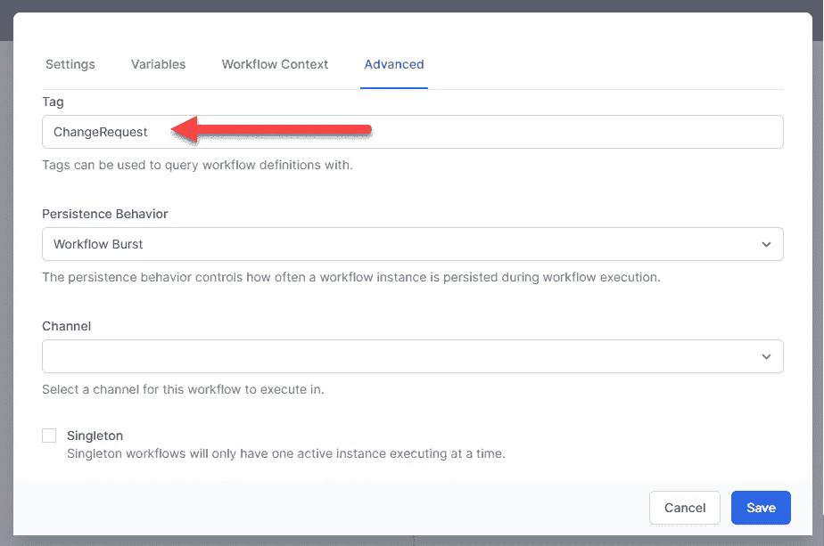

# 构建工作流驱动的第 5 部分。使用 Elsa 2 的. NET 应用程序

> 原文：<https://medium.com/geekculture/part-5-of-building-workflow-driven-net-applications-with-elsa-2-8c1f36f7b720?source=collection_archive---------7----------------------->

## 执行工作流


在[上一部分](https://sipkeschoorstra.medium.com/part-4-of-building-workflow-driven-net-applications-with-elsa-2-d6699a6a247e)中，我们做了一些简单的工作，建立了一个基本的 ASP.NET 核心 web 应用程序项目，包括 UI、域模型和数据访问。我们现在可以上传文件并在数据库中存储信息。

在这一部分中，我们将看到如何调用工作流来响应上传的文件。在这样做的时候，我们可以做各种有趣的事情，比如将文件作为电子邮件附件发送给审查，计算散列值，将它存档，以及任何其他让您高兴的事情。

当然，所有这些事情都可以在没有工作流引擎的情况下完成，但是使用工作流引擎提供了许多关键优势，例如:

*   通过人工交互协调自动化步骤变得简单，就像单击一个工作流一样。这里的主要优点是，这个长时间运行的流程的状态是为您处理的。
*   添加、更新和删除流程无需重新部署应用程序即可完成(如果您愿意，您仍可以将工作流作为应用程序的一部分，我们将会看到)。
*   开发人员提供构建块(工作流步骤，也称为活动)，使非程序员能够创建和管理工作流。

# 执行工作流

Elsa 提供各种服务来执行工作流，但其核心是`IWorkflowRunner`,它采用工作流蓝图和/或工作流实例，并逐个执行每个活动，直到不再有活动要执行或遇到阻塞活动。

对于我们的场景，我们希望在上传文件时在后台异步执行工作流。为了在后台执行工作流(例如使用队列工作器)，我们使用了`IWorkflowDispatcher`服务。

该服务将消息调度到一个队列中(默认情况下，该队列位于内存中，并使用 [Rebus](https://github.com/rebus-org/Rebus) )，然后消息消费者获取该队列，消息消费者进而使用`IWorkflowRunner`服务来实际执行工作流。

为了了解这是如何工作的，让我们首先创建一个简单的什么都不做的工作流，然后调用这个工作流来响应文件上传。

## 创建 HelloFile 工作流

在您的应用程序和 Elsa Studio 运行的情况下，创建一个名为`HelloFile`的工作流，并使用以下液体表达式添加一个**写行**活动:

```
Hello File {{ Input }}! 
```

`Input`将引用我们在调用工作流时作为输入发送的对象。发布您的工作流，接下来让我们看看如何调用它。

## 运行 HelloFile 工作流

您可能还记得，在上一部分中，我们创建了一个名为`DocumentService`的服务，它将在调用`SaveDocumentAsync`时发布`NewDocumentReceived`事件(这是在上传文件时从 web 项目中的`IndexModel`类完成的)。

现在我们将看到这种设置有多方便。为了处理该事件，在`DocumentManagement.Workflows`项目中创建一个名为`Handlers`的新文件夹，并向其中添加以下类:

上面显示的处理程序做两件事:

1.  通过*名称*获取*发布的*工作流程蓝图。
2.  *分派*工作流。

在识别这个处理程序之前，我们需要向服务容器注册它。为此，在同一个项目中打开`ServiceCollectionExtensions`类，并在`AddWorkflowServices`方法中链接以下代码行:

```
services.AddNotificationHandlersFrom<StartHelloFileWorkflow>()
```

这将注册在当前程序集中找到的任何&所有通知处理程序。

## 测试 HelloFile 工作流

为确保一切正常，请启动您的 web 应用并上传文件。过一会儿(0 到 15 秒之间)，您应该会在控制台窗口中看到类似以下输出的内容:


太好了！我们现在知道了如何在上传文档时运行工作流。

接下来，让我们看看如何为给定的文档类型选择工作流。

# 按文档类型划分的工作流

如果我们提出一种机制，允许我们将文档类型与工作流相关联，我们的应用程序将允许用户添加任意的文档类型和相关联的工作流来处理这些类型，而无需我们进行任何更改(当然，除非用户想要实现一个具有新功能的工作流，而我们还没有针对该工作流的活动)。

将工作流与文档类型相关联的一种简单方法是通过*标记*工作流。

例如，我们有一个 ID 为`"ChangeRequest"`的文档类型。让我们更新 **HelloFile** 工作流的设置，并在其*标签*字段(在*高级*标签下)中输入该类型 ID:



接下来，让我们更新我们的事件处理程序类，如下所示:

*   重命名为`StartDocumentWorkflows`。
*   选择标签与上传文档的文档类型 ID 匹配的所有工作流。
*   让我们使用文档 ID 作为工作流的关联 ID，而不是将文档 ID 作为工作流输入发送。这在实现长时间运行的工作流时非常有用，我们将在本系列的下一部分中看到。

最终结果应该是这样的:

让我们也更新 *HelloFile* 工作流的 *Write Line* 活动，以打印出关联 ID，而不是工作流输入(我们不再发送它):

```
Hello File {{ CorrelationId }}!
```

当您现在尝试上传文档时，请注意，只有当您上传类型为 *ChangeRequest* 的文档时，才会执行 *HelloFile* 工作流。

# 摘要

在这一部分中，我们已经看到了如何在后台执行工作流以响应域事件(`NewDocumentReceived`)以及如何通过*标签*属性将工作流与文档类型相关联。

# 然后

在[的下一部分](https://sipkeschoorstra.medium.com/part-6-of-building-workflow-driven-net-applications-with-elsa-2-9b3167c612dd)中，我们将看看构建一些自定义活动，我们需要这些活动来实现本系列介绍中描述的工作流。