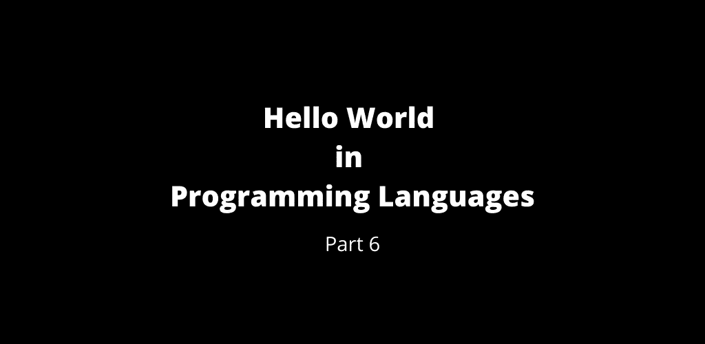

# 第 6 部分:编程语言中的 Hello World

> 原文：<https://medium.com/geekculture/part-6-hello-world-in-programming-languages-31861a8299af?source=collection_archive---------25----------------------->

Hello World — Part 6

 [## 第 5 部分:编程语言中的 Hello World

### 编程语言中的 Hello World 第 5 部分

manojahi.medium.com](https://manojahi.medium.com/part-5-hello-world-in-programming-languages-5014995454f8) 

# m4

# 宏-10

# 宏-11

# Macromedia-Flex

# 疯的

# 制造

# 马尔博尔格

# MAMASH

# 枫树

# 马尔梅拉德

# 数学

# 矩阵实验室

# [数]矩阵

# MAXIMUM 的复数

# MAXScript

# MCSBL

# MDM 锌

# 蜂蜜

# 元发布

# 墨西哥

# 显微技术

# 迷你脚本

# mIRC 别名

# mIRC 命令行

# mIRC 剧本

# MivaScript

# MML-AXE10

# 模数 2

# 模数 3

# 莫哈文字

# 牛叫声

# 老鼠

# 多重人格混乱

# MPLAB IDE

# MS Small Basic

# MSDOS

# MSIL

# 穆利普

# 腮腺炎

# MySQL 函数

# 迷魂汤

# 自然的

# 奈梅勒

# 新 ISP

# NewtonScript

# 尼斯（法国城市名）

# 偷

# 幼虫

# 节点. js

[https://gist . github . com/manojahi/14 c 0227 b 66 b 14b 7 b 8d 64d 0 ea 362 a3 E0 c](https://gist.github.com/manojahi/14c0227b66b14b7b8d64d0ea362a3e0c)

# NSIS

# NXC

# 奥伯龙，奥伯龙

# Oberon.std

# 目标-C

# OCaml

# 奥卡姆语言

# 八度音阶

# Omnimark

# 开关键控

Ook 中的 Hello World。无可奉告。

# OpenVMS

# OPL .对话框

# 简单操作

# 奥兹

评论你所熟悉的`Hello World`程序。

 [## 第 7 部分:编程语言的世界

### 编程语言的 Hello World 第 7 部分

manojahi.medium.com](https://manojahi.medium.com/part-7-hello-world-of-programming-languages-6384f0d5d21c) 

干杯！！