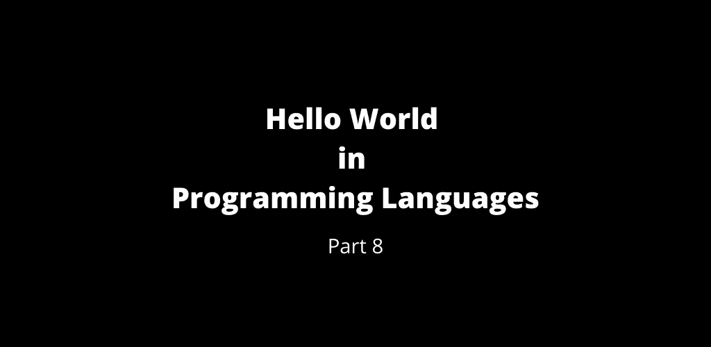

# 第 8 部分:编程语言中的 Hello World

> 原文：<https://medium.com/geekculture/part-8-hello-world-of-programming-languages-112c8d94b93d?source=collection_archive---------26----------------------->

Hello World — part 8

 [## 第 7 部分:编程语言的世界

### 编程语言的 Hello World 第 7 部分

manojahi.medium.com](https://manojahi.medium.com/part-7-hello-world-of-programming-languages-6384f0d5d21c) 

# S-Plus

# SAKO

# 盐

# 萨普

# 斯堪的纳维亚航空公司

# 萨瑟

# 索泽尔

# 斯卡拉

# 计划

# Scilab

# 种子 7

# 自己

# 感觉对话

# 集合 2

# 莎士比亚

# 沈

# SilverBasic

# 简单的

# 锡穆拉

# SinclairBasic

# 跳跃

# 闲聊(简单)

# 闲聊(窗口)

# Smalltalk 山

# 同步化多媒体整合语言(Synchronous Multimedia Integrate Language)

# SML

# snobol 语言

# 旋转

# 螺旋形

# SPL4

# Splunk SPL

# 敏捷的

# 附加电源装置（Supplementary Power Supply Set 的缩写）

# SQL(优势)

# SQL (DB2)

# SQL (Oracle)

# 结构化查询语言

# sqlplus

# 平方根(Square Root)

# 机会

# 松鼠

# 小规模集成(电路)(Small Scale Integration)

# 圣指南

# 超级对撞机

# 挽救（saving 的简写）

# 迅速发生的

# SyMAL

# Symsyn

# szl

# T-SQL

# T

# T9

# TACL

# 湖

# TCL 集团股份有限公司（TCL Corporation 的缩写）

# TECO

# 塑性的涂料

# Texinfo

# Thue

# TI 基本

# TI 扩展基本

# TinyFugue

# 坦克

# 玩具

# 反式

# 特洛夫

# TSO CLIST

# 图灵机

# 图灵

# 以打字打的文件

# Ubercode

# 单染色体

# Unix Shell

# unlambda

# 非真实脚本

# 乌尔萨拉

评论你所熟悉的`Hello World`程序。

 [## 第 9 部分:编程语言的世界

### 编程语言中的 Hello World 第 9 部分

manojahi.medium.com](https://manojahi.medium.com/part-9-hello-world-of-programming-languages-63b4e552155c) 

干杯！！