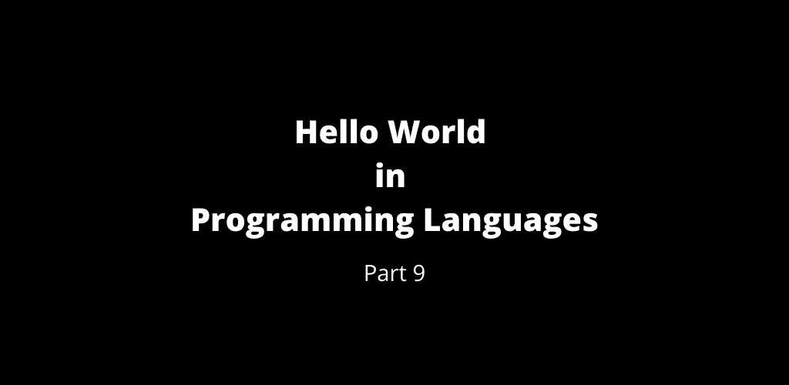

# 第 9 部分:编程语言中的 Hello World

> 原文：<https://medium.com/geekculture/part-9-hello-world-of-programming-languages-63b4e552155c?source=collection_archive---------20----------------------->

Hello World — Part 9

 [## 第 8 部分:编程语言的世界

### 编程语言中的 Hello World 第 8 部分

manojahi.medium.com](https://manojahi.medium.com/part-8-hello-world-of-programming-languages-112c8d94b93d) 

# 瓦拉

# 瓦尔阿克

# Vatical

# VAX 宏

# VAX-11 宏

# VBA (Excel)

# VBA(字)

# VBScript

# 速度

# Verilog

# Vexi

# 极高密度脂蛋白

# Vim 脚本

# visualbasic 语言

# Visual Basic。网

# Visual Basic 6

# Visual FoxPro

# 可视序言

# VisualWorks 小对话

# VMS-DCL

# 虚拟现实建模语言

# 危重患者名单

# 每当

# 旋转

你好，世界在[旋转](http://esolangs.org/wiki/Whirl)。此语言没有注释。

# 空白

# 脑白质病变

# 钨

# WSH

# X++

# Xbase++

# xblite

# 可扩展的超文本标记语言

# XLogo

# XPL0

# XQuery

# XSL-FO

# XSLT

# 亚卡斯

# 急转

# 齐姆

评论你所熟悉的`Hello World`程序。

干杯！！