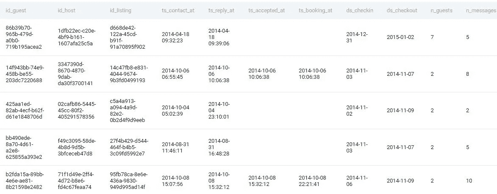
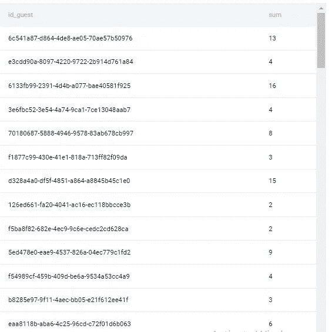
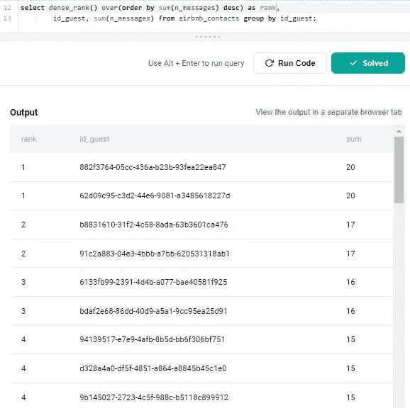

# 第 9 部分:排名最活跃的客人 Airbnb 提出的 SQL 问题

> 原文：<https://medium.com/geekculture/part-9-ranking-most-active-guests-sql-question-asked-by-airbnb-cf2897e45d67?source=collection_archive---------10----------------------->

# 让我们解决基于产品的公司提出的 SQL 问题

这是基于产品的公司在面试中提出的一系列 SQL 问题的第 9 篇文章。对于本文，我使用 StrataScratch 平台来获取基于产品的公司中被问到的问题。

StataScratch 是一个优秀的平台，适合任何希望开始学习数据科学并提高其 SQL 和 Python 技能的人。这个平台不仅提供编码题，还提供与数据科学相关的非编码题，比如统计、概率等等。我强烈建议你在 StrataScratch 网站上注册一个账户，在文章旁边练习这个问题。我将使用 Postgres SQL 数据库来解决这个问题。

以下是基于产品的公司提出的一系列 Postgres SQL 问题的链接:

[https://agupta 97 . medium . com/list/postgres-interview-problems-asked-in-product-based-com apnies-c 4020531504 b](https://agupta97.medium.com/list/postgres-interview-problems-asked-in-productbased-comapnies-c4020531504b)

如果你从事数据科学工作或者想在数据科学领域开始职业生涯，SQL 是最重要的技能之一。
如果你熟悉 SQL，你将有更好的机会通过数据科学面试或处理日常任务。本文将集中讨论一个问题以及如何解决它。如果你想提高你的 SQL 知识和经验，你必须阅读这篇文章。你提出想法和寻找解决方案的方法无疑会有所改进。


这是 Yelp 在一次采访中提出的一个难题。可以在这里查看问题[。](https://platform.stratascratch.com/coding/10060-top-cool-votes?code_type=1)问题名称为**顶酷投票。**以下是问题的详细内容:

# 排名最活跃的客人

根据客人与主人交流的信息数量对客人进行排名。与其他访客具有相同数量消息的访客应该具有相同的等级。如果前面的排名相同，不要跳过排名。输出等级、客人 id 和他们发送的消息总数。首先按邮件总数的最大值排序。

> *公司:* ***Airbnb*** *，难度:* ***中等*** *，面试问题 sid:****10159****，* *表格:***Airbnb _ 联系人*，***
> 
> *Table _ fields:***id _ guest**(varchar)、 **id_host** (varchar)、 **id_listing** (varchar)、**ts _ contact _ at**(datetime)、 **ts_reply_at** (datetime)、**ts _ accepted _ at**(datetime)、**ts _ booking _ at**(datetime)、 **ds_checkin**

**表格 airbnb_contacts 预览:**



**Some Records from Table airbnb_contacts**

首先，让我们试着理解这个问题。如问题中所述，我们将按降序查找等级、guest_id 以及来宾和主机之间交换的消息数量。本文假设您熟悉 select、from、where、order by、dense_rank()和 over()窗口函数。如果你想温习一下你的概念，你可以先阅读下面列出的文章，然后回到这里对这个问题有更深入的理解。

[https://agupta 97 . medium . com/list/lets-explore-postgres-in-deep-e9d 4985 a 1413](https://agupta97.medium.com/list/lets-explore-postgres-in-deep-e9d4985a1413)

**方法:使用 dense_rank()窗口函数**

**步骤 1:确定相关列和每个 guest_id 交换的消息总数**

首先，**我**首先确定需要回答这个问题的字段。我们需要 id_guest 和 n_messages 来回答查询。如问题中所问，我们需要找到特定来宾和其他主机之间交换的消息的总和。因此，我们对 guest_id 字段进行分组，并找到 guest_id 交换的消息总数。

```
**select  id_guest, sum(n_messages) from airbnb_contacts group by id_guest;**
```



**Few Records from the Output of Above Query**

**第二步:使用 Dense_rank()为 guest_id 分配等级**

我们需要再输出一个名为 rank 的列，它将根据每个客人交换的消息总数列出他们的等级，并按降序排序。考虑到问题中明确提出了为具有相同数量消息的来宾分配相同等级并防止跳过等级的要求，我们可以使用 dense rank()窗口函数来实现这一点。在 over()内部，我们不会给出任何 partition by 子句，因为我们必须将整个结果集视为一个分区。我们将只使用 order by 子句对邮件总数进行降序排列来分配等级。

```
**select  dense_rank() over(order by sum(n_messages) desc) ,
        id_guest,
        sum(n_messages)
        from airbnb_contacts
        group by id_guest;**
```



实际上，需要将问题分解成更小的问题。在阅读问题两遍后，决定使用哪些列来计算期望的结果。之后，确定计算每个子问题所需的函数，然后尝试连接子问题的解决方案。使用这种方法，你可以快速解决任何问题。接触将提高你开发解决问题的新方法和途径的能力。
感谢你阅读我的帖子并回复我；这对我意义重大。如果你喜欢它，竖起大拇指，点击“关注”在媒体上关注我，以便在我发布新内容时得到通知。