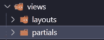
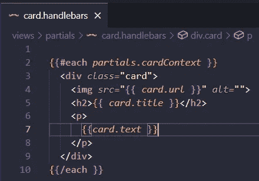
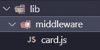
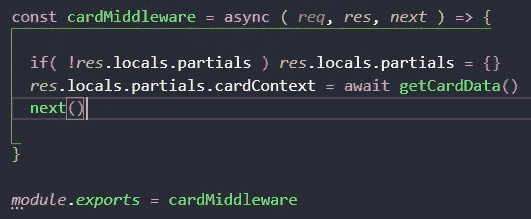
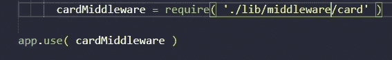
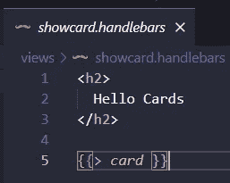
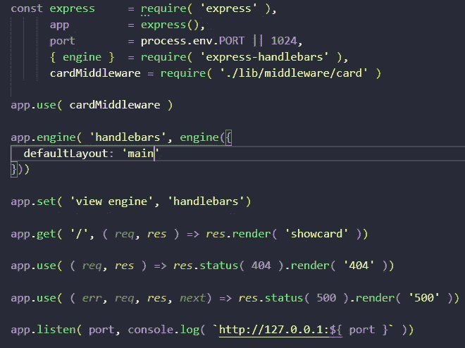

# Handlebars Express.js 中的 Partials 和使用中间件

> 原文：<https://medium.com/geekculture/partials-in-handlebars-express-js-and-using-a-middleware-f3415357ac9f?source=collection_archive---------12----------------------->


Partials 是在你的 Handlebars 项目中重用代码的最佳方式，有时我们希望在所有页面中使用一段代码，但我们倾向于一次又一次地复制和粘贴相同的代码，但对于 partials，我们实际上称之为 partial，仅此而已。

让我们开始在视图目录中添加一个部分目录



Example adding partials directory

然后，我们需要创建我们的 partial，例如在这种情况下，我将创建 card.handlebars，我将为每张卡片添加每个 handlebars 语句，这样它将打印带有各自标题、文本和图像的卡片



Example partial card handlebars

接下来，为了简洁起见，我们需要在 lib/middleware/目录下创建一个名为 card.js 的中间件



Example creating a card.js file on the middleware directory

我们将在 card.js 中加入一个名为 getCardData 的函数，该函数的返回是一个包含三个对象卡的承诺


Example creating the getCardData function returning a Promise

然后，一个名为 cardMiddleware 的异步函数将添加到全局 locals.partials 信息中，因此 cardContext 为我们上面的部分，用 module.exports 导出模块



Example adding a middleware called cardMiddleware who will add information globally

之后，我们需要添加我们的中间件到服务器



Example adding the cardMiddleware to our server

酷，我们需要在任何我们想添加的地方添加我们的部分，但是我如何添加它呢？使用这个代码，这个代码将搜索每一个部分，并将打印在页面上。

```
{{> card}}
```



Example adding the partial to my showcard view



Example final server code for partials

如果我们转到我们的主页(展示卡页面),我们可以看到卡片，但我没有为我们的部分卡片添加样式


Example partials on the web page

正如你所看到的，它工作顺利，但有问题，很抱歉，因为这些卡片没有样式。

# 结论

Partials 是练习或添加到 Handlebars Express.js 项目中的一个很好的选择，因为它是重用代码的一个很好的方式，并且与中间件连接可以创建一个整洁和可维护的代码。

# 来源

[](https://www.amazon.com/Web-Development-Node-Express-Leveraging-dp-1492053511/dp/1492053511/ref=dp_ob_title_bk) [## 使用 Node 和 Express 进行 Web 开发:利用 JavaScript 堆栈

### 使用 Node 和 Express 进行 Web 开发:利用 Amazon.com 的 JavaScript 堆栈。*免费*送货到…

www.amazon.com](https://www.amazon.com/Web-Development-Node-Express-Leveraging-dp-1492053511/dp/1492053511/ref=dp_ob_title_bk)