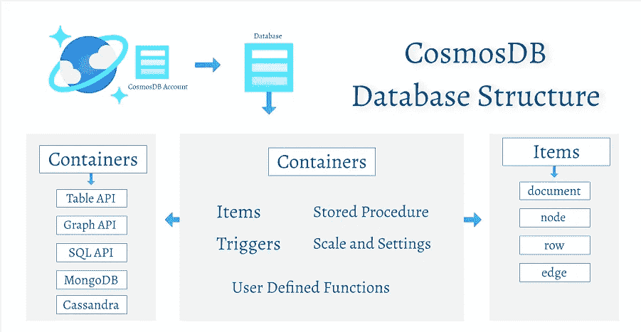
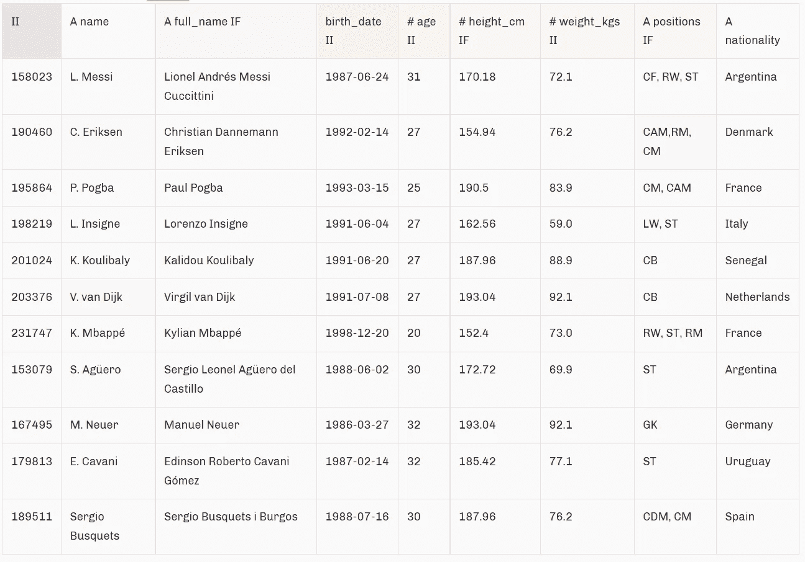

# Azure CosmosDB 中的分区

> 原文：<https://medium.com/geekculture/partitioning-in-azure-cosmosdb-5eca80ad4a3c?source=collection_archive---------13----------------------->

分区是一种数据存储功能，它允许将表和大型数据集分割成较小的子集，以实现更快的读取速度。Azure CosmosDB 用于存储大型数据集，同时保持快速读取访问，这只有在存储的数据分区良好的情况下才有可能。

Azure CosmosDB 的资源模型源自存放 CosmosDB 数据库的 CosmosDB 帐户，然后数据库被分成包含保存数据的项目的容器。

当分区键应用于数据时，从其创建的子集被称为 ***逻辑分区。*** 在这种情况下，逻辑分区是一组共享同一个分区键的数据。可以存在的逻辑分区的数量没有限制，假设选择了一个好的分区键，数据将充分地分布在各个逻辑分区上。

如果选择了无效的分区键，将会导致某些逻辑分区中的数据聚集，从而导致针对这些逻辑分区的查询运行时间更长。对于任何数据集来说，一个好的分区键都有很大范围的可能值，因此会产生更多的逻辑分区。

在创建过程中选择的分区键，如 Cosmos DB API，一旦选择就不能更改。对于被认为是最佳的分区键，它应该:

*   是一个值不变的属性。
*   基数很高。换句话说，属性应该有很大范围的可能值。
*   在所有逻辑分区中平均分配请求单元(RU)消耗和数据存储。这确保了在您的物理分区之间均匀的 RU 消耗和存储分布。

对于读取量大的容器，可以选择使用的查询过滤器作为分区键。这样做的最大好处是减少了跨分区查询的可能性，这在 RU 成本和延迟方面是很昂贵的。

让我们从一个更实际的角度来看这个问题: ***假设我们有一段 Fifa 球员的信息，如下所示。提供的列包括 id、姓名、全名、出生日期、年龄、身高、体重、职位和国籍。从这些列中选择最合适的分区键***

在所提供的列中，以下列不能作为正确的分区键:

*   ***ID***——假设我们只存储一个与每场比赛相关的记录，我们最终将拥有与联盟中的球员一样多的逻辑分区。每个逻辑分区只有一条记录。拥有以这种方式分割数据的分区键是无效的。
*   ***【出生日期】、姓名和全名*** —这些列会遇到在 ID 列下讨论的相同问题，它们可能具有较高的基数，但是它们缺少跨记录的均匀数据分布。
*   ***、年龄、身高 _ 厘米、体重 _ 公斤*** —这些列可能会以固定的间隔变化，或者倾向于随机变化，因此不会是有效的部分键。如上所述，分区键不应该改变。
*   **Positions —** 这不是一个有效的键，因为它是一个多值数据类型。它包含多个独立的值，代表球员在职业生涯中的某个时刻所担任的所有位置。

由于我们排除了所有其他列，剩下的一列是**国籍。**它符合上面详述的所有标准:它不会改变，并且考虑到国际足联球员来自的国家范围，我们最终会有相当数量的逻辑分区。

选择逻辑分区的一部分是要很好地理解组织使用的数据，这种知识会影响分区键的选择。