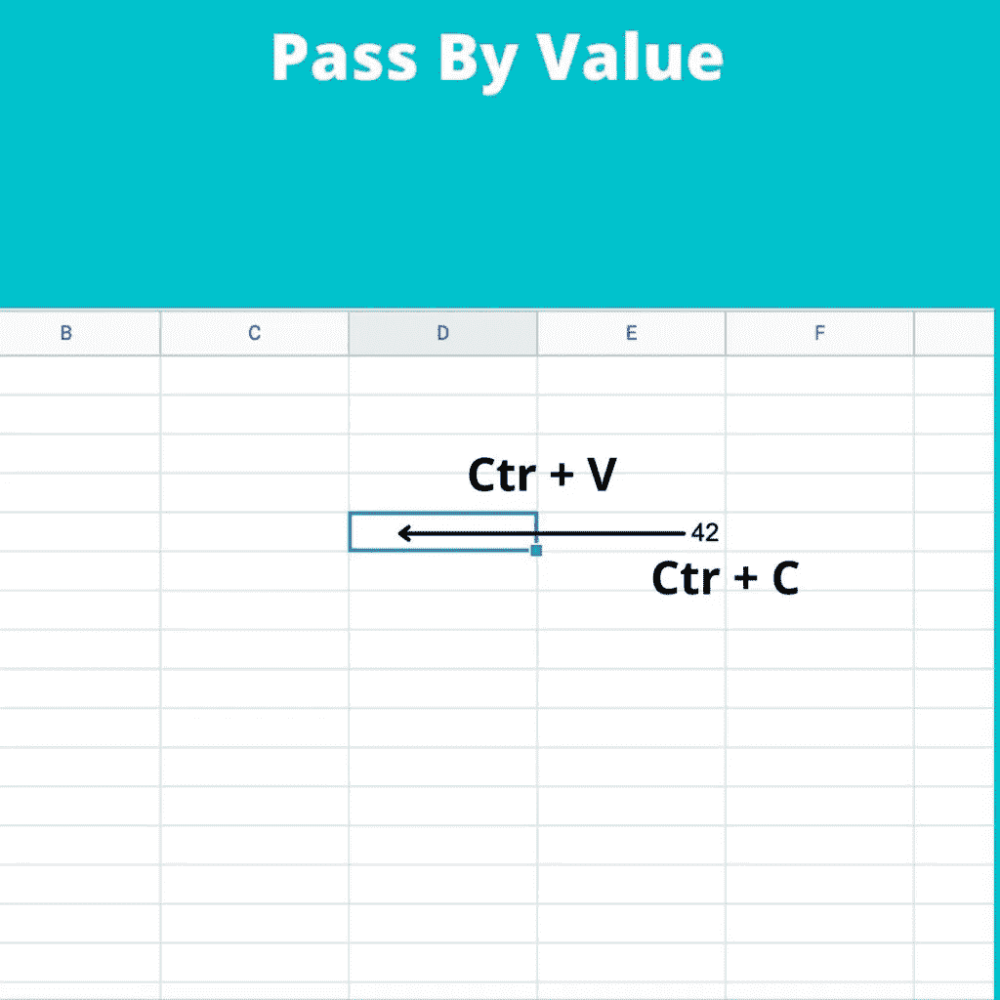
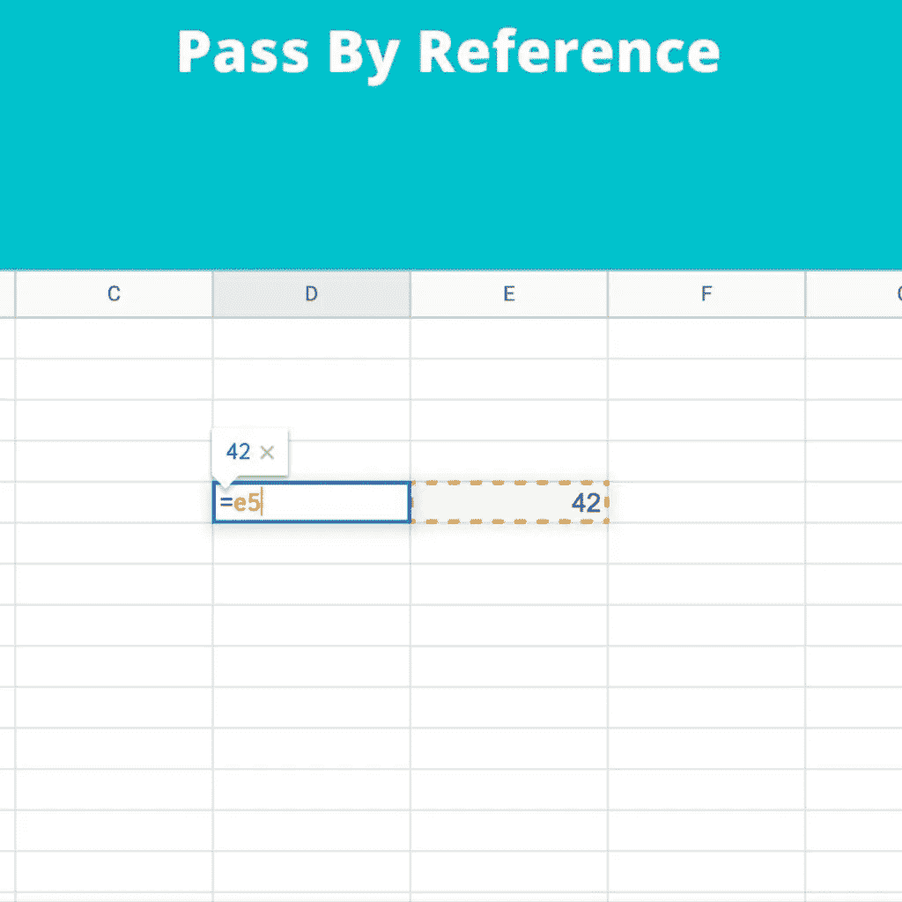

# 在 Swift 中通过引用和值传递

> 原文：<https://medium.com/geekculture/pass-by-reference-and-value-in-swift-ef332551b560?source=collection_archive---------19----------------------->

在每一种编程语言中(主要对于“新”开发人员来说)都不容易理解的一个概念是认识到“通过引用传递和通过值传递”之间的区别。

按值传递意味着:“将一个值从一个内存位置复制到另一个内存位置。”相反，通过引用传递意味着我们不复制目标中的值，而是复制对源的引用(地址)。

我喜欢用这些图片来解释不同之处:



因此，当我们通过值传递时，就像将一个单元格的值从一个单元格复制到另一个单元格，相反，当通过引用传递时，我们在目标单元格中设置源的地址(本例中为 e5)。

让我们看看 swift:

```
struct BoxStruct {
 var width = 0
 var height = 0
}

var littleBox = BoxStruct(width: 2, height: 3)
var bigBox = BoxStruct(width: 57, height: 84)

littleBox = bigBox

print("Little box: width \(littleBox.width) height \(littleBox.height)")
print("Bix box: width \(bigBox.width) height \(bigBox.height)")

bigBox.width = 150
bigBox.height = 333

print("Little box: width \(littleBox.width) height \(littleBox.height)")
print("Big box: width \(bigBox.width) height \(bigBox.height)")
```

执行这段代码有:

```
Little box: width 57 height 84 
Big box: width 57 height 84 
Little box: width 57 height 84 
Big box: width 150 height 333
```

在这种情况下，我们有一个按值复制的副本。我们将 bigBox 中的内容复制到 littleBox 中，因此两个 Box 具有相同的值；在我们改变 bigBox 的值之后，这两个盒子将包含不同的值。

让我们看看这个类发生了什么:

```
class TriangleClass {
 var width: Int
 var height: Int

 init(width: Int, height: Int) {
 self.width = width
 self.height = height
 }
}

var littleTriangle = TriangleClass(width: 2, height: 3)
var bigTriangle = TriangleClass(width: 57, height: 84)

littleTriangle = bigTriangle

print("Little Triangle: width \(littleTriangle.width) height \(littleTriangle.height)")
print("Big Triangle: width \(bigTriangle.width) height \(bigTriangle.height)")

bigTriangle.width = 150
bigTriangle.height = 333

print("Little Triangle: width \(littleTriangle.width) height \(littleTriangle.height)")
print("Big Triangle: width \(bigTriangle.width) height \(bigTriangle.height)")
```

现在我们有了这样的输出:

```
Little Triangle: width 57 height 84 
Big Triangle: width 57 height 84 
Little Triangle: width 150 height 333 
Big Triangle: width 150 height 333
```

这次不一样！复制后，三角形具有相同的值；在我们改变大三角形的尺寸后，神奇的事情发生了，小三角形的尺寸也改变了！为什么？对于类，复制是通过引用完成的，所以写“littleTrianlge = bigTriangle”，我们不是在 little 中复制 big 的内容，我们是像在 sheet 示例中那样复制引用。现在，每一个大的变化都会在小的方面显现出来。

同样的情况也发生在函数中，如果我们想要修改传递给函数的参数的原始值，这些都要通过引用来传递，这样:

```
func swap(a : inout Int, b: inout Int) {
    let dum = a
    a = b
    b = dum
}
```

作为练习，试着去掉关键字“inout ”,看看会发生什么。