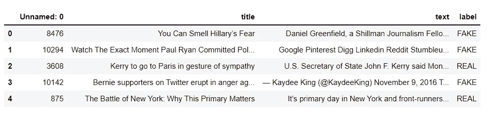

# 被动主动算法—适用于大数据模型

> 原文：<https://medium.com/geekculture/passive-aggressive-algorithm-for-big-data-models-8cd535ceb2e6?source=collection_archive---------10----------------------->


Photo by [Joshua Sortino](https://unsplash.com/@sortino?utm_source=medium&utm_medium=referral) on [Unsplash](https://unsplash.com?utm_source=medium&utm_medium=referral)

被动攻击算法是在大数据应用中广泛使用的一系列机器学习算法。

被动攻击算法一般用于大规模学习。它是**在线学习算法**中的一种。在在线机器学习算法中，输入数据按顺序出现，机器学习模型按顺序更新，这与一次性使用整个训练数据集的传统批量学习相反。

这在存在大量数据的情况下非常有用，并且由于数据的绝对大小，训练整个数据集在计算上是不可行的。

> 在线学习算法将获得一个训练样本，更新分类器，然后丢弃该样本。

一个很好的例子是在社交媒体网站上检测虚假公告，如 Twitter 和 WhatsApp，那里每秒钟都有新数据添加。要连续动态地从 Twitter 上读取数据，数据将会非常庞大，使用在线学习算法将是理想的选择。

被动攻击算法有点类似于感知器模型，因为它们不需要学习率。但是，它们包含一个正则化参数。我不会深入研究算法的数学，因为这超出了本文的范围，但我会链接一个关于该算法背后数学的精彩视频，**我建议观看 Victor Lavrenko 博士关于该算法工作的精彩视频**[](https://www.youtube.com/watch?v=TJU8NfDdqNQ)****。****

**我将提供一个用例，在这个用例中，将使用 python 中的被动攻击算法来执行假新闻检测。**

# ****读取数据和数据帧****

****

**Table overview**

# ****从数据帧中获取标签，然后**将数据集分成训练集和测试集。**

# ****初始化 tfidf 矢量器****

**初始化英语中的停用词和 0.7 的最大文档频率(具有较高文档频率的术语将被丢弃)。停用词是在处理自然语言数据之前要过滤掉的语言中最常见的词。tfidf 矢量器将原始文档的集合转化为 TF-IDF 特征的矩阵。**

**现在，在训练集上拟合和转换矢量器，在测试集上转换矢量器。**

# ****初始化被动-主动分类器。****

```
PassiveAggressiveClassifier(max_iter=50)
```

# ****对来自 tfidf 矢量器的测试集进行预测****

**使用 sklearn.metrics 中的 accuracy_score()计算准确度。**

```
Accuracy: 92.66%
```

# ****打印出一个混淆矩阵****

****

**Photo by [Jon Tyson](https://unsplash.com/@jontyson?utm_source=medium&utm_medium=referral) on [Unsplash](https://unsplash.com?utm_source=medium&utm_medium=referral)**

**深入了解假阴性和真阳性的数量。**

```
array([[589,  49],
       [ 39, 590]], dtype=int64)
```

**从这个算法中，我们得到 589 个真阳性和 590 个真阴性。**

# ****参考文献****

**[1]使用被动攻击和 TF-IDF 矢量器的假新闻检测—【https://www.irjet.net/archives/V7/i9/IRJET-V7I9274.pdf **

**[2]被动攻击性量词—【https://www.youtube.com/watch?v=TJU8NfDdqNQ】T4**