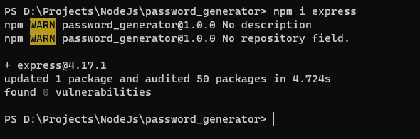
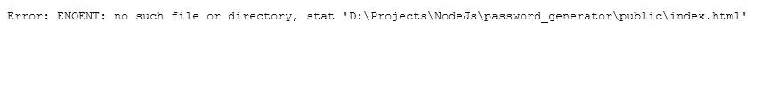
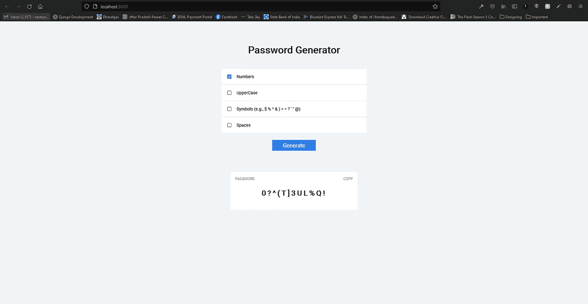
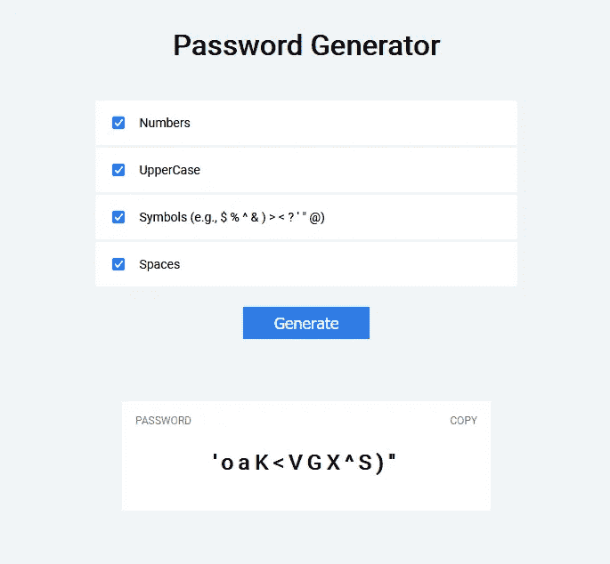

# NodeJS 密码生成器

> 原文：<https://medium.com/geekculture/password-generator-with-nodejs-1d561dd1338?source=collection_archive---------23----------------------->

用 Nodejs 和 Express 创建密码生成器。我们将学习如何创建一个简单的密码生成器来生成简单的密码。


## 要求

*   NodeJS 和 NPM 已安装
*   快速模块
*   HTML、CSS 和 JS 基础知识

## 设置项目

首先创建一个名为`password_generator`的文件夹，并在那里用`npm init`初始化节点项目。现在打开这个文件夹，安装带有`npm i express`的`express`模块。


打开 Visual Studio 代码，让我们创建`index.js`文件并创建`static`和`public`目录。

*   静态目录将保存 html 文件所需的静态文件，如`css`和`js`文件
*   公共目录将保存您想要在服务器上呈现的 html 文件。



## 创建 Web 服务器

打开`index.js`文件，你创建并键入代码。

```
// IMPORTING REQUIRED MODULES
const express = require('express');
// Creating instance of webserver
const app = express();// Setting up PORT where server will bind itself to
const PORT = process.env.PORT || 3000;// Serving STATIC FILES in static/ directory on our webserver
app.use(express.static('static'));// Creating route for / which will send index.html file in our public directory
app.get("/", (req, res) => {
    return res.sendFile(`${__dirname}/public/index.html`);
});// Listening to the PORT
app.listen(PORT, () => {
    console.log(`Your app is running on http://localhost:${PORT}/`);
});
```

现在如果你运行`nodemon .`，你会看到一个网页。



## 创建密码生成器用户界面

在您的`public`目录中创建名为`index.html`的文件，并键入以下代码。

```
<!DOCTYPE html>
<html lang="en">
	<head>
		<meta charset="UTF-8" />
		<meta http-equiv="X-UA-Compatible" content="IE=edge" />
		<meta name="viewport" content="width=device-width, initial-scale=1.0" />
		<title>Password Generator</title>
		<link rel="stylesheet" href="/style.css" />
	</head>
	<body>
		<div class="container">
			<h1>Password Generator</h1>
			<div class="blocks">
			    <!-- CHECKBOXES WHICH WILL WHAT OUR PASSWORD WILL CONTAIN -->
				<div class="check-form">
					<input type="checkbox" name="numbers" id="numbers" checked/>
					<label for="numbers">Numbers</label>
				</div>
				<div class="check-form">
					<input type="checkbox" name="uppercase" id="uppercase" />
					<label for="uppercase">UpperCase</label>
				</div>
				<div class="check-form">
					<input type="checkbox" name="symbols" id="symbols" />
					<label for="symbols"
						>Symbols (e.g., $ % ^ & ) > < ? ' " @)</label
					>
				</div>
				<div class="check-form">
					<input type="checkbox" name="spaces" id="spaces" />
					<label for="spaces">Spaces</label>
				</div>
			</div>
			<!-- BUTTON TO GENERATE PASSWORD -->
			<button id="generate" class="btn-primary">Generate</button> <div class="generate-form">
				<div class="flex-row">
					<span class="uppercase">Password</span>
					<span class="uppercase" id="copy">Copy</span>
				</div>
				<div class="password">
				    <!-- HERE WILL BE OUR PASSWORD -->
					<span id="password">0?^(T]3UL%Q!</span>
				</div>
			</div>
		</div>
	</body>
	<script src="/script.js"></script>
</html>
```

现在我们的`index.html`文件完成了。我们来设计一下。在`static`目录下创建`style.css`并输入。

```
@import url("https://fonts.googleapis.com/css2?family=Roboto&display=swap");html,
body {
	margin: 0;
	padding: 0;
	background-color: #f0f4f8;
	font-family: Roboto, sans-serif;
}.container {
	width: 50%;
	margin-left: auto;
	margin-right: auto;
	display: flex;
	flex-direction: column;
	align-items: center;
}.container h1 {
	margin: 75px 0px 40px 0px;
}.blocks {
	width: 50%;
	font-size: 14px;
}.check-form {
	background-color: white;
	padding: 15px;
	margin: 3px;
}.check-form label {
	margin-left: 10px;
}.btn-primary {
	background-color: #2f80ed;
	border: 0;
	box-shadow: none; padding: 7px 35px;
	font-size: 18px;
	color: white;
	margin: 20px 0px;
}.btn-primary:hover {
	cursor: pointer;
}.generate-form {
	background-color: white;
	padding: 15px;
	margin: 10px;
	margin-top: 50px;
	width: 40%;
	text-align: center;
}.uppercase {
	text-transform: uppercase;
	color: grey;
	font-size: 12px;
}.flex-row {
	display: flex;
	justify-content: space-between;
}.password {
	margin: 25px 0px;
	font-size: 24px;
	font-weight: bolder;
	letter-spacing: 5px;
}
#copy {
	user-select: none;
}#copy:hover {
	cursor: pointer;
}@media screen and (max-width: 1280px) {
	.container {
		width: 75%;
	}
}@media screen and (max-width: 768px) {
	.blocks {
		width: 100%;
	} .generate-form {
		width: 100%;
	}
}
```

现在，如果您重新加载页面，您将看到一个密码生成器用户界面。是时候写点代码了。



## 创建脚本以生成密码

在你的`static`目录中创建`script.js`并输入一些代码。

```
// GET ALL THE VARIABLES WE ARE GONNA NEED
const password = document.getElementById("password");
const copy = document.getElementById("copy");
const generate = document.getElementById("generate");
const numbers = document.getElementById("numbers");
const uppercase = document.getElementById("uppercase");
const symbols = document.getElementById("symbols");
const spaces = document.getElementById("spaces");// Listen for the click event on the `copy` and copy the password to your clipboard
copy.addEventListener("click", () => {
	var TempText = document.createElement("input");
	TempText.value = password.innerText;
	document.body.appendChild(TempText);
	TempText.select(); document.execCommand("copy");
	document.body.removeChild(TempText);
});// Actual Password Generator Code
// Listen for click event on `generate` button
generate.addEventListener("click", () => {
    // Creating an empty array
	var result = [];

	// list of normal characters
	var characters = "abcdefghijklmnopqrstuvwxyz";

    // If numbers is checked, Add digits to the characters
	if (numbers.checked) {
        characters += "0123456789";
	} // If uppercase is checked, Add uppercase letters to the characters
    if(uppercase.checked){
        characters += "ABCDEFGHIJKLMNOPQRSTUVWXYZ";
    }

    // If symbols is checked, Add symbols to the characters
    if(symbols.checked){
        characters += "$%^&)><?'\"@";
    } // If spaces is checked, Add space to the characters
    if(spaces.checked){
        characters += " ";
    } // Get the length of `characters` string
	var charactersLength = characters.length;

	// For loop to randomly select a random character from characters and add it to the result. You can change the length, (Default: 12)
	for (var i = 0; i < 12; i++) {
		result.push(
			characters.charAt(Math.floor(Math.random() * charactersLength))
		);
	}

	// Changing the password
	password.innerText = result.join("");
});
```

您的密码生成器已准备就绪。



## 伙计们，今天到此为止。希望你将建立这些项目，并学习一些新的东西。

你可以在[我的网站](https://programmer101n.com)上找到这些项目，如果找不到，可以订阅，以便在我发布关于它们的帖子时得到通知。

## 关注我的社交活动。