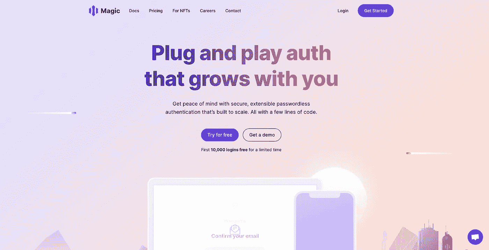

# 用户的无密码认证

> 原文：<https://medium.com/geekculture/passwordless-authentication-of-the-users-5352ee917158?source=collection_archive---------11----------------------->

仅使用电子邮件 id 认证用户，无需任何密码

Magic website screenshot

## 在后台

大多数用户甚至在使用谷歌和推特账户登录时都会遇到问题。在寻找减少用户数量下降的方法时，我们提出了无密码认证。虽然我们可以创建与我们将在室内讨论的相同的自定义流程，但不需要…