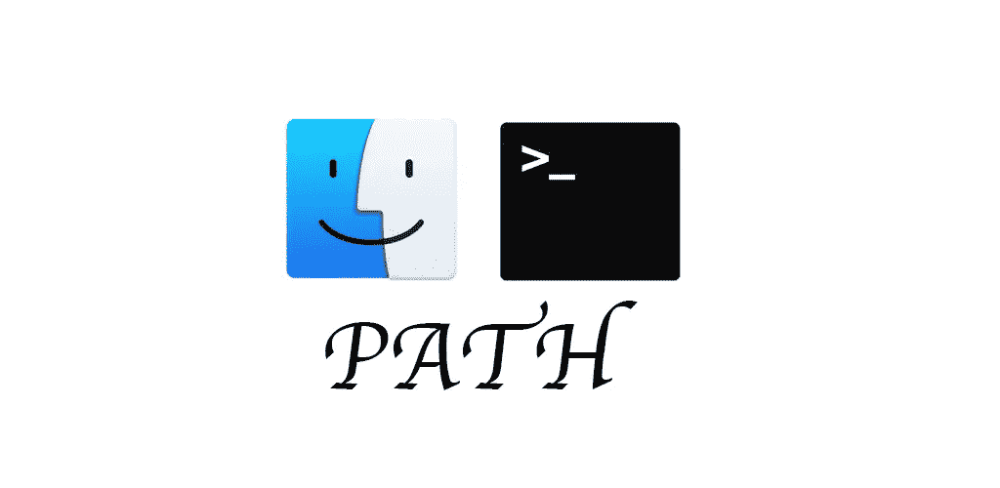

# Mac OS:(PATH)Mac OS 上 PATH 环境变量的最佳实践🔥

> 原文：<https://medium.com/geekculture/path-macos-best-practice-for-path-environment-variables-on-mac-os-35ec4076a486?source=collection_archive---------0----------------------->

> 你知道 Mac 是一个很棒的操作系统，如果你正在使用 MacOS，你可能需要知道如何编辑你的路径环境。好消息是，在 Mac OS 上这是一个简单的任务

# 1.什么是环境变量？

*环境变量*是*全局系统变量*,可由运行…的所有进程/用户访问