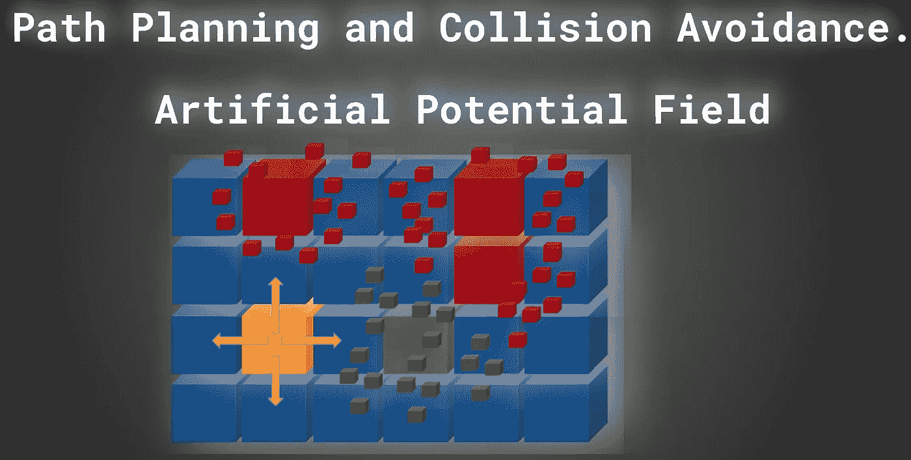
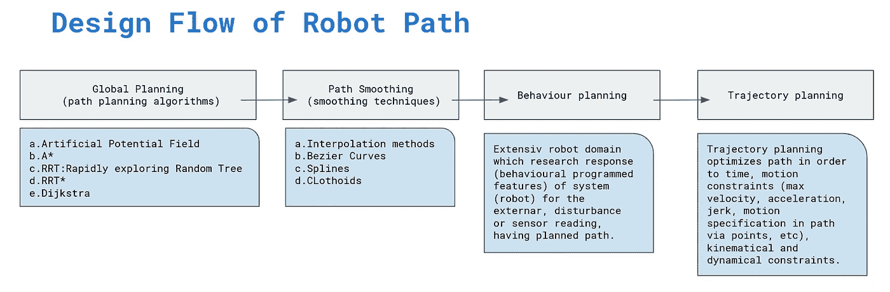
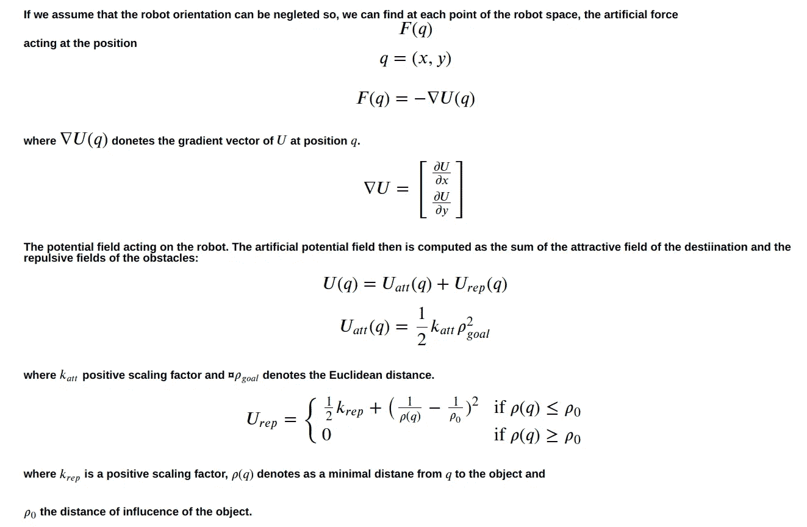
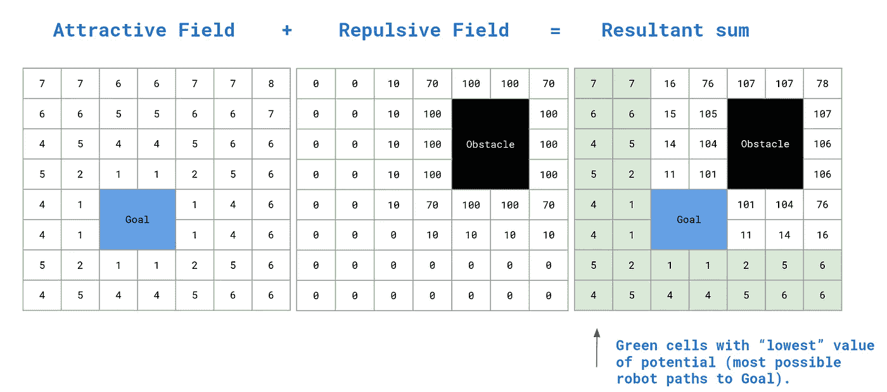
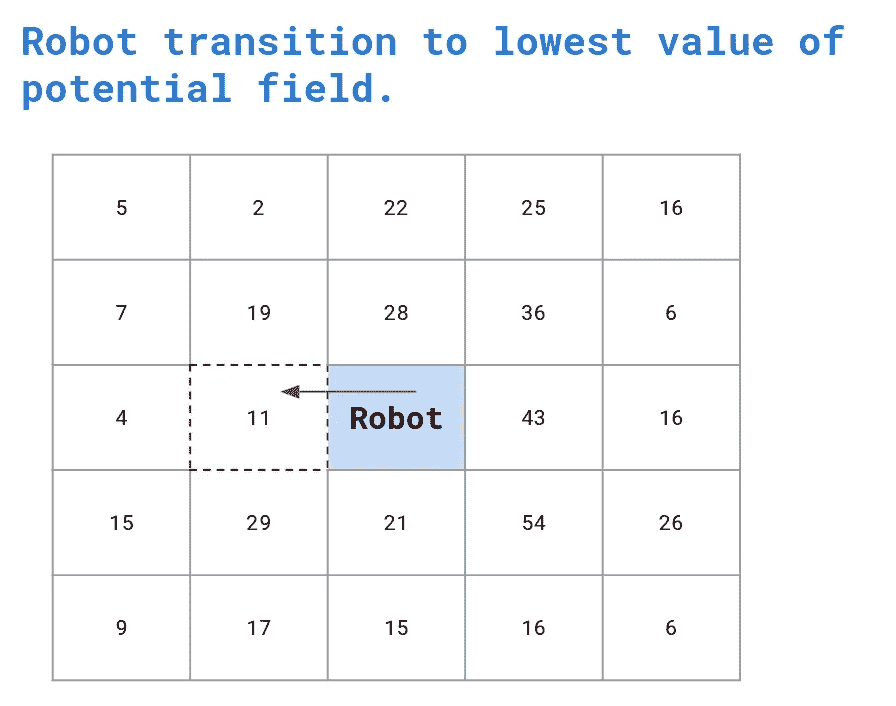
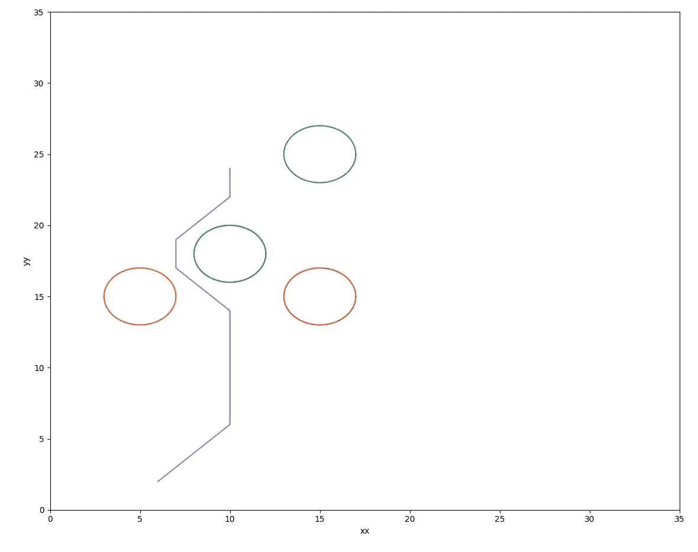
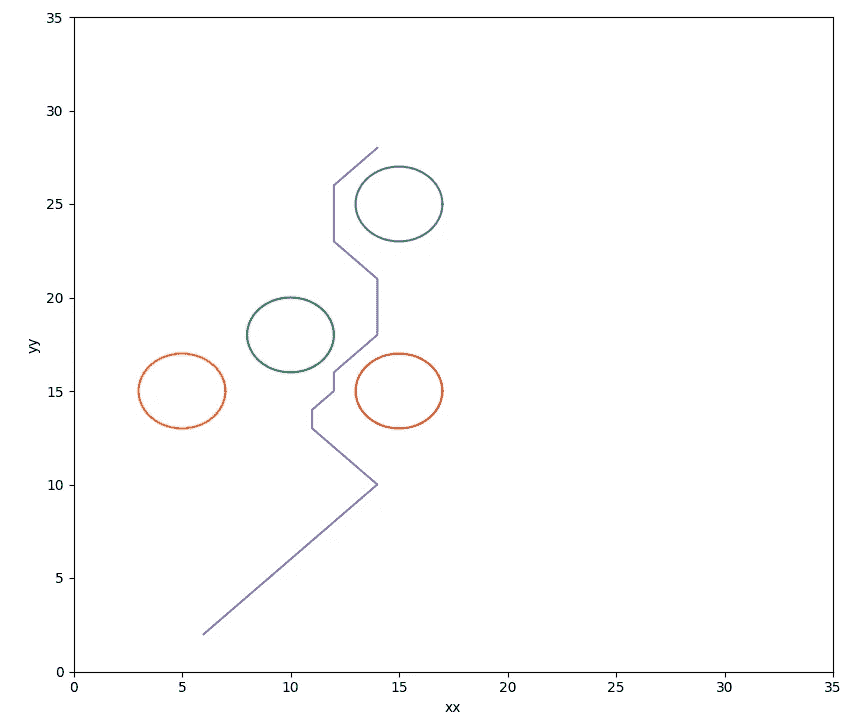

# 路径规划和碰撞避免。人工势场。

> 原文：<https://medium.com/geekculture/path-planning-and-collision-avoidance-artificial-potential-field-da10073a8fd2?source=collection_archive---------13----------------------->



by author

在这篇文章中，我将向你展示如何计算移动物体的路径(这里是一个规划机器人)。具有带有目标和一组障碍物的地图(例如来自激光雷达)的机器人将计划移动，以便无碰撞地到达目标。请记住，机器人路径规划是在路径平滑和轨迹规划之前执行的。记住，轨迹是由时间参数化的，因此我们可以计算速度和加速度。然而，路径规划和路径平滑一起提供了沿着无碰撞路径的空间点序列(这里是规划机器人的 XY)。

你会在我的 [**GitHub**](https://github.com/markusbuchholz/robot_path_planning) 上找到以下帖子的源代码。

该程序包括简化的模拟(您可以通过设置不同的参数来轻松修改机器人的起始位置、目的地或位置以及要避开的障碍物数量)。请注意，障碍物被视为圆形，然而在计算中，障碍物被视为正方形。

可以编译和运行的 C++代码如下。
[头文件](https://github.com/lava/matplotlib-cpp)(用于绘图库)必须与 cpp 在同一个文件夹中。

```
//compile
g++ my_prog.cpp -o my_prog -I/usr/include/python3.8 -lpython3.8//run
./my_prog//folder tree
├── my_prog
├── my_prog.cpp
├── matplotlibcpp.h 
```

请考虑下图，该图将为您提供关于任务的总体概述(该总体概述可能有所不同，并且高度依赖于特定项目或机器人),为了计算从起点到目标的安全路径，必须解决该任务。



by author

**人工势场算法**可以通过将主要思想划分为两个子任务来简单解释。一般来说，机器人空间(此处为 XY 平面)必须由网格划分，即机器人的某个离散位置，在此位置可以计算势场。

对于机器人的每个离散位置，人工势场由两个不同的分量组成。**引力场和斥力场相加**。吸引场是从某个位置到目的地(目标)的欧几里德距离的值。你可以假设这个值随着机器人接近目标而减少。
障碍物“产生”的排斥场可根据以下公式计算。正如所料，当机器人接近障碍物时，该值增加。



合力(由球门产生的吸引场和由障碍物产生的排斥场)为机器人计算和操纵具有最低电势的路径提供了极好的机会。



by author

在我们的例子中，机器人有四种可能的运动转换(移动的选择)向前、向后、向左和向右。在转移到下一个单元(离散位置)之前，机器人检查具有最低电位值的单元。当机器人到达目的地时，重复该过程。



by author

在机器人移动之前计算一次势场图。然而，这种假设只对静态环境有效。在动态空间中，障碍物可以改变位置，必须尽可能频繁地计算势场(以避免碰撞)。在这篇文章中，环境是静态的。

下面我包括一些简单的模拟，你可以很容易地修改。

**模拟 1。**



by author

**模拟 2。**



by author

感谢您的阅读。