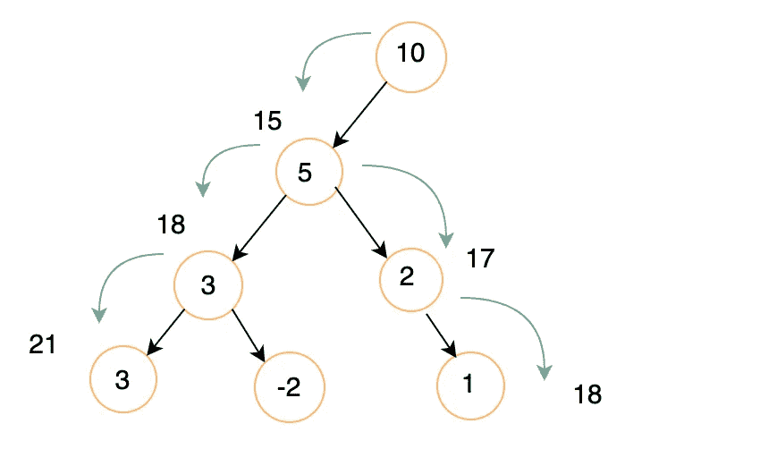
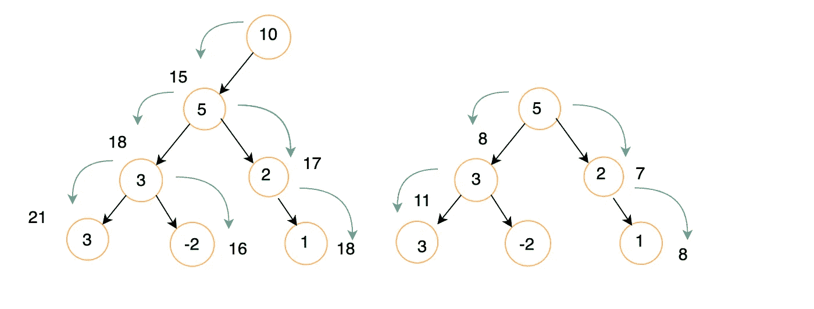
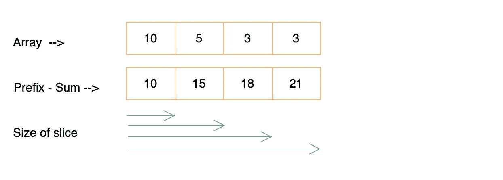
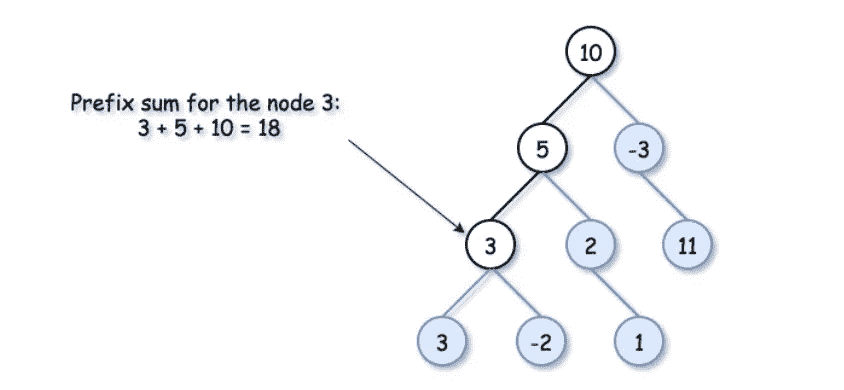
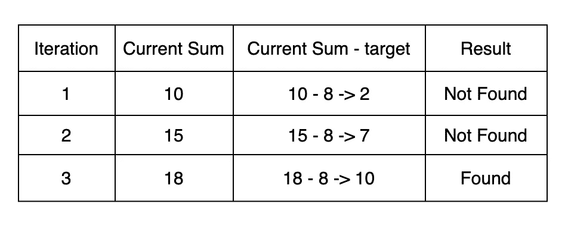

# 路径和 III — Leetcode 437

> 原文：<https://medium.com/geekculture/path-sum-iii-leetcode-437-588d8e56acac?source=collection_archive---------2----------------------->

你好，我自己 [Gauri wankhade](/@gauriwankhade) ，
软件开发人员，印度班加罗尔


image source — [https://leetcode.com/](https://leetcode.com/)

在本文中，我们将为下面的问题陈述解决 [leetcode 问题](https://leetcode.com/problems/path-sum-iii/)。

⚡ **问题陈述:-**

给定二叉树的`root`和一个整数`targetSum`，返回*路径的数量，其中沿着路径的值的总和等于* `targetSum`。

路径不需要在根或叶子处开始或结束，但是它必须向下(即，仅从父节点行进到子节点)。

示例:

```
**Input:** root = [10,5,-3,3,2,null,11,3,-2,null,1], targetSum = 8**Output:** 3**Explanation:** The paths that sum to 8 are shown below.
```


**约束:**

*   树中的节点数量在范围`[0, 1000]`内。
*   `-109 <= Node.val <= 109`
*   `-1000 <= targetSum <= 1000`

⚡ **思维过程:-**

为了找到总和等于 target 的所有路径，我们需要考虑从父节点到子节点的树中所有可能的路径。最基本的方法是将每个节点视为根节点，并计算来自该节点的路径的总和。

在下图中，我们将值为 10 的节点视为根节点，并计算了路径和。在探索路径时，如果我们遇到路径和等于目标，则递增计数器。

对所有节点重复相同的操作，并继续递增计数器。



⚡ **代码:-**

⚡ **复杂性分析:-**

*   时间复杂度:- O(N)其中 N 是树中节点的数量
*   空间复杂度:- O(N ),因为我们使用堆栈来存储每个节点。

我们已经讨论了给定问题的强力方法。在前面的解决方案中，有许多重复的操作，如下所示。



在上图中，我们可以看到在两种情况下遍历了相同的路径。类似的重复将发生在所有下层。

> 我们可以通过存储路径和来优化时间复杂度吗？

这里，我们使用前缀求和来优化我们的方法。[前缀求和](https://en.wikipedia.org/wiki/Prefix_sum)是一种通过增加切片大小来计算和存储切片中连续数字之和的技术。



我们可以使用 Prefix-sum 在二叉树中查找其值总和达到目标总和的节点。



image source- [https://leetcode.com/](https://leetcode.com/)

## 它是如何工作的？

考虑上面的例子，我们试图搜索其总和等于目标的节点，然后在前缀-总和映射中搜索某个值，其中当前总和与目标之间的差等于该值。

这就是证据

```
arr          = [10,  5,  3,  3]
prefix-sum   = [10, 15, 18, 21]
target       = 8In the third iteration we have found the subarray whose sum adds up to target.
```



⚡ **解决方案(优化):-**

第一步

从根节点开始遍历，将前缀和存储在某个地方，最好存储在 hashmap 中，因为它以恒定的时间进行搜索操作。

第二步

维护一个计数器来存储结果。在以下两种情况下增加计数器的值—

*   当前总和等于目标值
*   在前缀和映射中找到当前和与目标之间的差值

第三步

一旦任何节点的左右子树都被遍历，从前缀和数组中删除它们的和。这是为了避免无效路径(不遵循父到子流程)

***注:-***

*我们在前缀和映射中遇到(当前和-目标)的次数，这将是目前子阵列的数量，其和加起来达到目标。*

⚡ **代码:-**

⚡ **复杂性分析:-**

*   时间复杂度:- O(N)，其中 N 是树中节点的数量
*   空间复杂度:- O(N)，我们使用 hashmap 存储前缀和

如果你觉得这篇文章有用，请分享和喜欢。在 medium [Gauri wankhade](https://medium.com/u/6966187582ce?source=post_page-----588d8e56acac--------------------------------) 和 Twitter[Gauri _ infj](https://twitter.com/gauri_infj)上关注我。

谢谢！！！

快乐学习…