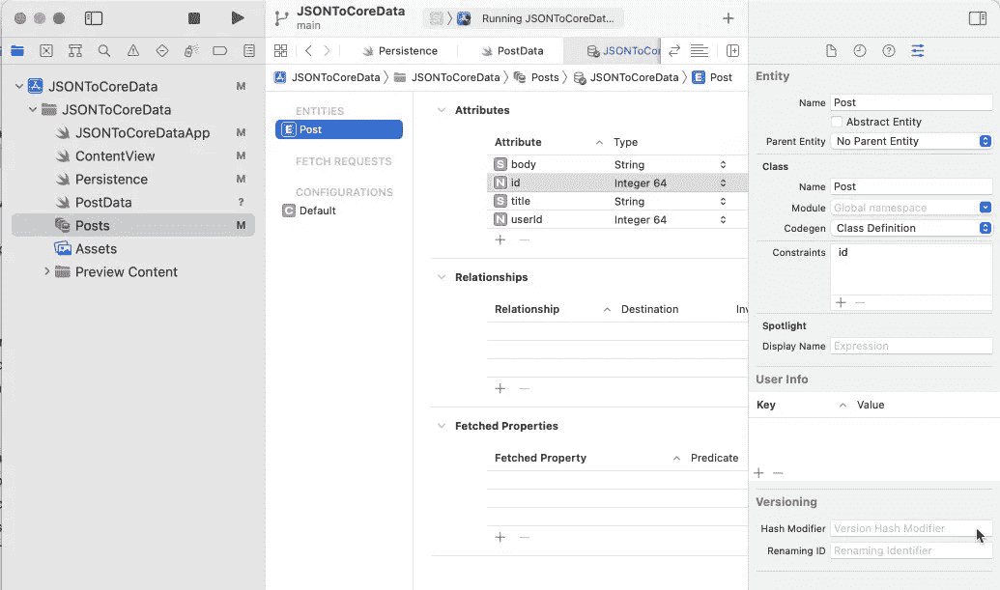

# 在 JSON 和 CoreData 之间铺路

> 原文：<https://medium.com/geekculture/paving-a-road-between-json-and-coredata-62d2f342b7e7?source=collection_archive---------9----------------------->

## 在 CoreData 中获取 JSON 响应的简短指南

Photo by [Joshua Sortino](https://unsplash.com/@sortino?utm_source=unsplash&utm_medium=referral&utm_content=creditCopyText) on [Unsplash](https://unsplash.com/s/photos/network?utm_source=unsplash&utm_medium=referral&utm_content=creditCopyText)

CoreData 是苹果在 iOS 上的数据持久性框架，经过了战斗考验，功能齐全，并与 CloudKit 和 SwiftUI 等其他框架集成，但学习曲线很陡。在这篇文章中，我将介绍将 JSON 数据从 web 请求转移到 CoreData 中的持久性存储所需的步骤。

# 介绍

CoreData 是一个庞大而复杂的框架，有许多可移动的部分。在本文中，我假设您至少对 CoreData 有一点经验。一些介绍文章和/或一两个入门项目就足够了。为了简洁(和我自己的理智)，我将放弃一步一步的项目教程，只触及重点。

我为本文编写了一个名为 JSONToCoreData 的示例项目。请随意从 GitHub 下载它，启动 XCode，然后跟着做。

# 概述

*   示例 JSON 和 CoreData 模型
*   解码 JSON
*   更新持久性存储
*   结论

## 示例 JSON 和 CoreData 模型

让我们从描述一些我们可以使用的玩具数据和 CoreData 中的一个关联模型开始。数据将来自 [{JSON}占位符](https://jsonplaceholder.typicode.com)，它提供了一个免费的假 API 和测试数据。他们提供的端点之一， */posts，*提供了如下所示的 JSON:

如您所见，JSON 包含一个帖子列表，每个帖子有四个属性。相应的 CoreData 模型如下所示:

Posts 数据模型包含一个实体`Post`，它和 JSON 一样有四个属性(body: String，id: Int64，title: String，userId: Int64)。几个快速注意事项:1 .在检查器(最右边)中，Codegen 参数正在自动构建名为`Post`的`NSManagedObject`的子类，我们可以从代码中的任何地方调用它，2。我在 Post 实体上添加了一个约束(针对 id 属性),这将确保在后续更新中不会有重复的 Post 被添加到数据存储中。

## 解码 JSON

Sow 如何从 JSON 到 CoreData？让我们首先创建一个符合可解码协议的名为 PostData 的结构。

我们可以使用`JSONDecoder().decode([PostData].self, from: data)`解码从`URLSession.dataTask`接收的数据。REST API 调用的完整函数可能类似于:

注意对于可解码的协议，基本数据类型如 Int 和 String 会自动为您处理，但是对于格式不良的 JSON 或更复杂的数据类型，您可能需要直接实现`init(from decoder: Decoder)`。有关解码的更多信息，您可以查看:

 [## 可编码-可解码完全指南

### 将 JSON 对象转换成数据模型的快速简单的方法

medium.com](/flawless-app-stories/complete-guide-to-codable-decodable-b1ff696da24f) 

在我们继续之前，我们还将为 PostData 添加一个扩展，并添加一个名为`propertyDictionary`的函数:

这个函数使用内省([镜像](https://developer.apple.com/documentation/swift/mirror))遍历`PostData`的属性，返回一个`[String: Any]`的字典。请记住这一点，因为我们稍后将使用它进行批量插入。

## 更新持久性存储

还记得我说过我们的 CoreData 模型自动为我们创建了一个名为`Post`的`NSManagedObject`子类吗？你可能会尝试遍历`[PostData]`并在完成后使用`Post(context: viewContext)`保存上下文来创建`NSManagedObjects`。这对于小的更新来说可能很好，但是对于大的数据转储来说，它会产生大量的开销，从而导致一些严重的性能问题。更好的技术是使用`NSBatchInsertRequest`直接与持久性存储(sqlite 数据库)交互。看看这个示例代码:

让我们仔细浏览一下这一部分。首先，我们创建一个在后台线程上运行的新`NSManagedObjectContext`(详见 repo)。我们将`.mergePolicy`设置为使用我们最新的数据覆盖数据存储中已经存在的任何重复帖子，并将`.undoManager`设置为`nil`。接下来，我们将数据分成几批，以进一步减少开销。(在这个例子中不是必需的，但是对于大型数据转储来说很方便)。然后我们使用`NSBatchInsertRequest`来插入我们的数据。还记得我们一分钟前在`PostData`上写的那个小扩展`.propertyDictionary`吗？我们用它来创建`dictionaryObjects`(类型为`[[String: Array]]`)，这是一个我们传递给`NSBatchInsertRequest`的 objects 参数的变量。在最后一步中，我们使用`privateContext.execute(batchInsertRequest)`提交批处理，在继续之前检查错误。就是这样！不需要调用`privateContext.save()`，因为更改已经直接应用到后备存储器。

# 结论

我希望这篇关于将 JSON 数据移入 CoreData 模型的简短教程对您有用。如果您想更深入地了解 SwiftUI 中持久性存储上的更改是如何更新的，您可以看看来自苹果的[加载和显示大型数据馈送](https://developer.apple.com/documentation/coredata/loading_and_displaying_a_large_data_feed)。这比我在这里展示的要复杂一些，但是为示例应用程序提供了基础。最后，如果你喜欢这篇文章，想要更多，点击绿色的关注按钮:)

# 资源

*   https://jsonplaceholder.typicode.com
*   [https://developer . apple . com/documentation/coredata/loading _ and _ displaying _ a _ large _ data _ feed](https://developer.apple.com/documentation/coredata/loading_and_displaying_a_large_data_feed)
*   [https://sqlite.org/index.html](https://sqlite.org/index.html)