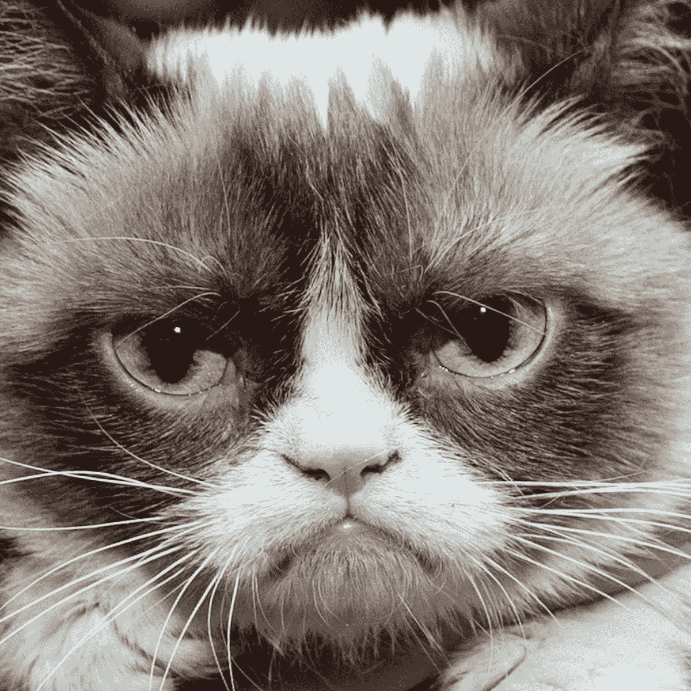

# Pawthereum:拯救动物的加密货币

> 原文：<https://medium.com/geekculture/pawthereum-the-cryptocurrency-that-is-saving-animals-e32119c1d8ef?source=collection_archive---------14----------------------->

Pawthereum 是由暴躁令牌的火热一端锻造而成的，由于已故暴躁猫的主人发出了一封[停止和终止信](https://viacasinos.com/blog/grumpy-did-a-dumpy/)，它以一种不礼貌的方式结束了。但是暴躁的开发团队不会因为一场诉讼就放弃一切。脾气暴躁的代币持有者可以将代币换成一种新铸造的加密货币，名为 [Pawthereum](https://pawthereum.com/) ，这种新代币已经大受欢迎。

Grumpy Cat (2012–2019)

对 Pawthereum 的投资经历了疯狂的几周，当然也不是一帆风顺的。一方面，在比特币失去市场之前，其价格已经从最初的价格上涨了令人瞠目的 20 倍，损失了大约 70%的价值；然而，它仍比起始位置高出约 7 倍。你可以想象，持有这样一种不稳定的资产不适合胆小的人，但这是与生俱来的。

是什么让 Pawthereum 与所有其他的 meme 硬币截然不同？首先，核心团队非常认真地对待这个项目；此外，他们拒绝 Pawthereum 作为一个迷因硬币的地位。虽然表面上看起来可能只是一枚迷因币，但 Pawthereum 并不是一个笑话。截至发稿时，低资本的 altcoin 已经向世界各地的动物收容所捐赠了 27.9 万美元，他们的捐赠在区块链得到了证明，以抵御怀疑论者。这些捐赠之所以成为可能，是因为这种货币有 4%的交易费。其中 2%捐给慈善机构，2%返还给 PAWTH 持有者作为回报(有点像利息)。“PAWTH”是货币名称(例如，PAWTH 对于 Pawthereum 就像 ETH 对于以太坊一样)。然而，社区最近决定消除反射，因此对于更大的集中式交换来说，这将是一个更有吸引力的提议。

为什么我对这个项目感到兴奋？好吧。。。实际上有很多原因。首先，它是*的新款*。截至发稿时，coin 才上线一个月，但团队已经花了好几个月来准备代码和构建社区。尽管最近价格有所调整，Pawthereum 社区的数量仍在稳步增长。

现在，我不得不承认，新奇本身没什么特别的。有很多项目出现的快，消失的也快，但是我真心实意地相信 Pawthereum 是不同的。在我看来，如果它能在相对较少的媒体上运行 10 美分，想象一下一旦 Pawthereum 变得更广为人知会发生什么。

很长一段时间以来，密码空间已经被一系列迷因狗填满。他们说每只狗都有它的好日子，但是猫呢？这让我想到了 Pawthereum 固有的可销售性。Pawthereum 有几个高调的支持者，包括《鲨鱼池》的中流砥柱凯文·奥利里，他已经在[写了多条关于这个崭露头角的硬币的推特](https://investorplace.com/2021/11/kevin-oleary-sparks-a-battle-of-cat-vs-doge-while-promoting-little-known-pawthereum-crypto/)。

另一件令人兴奋的事情是，核心团队是 doxxed(意味着他们的身份是众所周知的)，所以他们表面上是把他们的职业生涯押在 Pawthereum 项目的成功上。他们夜以继日地帮助改善 Pawthereum 及其与受益人的关系。此外，流动性被锁定，代码被审计，这意味着开发人员在项目建立之前不能收回任何个人资产，从而允许负责任的获利。他们已经公开声明，随着时间的推移，他们的意图是重新锁定流动性。

顾名思义，Pawthereum 是基于以太坊网络的。虽然有许多网站选项，但你可以使用 [Uniswap](https://uniswap.org/) 、 [Shibaswap](https://shibaswap.com/#/) ，甚至一个名为 [PawSwap](https://my.pawthereum.com/#/swap) 的专有交换协议来购买 Pawth。对你来说最便宜的方法可能会根据你住的地方，汽油价格，甚至你想花的钱的多少而有所不同。

如果你不确定，我强烈建议你通过 [Telegram](https://t.me/pawthereum) 与团队交流，因为他们很有帮助。开发团队整天在 Telegram 上闲荡，所以如果你有任何问题，通常不难联系到某人。这枚硬币还有一个活跃的 Reddit 社区和一系列其他社交媒体账户。此外，如果你是一个动物慈善机构的代表，想要接受捐赠，请发电子邮件给 rasmus@pawthereum.com。

**完全披露:**虽然我是 Pawthereum 的投资者，但我写这篇文章并没有得到报酬。我只是这个团队、这个项目和拯救动物的巨大支持者！我不是理财顾问，本文也不是理财建议。本文包含的信息是一般性的，**没有**考虑到您的个人情况。此外，如果你打算投资，我鼓励你阅读[白皮书](https://pawthereum.com/shared-files/2097/?Pawpaper.pdf)，并事先做好自己的研究。官网有[这里](https://pawthereum.com/)。