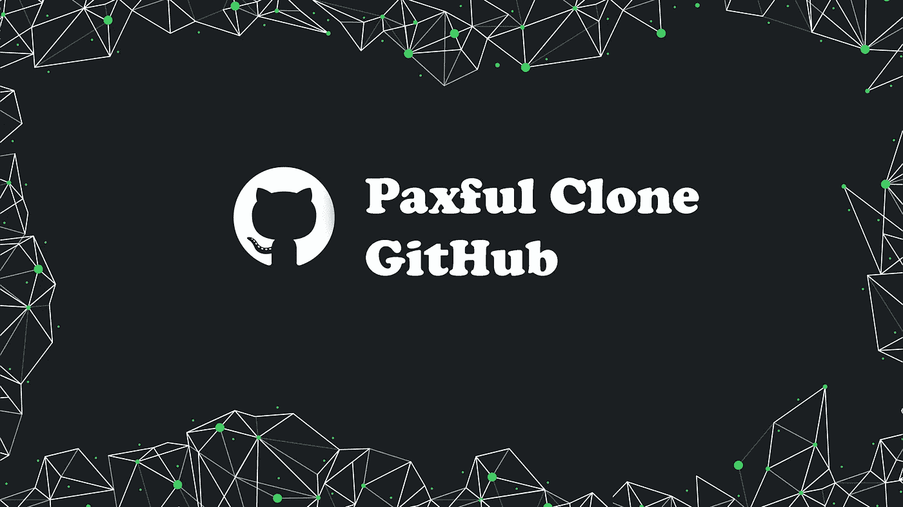
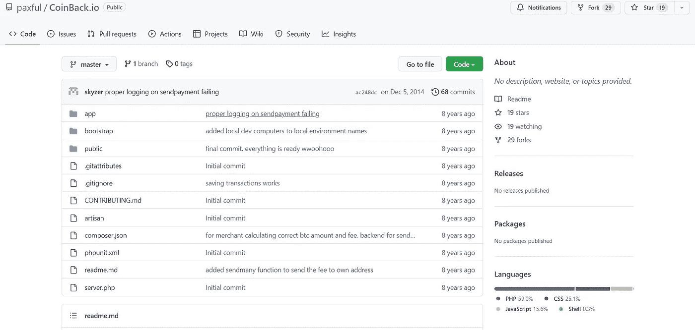

# Paxful 克隆 GitHub

> 原文：<https://medium.com/geekculture/paxful-clone-github-a65ccedfb3d5?source=collection_archive---------6----------------------->

# **简介**

你有没有想过创建自己的密码交易所，比如币安、Paxful、比特币基地或 Kucoin？创建一个密码交易所，让数百名交易者在你的平台上买卖密码，这个想法一直是一个热门的商业模式。

然而，所应用的技术要求超过了一个企业所能实现的。对于大多数初创公司来说，建立这种平台的成本、安全问题以及处理金融交易的要求都非常高。

不要担心，因为有一些更简单的方法。有一些加密交换网站脚本非常适合创建类似的网站(例如 Paxful Exchange ),其设计和功能灵感来自现有网站。使用这些脚本，您可以启动 Paxful exchange 平台，而无需进行任何新的开发。

在本文中，我们将回顾 Paxful 克隆 GitHub 和 [***Paxful 克隆脚本***](https://radindev.com/paxful-clone-script/) 。

在我们进入文章的主要部分之前，先简单解释一下 GitHub…

# **什么是 GitHub？**

GitHub 是软件项目的托管服务。这个名字来源于“GitHub”是 Git 分布式版本控制工具的一个实现。它是一个非常强大的平台，包含开源软件的各种实现，对定制非常有用，可以直接从 Git 命令行安装，也可以使用(例如在 **PHP** 中)解决方案来管理有组织的软件依赖关系。

像 GitHub 这样的软件提供在线代码存储和维护服务，所以:

在某个日期/时间备份一个版本；

在出现错误的情况下，能够恢复以前的版本；

有能力管理代码的各个分支，也就是他们正在工作的软件的稍微不同的或者定制的版本。

如果你是一名网站管理员、后端、前端或全栈开发人员，或者如果你只是喜欢在插件方面定期更新你的网站，等等，GitHub 可以成为你日常工作的基本组成部分。所有指出的活动都是被称为代码版本化的良好编程实践的一部分，尤其是在团队中工作时。

## **GitHub:** **什么是 Paxful 克隆？**

但是，通过正确使用 GitHub，您将能够访问其他命令行选项，例如:

下载程序的代码

根据你的喜好修改它，或者修复其中的任何错误

在 GitHub 中重新加载它，作为一个备选分支(显然，大多数时候，这是在发布它的程序员批准更改之后发生的)。

在这种情况下，下载操作被称为克隆，在 GitHub 中，您需要确定想要下载的存储库的路径。您可以查看包含整个应用程序的 GitHub 源代码。

# **什么是 Paxful 克隆 GitHub，它是如何工作的？**

通过这篇指南，我将向您介绍关于 **Paxful 克隆版 GitHub** 的话题，这款软件的版本控制软件可能是 GitHub 中最好的、功能最强的(基本使用也是免费的)。一旦您熟悉了命令界面，使用它来制作您辛苦获得的代码的共享副本(公开或私下)就不会很复杂，并且您将有机会制作不同临时版本的多个副本。

# **如何从 Github 下载 Paxful 克隆？**

Github 可能是最好的、提供最多的开源代码仓库之一:为了立即开始工作，它允许您使用这个命令行软件直接下载各种仓库的内容。对于那些懒惰的人来说，直接从浏览器下载 ZIP 格式的代码就足够了，因为他们已经启用下载选项有一段时间了。

## **Pax ful Clone Github 使用哪些编程语言？**

让我们来看看这个资源库，例如，[https://github.com/paxful/CoinBack.io](https://github.com/paxful/CoinBack.io)

PHP 59.0%

社会保障 25.1%

JavaScript 15.6%

外壳 0.3%

## **Paxful 克隆 Github:优点&缺点**

**好处**

详细的反馈跟踪

提供实用的合作工具

免费服务，虽然有付费版本

在存储库结构中快速搜索

大型社区，这使得互相帮助更加容易

易于与其他第三方服务集成

**弊端**

没有客户支持

包含恶意代码并且不可靠

事实上，默认情况下，您的所有项目都是公共的，其他人可以操作、修改、开发和编辑它们。

单个文件不能超过 100 MB(免费版)

存储库限制为 1 GB(对于免费版本)

没有集成的部署平台

现在，我想谈谈我们开发的 paxful 克隆脚本。

# **什么是 Paxful 克隆脚本开发？**

由 **Radin** 开发的 Paxful 是市场上最好的现成的 **Paxful 克隆脚本**之一，用于开发功能性加密交换。你可以定制你自己的密码交换来适应你的商业模式，类似于 [Paxful](https://paxful.com/) 。此外，我们的 Paxful 克隆软件以其用户友好和反应灵敏的设计提供了清晰的用户体验。网络和移动平台都符合 SEO 实践，有助于为平台带来更多流量。

**优点**

它具有成本效益，可以构建一个成熟的 Paxful exchange，而无需从头开始编码。肯定是独一无二的。只需一次性付款，您就可以获得源代码和最先进的技术。

**缺点**

如果您不为 **Paxful 克隆脚本开发**实现独特的定制，您可能会有另一个克隆平台无法为您的业务带来稳定的收入。因此，您还需要在脚本定制方面投入一些资金。

## **Pax ful 克隆脚本的特性**

多种货币支持

KYC/反洗钱验证

无限加密货币对

证券市场为调整供求或价格而进行的买卖

P2P 交易

托管驱动的交易

流动性 API

保证金交易

加密货币钱包集成

加盟计划

加密货币赌注

适用于 Android、IOS 和 web 的 Paxful 应用

令牌列表

## **结论**

在 crypto exchange 网站脚本的帮助下，企业和初创公司可以以合理的成本轻松建立自己的企业。使用 Paxful 网站克隆脚本，您可以创建一个全面的加密货币交易所，但是，您必须明白，使用克隆脚本创建在线加密交易所是一回事，创建具有独特功能和改进的增强版本是另一回事。

后者需要选择最佳的网站脚本来启动全功能的加密交换。所以在选择克隆脚本之前，一定要三思。但是如果你正在寻找一个免费的 Paxful 克隆脚本，我们建议你使用 Paxful 克隆 GitHub。虽然，GitHub 经常存在诸如缺乏安全功能、在启动你的项目时缺乏客户对你的支持等缺陷，并且还包含代码中的错误。