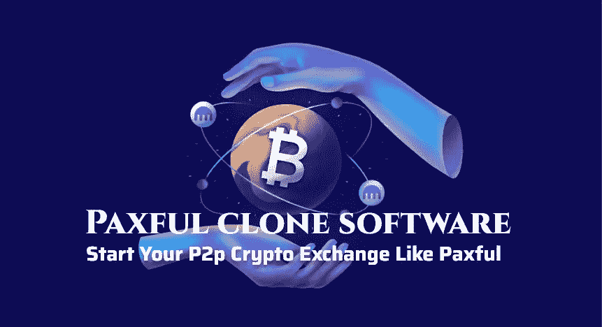

# Paxful 克隆软件，像 paxful 一样启动您的 p2p 加密交换

> 原文：<https://medium.com/geekculture/paxful-clone-software-to-start-your-p2p-crypto-exchange-like-paxful-590ba8213bfb?source=collection_archive---------11----------------------->

paxful clone software

Paxful 是一个著名的 p2p 加密交换平台，由创始人 Ray Youssef 和 Artur Schaback 于 2015 年创建。Paxful 采用比特币引入的点对点技术，旨在为所有人创建一个新的金融系统。

Paxful 拥有 300 多种支付方式，年收入 1 亿美元，交易额 50 亿美元，用户遍布 200 多个国家，已经成为一个家喻户晓的品牌。这使得 Paxful 成为有价值的加密交易商业模式，适合带着新想法进入市场的新企业家。

启动像 paxful 这样的 p2p 交易所将帮助你在短期内赚取巨额利润。此外，模仿流行的交易所将有助于你提高品牌价值和加密市场的收入。如果你是一个新兴的创业公司，计划开始 p2p 加密交换业务，那么让我们看看…

# **如何启动像 Paxful 这样的 P2P 加密交易所？**

在当前的熊市中，开办一家 p2p 加密交易所是个不错的主意。随着你的潜在竞争对手在熊市的压力下倒下，你可以填补竞争对手留下的空间。在充满不确定性和波动性的熊市中，聘请专家并不是一件容易的事情，积累人才是再自然不过的事情。

但是，最重要的是，现在开办交易所比以往任何时候都容易。为什么？因为可以使用 [**Paxful 克隆软件**](https://www.coinsclone.com/paxful-clone-script/?utm_source=07paxful1&utm_medium=gk&utm_campaign=MSP) 。Paxful 克隆软件将允许有抱负的企业家在创业时跳过开发阶段。克隆脚本将重新创建一个完全相同的在线交换，就像 Paxful 一样，具有所有的功能和特性。

使用 Paxful 克隆软件，您只需将它托管在一个域名上，并在一个有专业营销团队的网站上发布。

# 什么是 Paxful 克隆软件？

Paxful 克隆软件是运行 Paxful 平台的软件代码的精确复制品。由于克隆脚本是从现有的交易所复制的，它将具有网站的所有功能和特点。

此外，它的用户界面可以定制、更改和裁剪，以适应买家的口味。它将有最好的安全性和用户生物特征的管理加密。并且可以通过向当前市场添加更多独特的附加功能来进一步开发和改进它。

使用 Paxful 克隆脚本，创业公司可以推出 P2P 加密交易所，作为金融科技的替代金融服务。

## Paxful 克隆脚本的特性

开发加密交换的挑战性任务是结合区块链技术。Paxful 克隆脚本具有 Paxful 站点的所有内置特性，等等。

例如，让我列出几个特性来给你一个思路。

*   管理仪表板
*   用户仪表板
*   供应商仪表板
*   菲亚特钱包集成
*   附属仪表板
*   加密图表
*   评论和评级

Paxful 克隆脚本的安全特性是在线平台中较好的安全性之一；必须提供。由于区块链技术是实验性的，安全和保障是一个优先事项。

*   KYC/反洗钱
*   双因素认证
*   监狱登录守卫
*   SSL 集成
*   DDoS 迁移
*   CSRF 一体化
*   端到端加密

这里列出了 Paxful 克隆脚本必须提供的一些功能。

# 使用 Paxful 克隆脚本的优势

让我们来看看使用 Paxful clone 脚本给有兴趣开始 P2P 加密交换的企业家带来了什么好处。

**体验** —使用克隆脚本意味着将 Paxful 的体验加入到你的冒险中。此外，有了 Paxful 的简化软件，您可以减少试错的需要。而这反过来会帮你节省时间。

**定制** —定制是使用克隆脚本的另一个重要方面。它将让买家拥有他们心目中设想的平台。这将允许企业家创造独特的愿景。

**易于管理** —作为一个 P2P 加密交易所的管理员，克隆脚本是一个福音。它将允许管理者仅用骨干员工来运行平台。这种低维护成本反过来又会节省开支成本和时间。

**资本最大化** —说到成本，使用 Paxful 克隆脚本是最理想的投资方式。使用 Paxful 克隆软件意味着:它需要更少的启动资金和很少的运营支出。

**利用市场法规** —市场法规通常是企业面临的一个问题，加密交易业务也不例外。但有了 P2P 加密交易所，就可以避开监管，因为该公司不属于金融科技。

这些是为您的业务使用 Paxful 克隆脚本的一些优势。使用 Paxful 克隆脚本还有很多好处。

# **开发一个像 Paxful 这样的 P2P 密码交易所要多少钱？**

一般来说，任何建立点对点加密交换的创业公司或组织都是昂贵的。专业知识是不可避免的支出。开发是一项团队工作，你需要团队中的专业人士。毕竟，你需要熟练的专家来构建任何数字平台。专家的服务并不便宜。

许可经营是另一个不常谈论的话题。国际组织正致力于对加密资产和稳定密码制定全面的加密法规。广泛的加密法规很可能已经出现。例如，在美国，许可费用因州和联邦法律而异。平均而言，一个加密平台的许可费高达 10 万美元。

时间是另一个被曲解的因素。由于最近在加密领域的创新，它不再像以前那样复杂。因此，开发阶段现在只需要 12 个月。

考虑到所有这些，在 2022 年创建一个 p2p 加密交易所可能需要超过 12 个月的 20 万美元。但是，克隆脚本产品根据其功能有固定的价格限制。平均而言，一个包含所有标准模块的 Paxful 克隆软件的价格上限为 8000 美元至 14000 美元。根据客户要求的定制，价格可能会有所不同。

# 哪里可以找到最好的 Paxful 克隆软件？

找到 Paxful 克隆软件并不难。当你在谷歌或其他搜索引擎中搜索时，会出现十几个网站。但是，并不是所有的脚本提供者都像他们看起来那样；当你偶然接触到一个没有经验的服务提供商时，这是一个风险。

为了降低这种风险，您应该联系市场上知名的 paxful 克隆脚本提供商。审查是降低风险的一种方式。正面评论的数量意味着更多的市场存在。客户服务是剔除不太可能的潜在客户的另一种方式。但是确定一个合法的 paxful 克隆脚本的最好方法是使用演示程序并感受一下它。没有什么比亲身体验产品更好的了。

[**crypto exchange 克隆脚本**](https://www.coinsclone.com?utm_source=07paxful&utm_medium=gk&utm_campaign=MSP) 服务提供商必须拥有一个软件工程师、UI 专家和区块链开发者团队。最后，你雇佣的公司不是一次性的服务；他们将是你的技术支持伙伴，直到你建立自己的密码交换平台。

在这里获得即时演示> > > [**Paxful 克隆软件**](https://www.coinsclone.com/paxful-clone-script/?utm_source=07paxful&utm_medium=gk&utm_campaign=MSP)