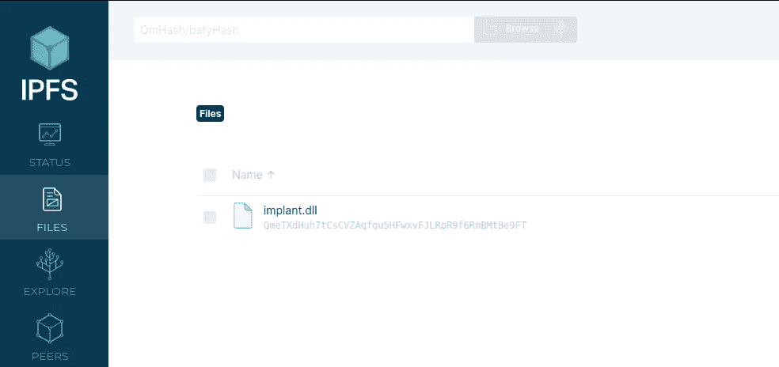

# IPFS 上空的有效载荷交付

> 原文：<https://medium.com/geekculture/payload-delivery-over-ipfs-30771c6c0db?source=collection_archive---------5----------------------->

## 分布式弹性有效载荷托管

H ello，🌎！星际文件系统(Interplanetary File System，简称 IPFS)是一种点对点的分布式文件系统，它可以确保没有任何内容托管在一台服务器上，在那里它可以被审查或故意变得不可用。IPFS 使用散列法(如果你想了解更多关于散列法的知识，请查看我的第一个中型博客，其中讨论了散列法)来定位任何给定的文件…