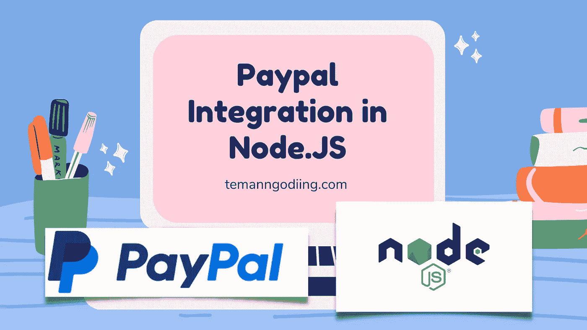
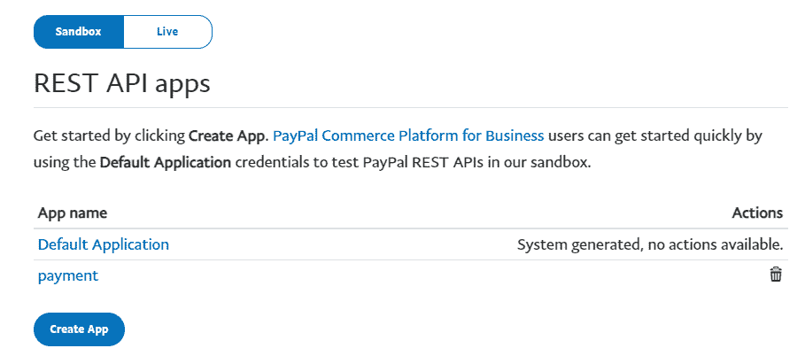
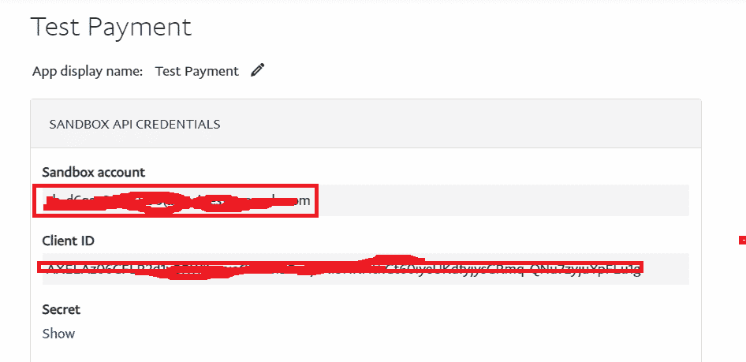
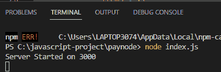
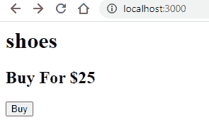
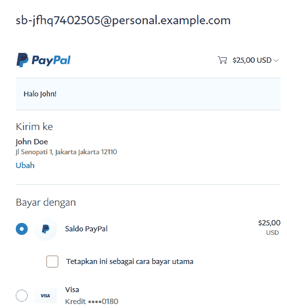

# Paypal 在 Node 中的集成。射流研究…

> 原文：<https://medium.com/geekculture/paypal-integration-in-node-js-e47bd8de4afb?source=collection_archive---------1----------------------->



你好，朋友们，我祝你们身体健康，永远成功。这次我们仍然在讨论如何整合 Paypal，但我们将使用 Node.jS 来实现它。

Paypal 是一种国际支付方式，适用于大多数支持在线转账的国家。Paypal 提供了一种更快捷、更安全的转账方式。由于其受欢迎程度，大多数电子商务企业使用贝宝向客户收款。

在本文中，我们将 Paypal 支付网关集成到 node.JS 中。这是一个电子商务网站，有助于使用 Laravel 框架作为后端技术。我们将从开始一步一步地经历它。

请遵循以下步骤:

1.  创建新项目
2.  使用 npm 为 Paypal 支付网关安装软件包
3.  创建 PayPal 凭据。基金账户
4.  创建 JS 文件
5.  签出视图
6.  支付处理人员
7.  运行应用程序

下面我们只讨论教程。也可以在这里阅读其他教程:

[Paypal 支付网关与 Laravel 的集成](https://temanngoding.com/en/paypal-payment-gateway-integration-with-laravel/)

[Laravel 中的错误处理](https://temanngoding.com/en/error-handling-in-laravel/)

[用 Laravel 创建评分和评论](https://temanngoding.com/en/creating-ratings-and-reviews-with-laravel/)

# 1.创建新项目

使用下面的命令创建一个新项目。

```
$ mkdir paynode
$ cd paynode
$ npm install
$ npm init
```

npm init 命令将 package.json 文件添加到我们的 paywave 目录中，使其成为 Node.js 应用程序。

# 2.使用 npm 为 Paypal 支付网关安装软件包

运行下面的命令将 express 和 paypal-rest-sdk 安装到我们的项目中。

```
$ npm i express
$ npm i paypal-rest-sdk
```

# 3.创建 PayPal 凭据

安装 paypal 包后，我们需要 paypal 集成的 client_id 和 secret_key，因此我们需要进入 paypal 开发者模式，并为其创建新的沙盒帐户。登录 paypal 后，您需要获得如下所示的客户端 id 和密钥。在获得客户端 id 和密钥之前，我们需要创建应用程序。所以，检查下面的截图，建立一个应用程序。登录[开发者仪表板](https://www.paypal.com/signin?returnUri=https%3A%2F%2Fdeveloper.paypal.com%2Fdeveloper%2Fapplications)。

单击创建应用程序。



填写创建的应用程序的名称。


然后，您将获得将在应用程序中使用的客户端密钥和秘密密钥。



# 4.创建 JS 文件

*   在 paynode 目录中，创建一个名为 index.js 的新文件
*   将以下代码添加到上面创建的 index.js 文件中。

```
const express = require('express');
const paypal = require('paypal-rest-sdk');paypal.configure({
  'mode': 'sandbox', //sandbox or live
  'client_id': '####yourclientid######',
  'client_secret': '####yourclientsecret#####'
});const app = express();app.get('/', (req, res) => res.sendFile(__dirname + "/index.html")); app.listen(PORT, () => console.log(`Server Started on ${PORT}`));
```

*   使用 paypal 调整 client_id 和 client_screet。

# 5.签出视图

*   在 paynode 目录中，创建一个名为 index.html 的文件。
*   将下面的代码片段添加到 index.html。

```
<!DOCTYPE html>
<html lang="en">
<head>
  <meta charset="UTF-8">
  <meta name="viewport" content="width=device-width, initial-scale=1.0">
  <meta http-equiv="X-UA-Compatible" content="ie=edge">
  <title>PayPal Node App</title>
</head>
<body>
  <h1> Shoes </h1>
  <h2>Buy For $25</h2>
  <form action="/pay" method="post">
    <input type="submit" value="Buy">
  </form>
</body>
</html>
```

*   在 html 代码中，我们只是添加了将用于结帐的路线。

# 6.支付处理人员

将以下代码添加到 index.js 文件中。

```
app.post('/pay', (req, res) => {
    const create_payment_json = {
      "intent": "sale",
      "payer": {
          "payment_method": "paypal"
      },
      "redirect_urls": {
          "return_url": "http://localhost:3000/success",
          "cancel_url": "http://localhost:3000/cancel"
      },
      "transactions": [{
          "item_list": {
              "items": [{
                  "name": "Red Sox Hat",
                  "sku": "001",
                  "price": "25.00",
                  "currency": "USD",
                  "quantity": 1
              }]
          },
          "amount": {
              "currency": "USD",
              "total": "25.00"
          },
          "description": "Hat for the best team ever"
      }]
  }; app.get('/success', (req, res) => {
    const payerId = req.query.PayerID;
    const paymentId = req.query.paymentId;

    const execute_payment_json = {
      "payer_id": payerId,
      "transactions": [{
          "amount": {
              "currency": "USD",
              "total": "25.00"
          }
      }]
    };

    paypal.payment.execute(paymentId, execute_payment_json, function (error, payment) {
      if (error) {
          console.log(error.response);
          throw error;
      } else {
          console.log(JSON.stringify(payment));
          res.send('Success');
      }
  });
  }); paypal.payment.create(create_payment_json, function (error, payment) {
        if (error) {
            throw error;
        } else {
            for(let i = 0;i < payment.links.length;i++){
              if(payment.links[i].rel === 'approval_url'){
                res.redirect(payment.links[i].href);
              }
            }
        }
      });

      }); app.get('/cancel', (req, res) => res.send('Cancelled'));
```

# 7.运行应用程序

在您的目录中编写代码节点 index.js。



*   在浏览器中运行您的应用程序，结果如下所示。



*   结账流程



您已经能够创建一个简单的应用程序，在 Node.JS 中集成 Paypal。

这就是我这次可以传达的教程，希望有用。

谢了。