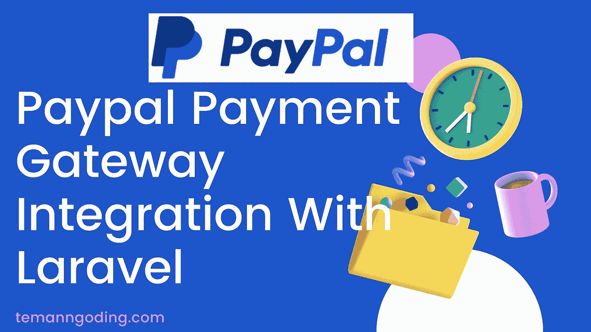
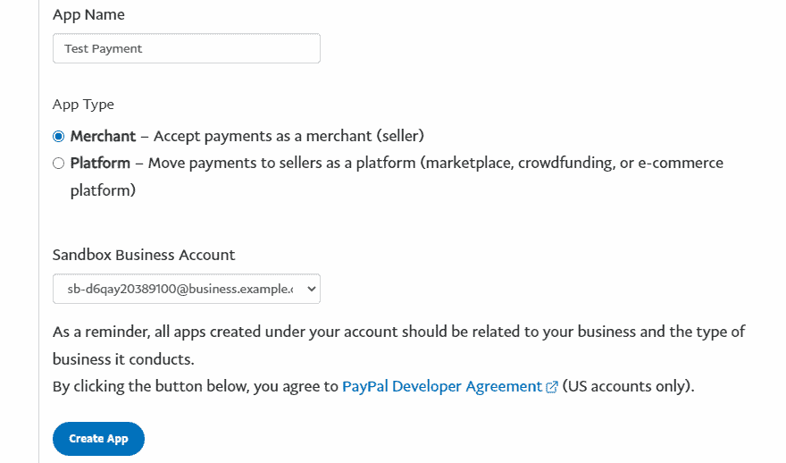
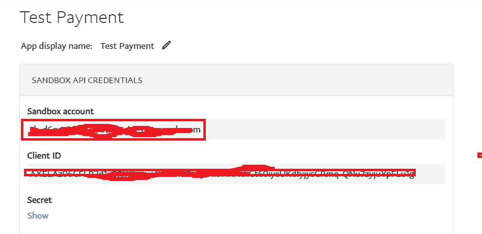
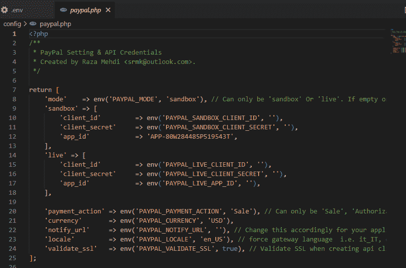
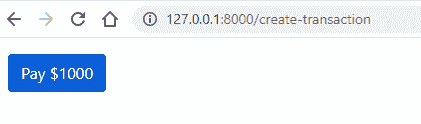
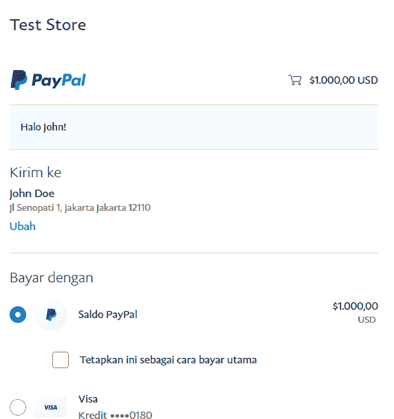

# Paypal 支付网关与 Laravel 的集成

> 原文：<https://medium.com/geekculture/paypal-payment-gateway-integration-with-laravel-ebebc7ccf470?source=collection_archive---------0----------------------->



你好，朋友们，我祝你们身体健康，永远成功。这次我们将讨论如何连接 Paypal 和 Laravel。这个教程对那些有销售网站的人来说非常有用。

Paypal 是一种国际支付方式，适用于大多数支持在线转账的国家。Paypal 提供了一种更快捷、更安全的转账方式。由于其受欢迎程度，大多数电子商务企业使用贝宝向客户收款。

在本文中，我们将把 Paypal 支付网关集成到一个 Laravel 应用程序中。这是一个电子商务网站，帮助使用 Laravel 框架作为后端技术。我们将从开始一步一步地经历它。

请遵循以下步骤:

1.  创建新项目
2.  使用 Composer 为 Paypal 支付网关安装软件包
3.  创建 PayPal 凭据。基金账户
4.  配置包
5.  创建路线
6.  创建刀片文件以创建付款按钮
7.  运行应用程序

下面我们只讨论教程。也可以在这里阅读其他教程:

[Laravel 中的错误处理](https://temanngoding.com/en/error-handling-in-laravel/)

[拉勒维尔教程~拉勒维尔口才关系](https://temanngoding.com/en/laravel-tutorial-laravel-eloquent-relationships/)

[用 Laravel 创建评分和评论](https://temanngoding.com/en/creating-ratings-and-reviews-with-laravel/)

[使用 Laravel 创建评分和评论](https://temanngoding.com/en/creating-ratings-and-reviews-with-laravel/)

# 1.创建新项目

使用下面的命令创建一个新项目。

```
composer create-project laravel/laravel paypal --prefer-dist
```

创建新项目后，转到您的项目目录。

```
cd paypal
```

# 2.使用 Composer 为 Paypal 支付网关安装软件包

运行以下命令。

我们将为 laravel 6，7，& 8 安装 [Laravel-Paypal](https://srmklive.github.io/laravel-paypal/)

```
composer require srmklive/paypal:~3.0
```

# 3.创建 PayPal 凭据

安装 paypal 包后，我们需要 paypal 集成的 client_id 和 secret_key，因此我们需要进入 paypal 开发者模式，并为其创建新的沙盒帐户。登录 paypal 后，您需要获得如下所示的客户端 id 和密钥。在获得客户端 id 和密钥之前，我们需要创建应用程序。所以，检查下面的截图，建立一个应用程序。登录到[开发者仪表板。](https://www.paypal.com/signin?returnUri=https%3A%2F%2Fdeveloper.paypal.com%2Fdeveloper%2Fapplications)

单击创建应用程序。


填写创建的应用程序的名称。



然后，您将获得将在应用程序中使用的客户端密钥和秘密密钥。



# 4.配置包

包安装完成后，您打开项目并添加您在。环境文件。

```
PAYPAL_MODE=sandbox
#Paypal sandbox credential
PAYPAL_SANDBOX_CLIENT_ID=AXELAz06GFLR.............................QNu7zyjuYpFLu1g
PAYPAL_SANDBOX_CLIENT_SECRET=EA9dinW1.............................PUzgVQCz7fK4tqe1-jLZCyHzZ0tDTRAx-6qJdIY933Q
```

如果您想自定义软件包的默认配置选项，请运行下面的 vendor:publish 命令。

```
php artisan vendor:publish --provider "Srmklive\PayPal\Providers\PayPalServiceProvider"
```


这将创建一个配置文件 **config/paypal.php** ，详细信息如下，您可以对其进行修改。



# 5.创建路线

现在我们需要创建一个应用程序路由，我们将在其上测试应用程序测试事务。打开 route/web.php 应用程序路由文件，并添加以下新路由。

```
<?phpuse Illuminate\Support\Facades\Route;
use App\Http\Controllers\PayPalController;Route::get('create-transaction', [PayPalController::*class*, 'createTransaction'])->name('createTransaction');
Route::get('process-transaction', [PayPalController::*class*, 'processTransaction'])->name('processTransaction');
Route::get('success-transaction', [PayPalController::*class*, 'successTransaction'])->name('successTransaction');
Route::get('cancel-transaction', [PayPalController::*class*, 'cancelTransaction'])->name('cancelTransaction');
```

*   创建控制器

在我们创建一条路线之后，接下来我们使用 php artisan 创建一个控制器。

```
php artisan make:controller PayPalController
```

我们在目录`**app/Http/Controllers/PayPalController.php**`中已经有了一个控制器。打开它并添加下面的代码。

```
<?phpnamespace App\Http\Controllers;use Illuminate\Http\Request;
use Srmklive\PayPal\Services\PayPal as PayPalClient;class PayPalController extends Controller
{
    /**
     * create transaction.
     *
     * @return \Illuminate\Http\Response
     */
    public function createTransaction()
    {
        return view('transaction');
    } /**
     * process transaction.
     *
     * @return \Illuminate\Http\Response
     */
    public function processTransaction(Request $request)
    {
        $provider = new PayPalClient;
        $provider->setApiCredentials(config('paypal'));
        $paypalToken = $provider->getAccessToken(); $response = $provider->createOrder([
            "intent" => "CAPTURE",
            "application_context" => [
                "return_url" => route('successTransaction'),
                "cancel_url" => route('cancelTransaction'),
            ],
            "purchase_units" => [
                0 => [
                    "amount" => [
                        "currency_code" => "USD",
                        "value" => "1000.00"
                    ]
                ]
            ]
        ]); if (isset($response['id']) && $response['id'] != null) { // redirect to approve href
            foreach ($response['links'] as $links) {
                if ($links['rel'] == 'approve') {
                    return redirect()->away($links['href']);
                }
            } return redirect()
                ->route('createTransaction')
                ->with('error', 'Something went wrong.'); } else {
            return redirect()
                ->route('createTransaction')
                ->with('error', $response['message'] ?? 'Something went wrong.');
        }
    } /**
     * success transaction.
     *
     * @return \Illuminate\Http\Response
     */
    public function successTransaction(Request $request)
    {
        $provider = new PayPalClient;
        $provider->setApiCredentials(config('paypal'));
        $provider->getAccessToken();
        $response = $provider->capturePaymentOrder($request['token']); if (isset($response['status']) && $response['status'] == 'COMPLETED') {
            return redirect()
                ->route('createTransaction')
                ->with('success', 'Transaction complete.');
        } else {
            return redirect()
                ->route('createTransaction')
                ->with('error', $response['message'] ?? 'Something went wrong.');
        }
    } /**
     * cancel transaction.
     *
     * @return \Illuminate\Http\Response
     */
    public function cancelTransaction(Request $request)
    {
        return redirect()
            ->route('createTransaction')
            ->with('error', $response['message'] ?? 'You have canceled the transaction.');
    }
}
```

# 6.创建刀片文件以创建付款按钮

我们将创建一个视图来指导事务处理。创建刀片视图**resources/views/transaction . blade . PHP**文件，并在其中添加以下代码。

# 7.运行应用程序

Paypal 整合完成。现在我们需要做一笔交易。使用下面的 Artisan 命令运行 Laravel 服务器。

```
php artisan serve
```

用下面的网址打开它。要使用 PayPal 帐户支付，您需要创建一个帐户[创建沙盒帐户](https://developer.paypal.com/developer/accounts/)。

```
[http://localhost:8000/create-transaction](http://localhost:8000/create-transaction)
```



点击支付，将显示支付表单。



因此，我提供的这个教程，希望是有用的。

谢了。