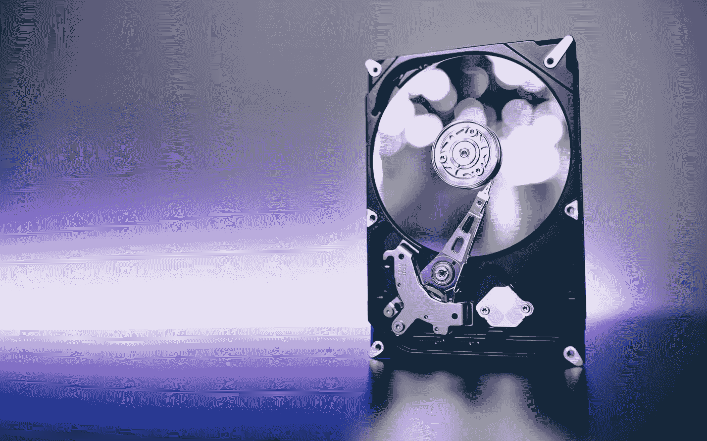

# PC 制造商们，就让微软做一次好事吧

> 原文：<https://medium.com/geekculture/pc-builders-just-let-microsoft-do-good-for-once-702518ff3410?source=collection_archive---------2----------------------->

## 转向纯固态硬盘将是 Windows 的一个重大变化，它已经在进行中，而且很重要——下面是原因

According to reports Microsoft wants people to stop using hard disks as boot drives for Windows 11 and switch exclusively to SSDs. In 2022 terms, that’s fair. (Image: Freepic Diller, Freepik)

这是几天来一直不为人知的故事之一，但可能会被证明比大多数科技公司这些天想要发布的“官方新闻”重要得多。所以…