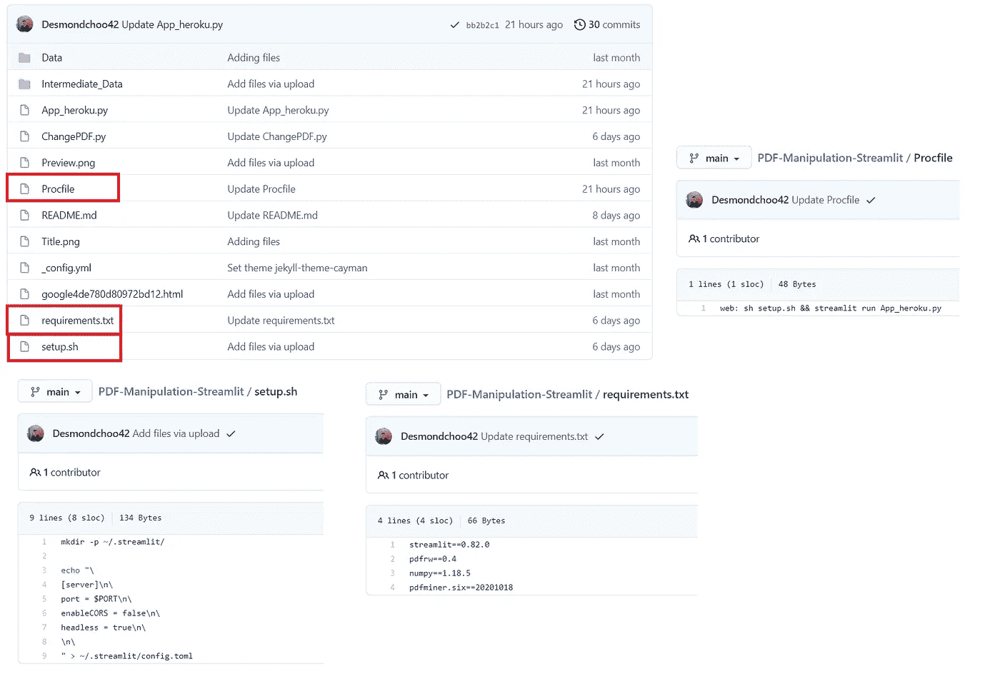
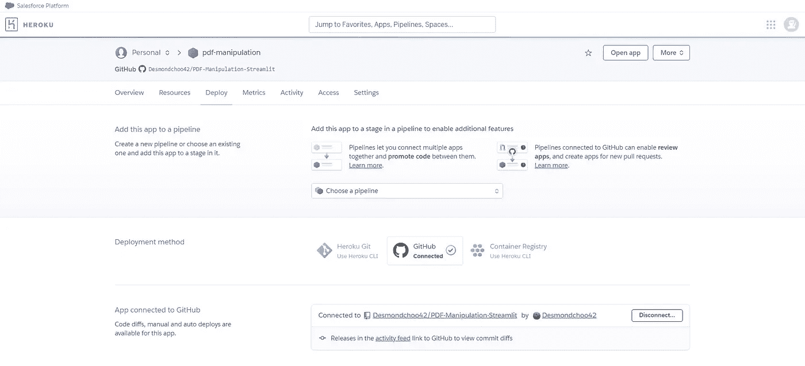
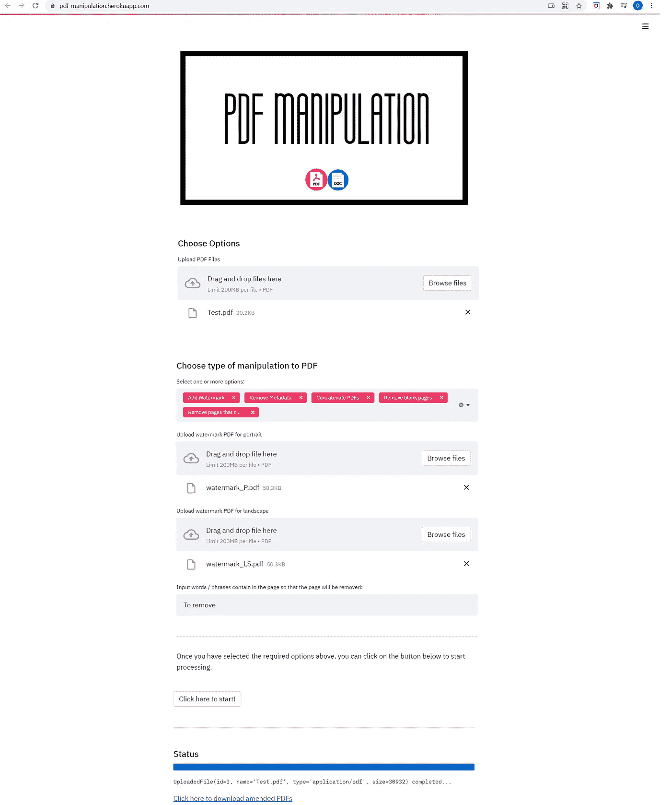

# PDF 操作应用程序第 3 部分—在 Heroku 上部署应用程序并将结果输出为 zip 文件

> 原文：<https://medium.com/geekculture/pdf-manipulation-application-part-3-deploying-the-application-on-heroku-and-output-result-as-zip-531886732f0e?source=collection_archive---------18----------------------->

本文是我创建的 PDF 操作应用程序的最后一部分。在本文中，我将介绍我是如何在 Heroku 上部署这个应用程序的，以及在这个过程中我所面临的挑战。


# 介绍

在根据我的需求成功地创建和增强了 PDF 操纵应用程序之后，理想的下一步是能够以一种其他人能够使用它的方式部署它，而不需要安装必要的 python 包并在 python 上运行它以便他们能够访问它。

我不完全理解在 http 或虚拟机上托管应用程序的要求和后端基础设施。但是我知道我可以很容易地在 Heroku 上部署这个应用程序(很确定还有其他一些平台/服务也提供这个功能)。

当然这个过程并不全是阳光和彩虹。在这个过程中，我遇到了一些挑战，导致我需要找到一个解决方案，或者对我的初始应用程序进行妥协，以便我能够在 Heroku 上部署它。

因此，在本文中，我将讲述我是如何在 Heroku 上部署我的应用程序的，以及我是如何应对这些挑战的。

如果你有兴趣知道在 Heroku 上的最终产品之前，我对 python streamlit 应用程序做了哪些要求和增强，你可以参考[第 1 部分](/codex/pdf-manipulation-application-using-streamlit-and-pdfrw-917a1f89bf5a)和[第 2 部分](https://choodesmond42.medium.com/pdf-manipulation-how-to-remove-unwanted-pages-using-pdfminer-56ba93bdd7d1)。

# 入门指南

为了在 Heroku 上部署我的 streamlit web 应用程序，我碰巧看到了这个数据教授的 youtube 视频。他建议我们可以直接在 Heroku 上部署 Github 中的脚本，尽管我们需要添加一些文件。这引起了我的兴趣，因为它听起来很简单。

## Github 的附加文件

有三个额外的文件需要添加到 Github 存储库中——(1)setup . sh，(2) requirements.txt 和(3) Procfile。

*   **setup.sh** :无需修改。
*   **requirements.txt** :您需要指定您需要 Heroku 安装的特定版本，以便运行您的应用程序。您可以通过在 cmd 上运行命令“pip freeze”来轻松检查这一点。
*   **Procfile** :你可以直接复制粘贴 synatx，并更改。py”脚本添加到您希望 Heroku 部署的应用程序中。

更多细节见下图。



**Additional files needed in order to deploy on Heroku**

## 赫罗库

注册或登录您的帐户后，在左上角单击“新建”，然后单击“创建新应用程序”。给你的应用取一个合适的名字，你就可以点击“创建应用”而不用改变地区。

完成后，您将自动导航到“部署”页面，在“部署方法”下，单击“Github”。将你的 Github 账号连接到 Heroku，然后选择正确的库，输入你的包名。完成后，点击“搜索”，如果正确，点击“连接”。如果你做了所有这些，你应该会看到下图。



**Github and package connected on Heroku**

确保要部署的分支是“手动部署”下的“主”分支，然后单击“部署分支”。

如果您是第一次部署，这将需要一些时间，因为 Heroku 会在部署应用程序之前尝试安装所有必需的包。您将能够看到描述状态的日志以及错误消息(如果有的话)。一旦部署完毕，将会有一个按钮将您引导到您的应用程序。


**Deployment successful on Heroku**

# 挑战

正如你从上面读到的，这个过程非常简单明了。然而，在尝试让我的完整应用程序在 Heroku 上运行时，我确实面临了一些挑战。

## Comtypes

我的完整应用程序有一个功能，用户可以根据他们的输入在处理之前将他们的 doc/docx 文件转换成 pdf。然而，要做到这一点，需要一个 python 包调用“Comtypes”。

然而，这个软件包只能在 Windows 平台上运行，即使安装成功，Heroku 似乎也无法运行。没有简单的方法可以解决这个问题，因为我想保持我的脚本基于 PDFrw 和 PDFminer。因此，我从最初的包中删除了这个功能。

## 输出处理后的 pdf

我面临的另一个挑战是，Heroku 或虚拟机(VM)无法访问用户的目录。我想从安全的角度来看这是有道理的，但这也意味着即使 Heroku 上的应用程序显示状态为“成功”,将处理后的 pdf 直接输出到文件夹的过程也不会工作。

我能想到的变通解决方案是创建一个下载链接供用户点击下载处理过的 pdf，但是如果有多个 pdf，这就不理想了，因为这会创建多个下载链接。因此，我认为压缩这些 pdf 文件并给用户一个下载链接是最好的解决方案。

在我决定采用这种方法后，是时候使用这些解决方案并清理我的应用程序代码了。

# 实施变更

如上所述，我的解决方案是将所有处理过的 pdf 文件压缩在一起，为此，我仍然打算先将我的 pdf 文件输出到一个文件夹中，然后再将其读入一个 zip 文件。该文件夹将在虚拟机中，因此用户将无法在他们的目录中看到它，但我仍然可以读取它。

至此，我用下面列出的输出路径代替了原来的过程。这样，它会在虚拟机中查找工作目录，并将其保存在目标文件夹中。

```
## If user is concatenating the PDFs
writer.write(os.getcwd()+”/Intermediate_Data/”+”Annex “+str(i+1)+”.pdf”)## If user wants to concatenate the PDFs
writer.write(os.getcwd()+"/Intermediate_Data/Annex.pdf")
```

在我讨论 zip 文件之前，我们需要先做一个重要的步骤，那就是确保脚本开始时文件夹(“Intermediate_Data”)是空的，这样就不会有任何不需要的旧 pdf 文件输出到 zip 文件中。

```
def find_ext(dr, ext): 
  return glob(path.join(dr,”*.{}”.format(ext)))## Making sure that all residue annex files were deleted in the intermediate folder filepath_todel = find_ext(os.getcwd()+"/Intermediate_Data","pdf")    
for file in filepath_todel:        
  os.remove(file)
```

一旦完成，我将需要在我的脚本中创建一个下载的 zip 文件。您不需要任何新的 zip 文件包，只需使用已经存在于 python 中的 zip file 包。但是，为了执行下面的代码，您将需要另一个包调用 base64。

最后，我们使用 streamlit 的 markdown 使链接“可下载”。

```
from zipfile import ZipFile
import base64## Creating a zipfile for download     
zipObj = ZipFile("download.zip", "w") # Add multiple files to the zip    
filepath = find_ext(os.getcwd()+"/Intermediate_Data","pdf")    
for file in filepath:        
  zipObj.write(file) # close the Zip File    
zipObj.close() ZipfileDotZip = "download.zip" with open(ZipfileDotZip, "rb") as f:        
  bytes = f.read()        
  b64 = base64.b64encode(bytes).decode()        
  href = f"<a href=\"data:file/zip;base64,{b64}\" download='{ZipfileDotZip}.zip'>\ Click here to download amended PDFs\        </a>" st.markdown(href, unsafe_allow_html=True)
```

# 试映

如果你想试用这个应用程序，你可以在这里访问它[。否则，下面是最终产品的片段。](https://pdf-manipulation.herokuapp.com/)



**Preview of the application on Heroku**

# 最终想法

虽然这个应用程序绝不是一个完美的产品，也不是一个复杂的产品，但我仍然很高兴能够开始使用它，因为我从它身上学到了很多东西——从使用 PDFrw 处理 pdf，到思考用户在 Streamlit 中使用该应用程序的体验，以及最终如何通过创造性的解决方法和妥协在 Heroku 上部署它。

我的这次学习之旅更加坚定了我自己的信念，即最快的学习方法就是亲自动手，没有比从像这个项目这样的小事开始更好的学习方法了。

我希望本系列中的这些文章对您也有用，非常感谢您阅读我的文章。:)

# 其他项目

*   [使用 Streamlit 和 Selenium 进行价格比较](https://choodesmond42.medium.com/price-comparison-application-using-streamlit-and-selenium-96212aa5a229)
*   [表格数据来自 PDF:卡米洛特 vs Tabula？为什么不两者并用呢？](https://choodesmond42.medium.com/tabular-data-from-pdf-camelot-vs-tabula-why-not-use-both-together-433aa852f607)
*   [使用 Streamlit 和 PDFRW 的 PDF 处理应用程序](/codex/pdf-manipulation-application-using-streamlit-and-pdfrw-917a1f89bf5a)
*   [PDF 处理—如何使用 PDFminer 删除不需要的页面](https://choodesmond42.medium.com/pdf-manipulation-how-to-remove-unwanted-pages-using-pdfminer-56ba93bdd7d1)