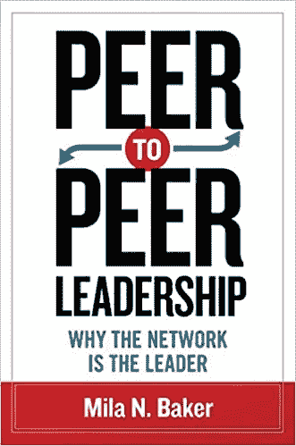

# 对等领导——为什么网络是领导者

> 原文：<https://medium.com/geekculture/peertopeer-leadership-why-the-network-is-the-leader-ea04d788326f?source=collection_archive---------13----------------------->

# 从 Mila N. Baker 手中收回 2015 年的精彩书籍

Book Page Cover from Mila N. Baker’s book on PeerToPeer Leadership

> ❝向 Mila Nevada Baker 博士致敬，因为她在 2015 年的书《Peer2Peer Leadership》中提前写下和解释的话已经变得如此真实。❞

# 开始之前

# 放弃

**本帖为个人中帖**。这里表达的任何观点仅属于作者，并不反映作者曾经或现在隶属的任何公司或组织的任何观点或意见。查看完整的免责声明[这里](https://jhadnr68.medium.com/disclaimer-70803d581009)。

# 📝1 |关于对等领导

早在 2015 年，在参加一个关于领导力和管理的研讨会时，我被要求选择并阅读一本我个人选择的书，随后将向所有观众展示。

目标是总结和分享关于管理和领导力主题和关注点的主要亮点。

**我通常尽量不遵循标准的建立——这可能意味着在企业架构中工作。**

我在互联网上搜索，寻找**领导和管理**与其他来自 **IT 相关领域**的更广为人知的主题之间的联系和可能的模式——如分散架构、运营模式、工作方式、决策过程等等。

我记得在阅读了周围许多提及的分散笔记后，我立即选择了 Mila N. Baker 的“同行领导”。

1.  领导模式陈旧过时，停留在工业时代。应该取代以个人为中心的命令和控制型领导方式；
2.  他们遵循自上而下的模型，不符合当前世界的复杂性，数据和信息的数量来自太多的来源和不同的方向，具有不同的速度和质量，这使得任何领导者几乎不可能保持领先；
3.  层级和集中模型正在到处被打破——这已经是关于软件架构的讨论，以提供更大的灵活性、弹性和分散的责任；为什么要在领导上有所不同？

这本书承诺了一种领导组织的新方法。

1 .这个组织应该成为一个由权力“对等”节点组成的网络。

2.新领导在那里**设定和调整总体目标和方向**和**优化网络的健康**，而不是告诉其他人做什么和如何做；

3.新的领导风格将需要不断快速转变的能力，以适应任何给定的变化情况的需要。

4 .信息应该**自由流动**并且对那些需要它的人来说变得**可访问和可用**，因此在任何给定的时间都可能容易和立即采取行动；

5.**网络内的反馈回路应该成为企业工作流程**的有机组成部分，实现快速**过程修正**，总体**透明**，以及所有对等方之间**可信**的一致。

# ◔̯◔ 2|目录

在浏览目录时，我记得当时的一些亮点立即闪现，以及如此多的主题看起来可能令人感兴趣并与 IT 主题相关:

**第 1 章——领导力的语言** 领导力和技术革命

**第二章——节点社区**
节点社区的力量:即时信息共享
传统沟通模式的颠覆
节点社区在组织中的价值
高效有效的信息流动
整个社区的专业知识
实时反馈和对话

**第 3 章——组织中的均势**
组织中均势的力量
所有节点都是平等的:每个人都领导，每个人都跟随
由沟通(节点)驱动
组织中均势的价值
对组织设计的意义
对新领导范式的意义

**第 4 章–关系动力学**
人员、信息和联系
组织无政府状态
共享决策和治理
对新领导范式的影响

**第 5 章——从适者生存到互联生存**
适应和缓解
解决问题解决问题

**第六章——信息的流动**
传统的沟通障碍
日常的分享:网络作为沟通的基础设施
信息公开传递的好处

**第 7 章–灵活性和变化**
P2P 和驱动变化
生命周期和文化模式

**第八章——实时反馈和对话**
更好的方式

**第 9 章——对组织设计的启示**
P2P 架构为什么重要？
工作环境

**第 10 章——领导力的含义**
人力资源和组织发展
质疑传统领导力

IT 挑战、IT 主题以及围绕管理、领导和团队结构的组织变革之间的关系似乎令人惊讶地令人兴奋和富有挑战性。

> ❝新的领导模式似乎受到了来自 IT 世界的点对点架构的影响，在 it 世界中，协作各方实时构建和使用动态且不断变化的连接和结构，以适应 needed❞.

很明显，旧的大型机甚至客户机-服务器 It 系统和对等 IT 系统之间的关系**与传统的等级领导结构和新的对等网络社区领导和组织结构之间的关系**有相似之处。

**那些旧的结构总是要求信息被集中，然后从中心分发出去。**相反，点对点 IT 架构的新动态结构由一个由相互连接的“节点”组成的网络组成，这些节点形成了一个网络社区。

**技术正在改变世界，最近的技术进步已经重塑了 IT 结构和软件架构**。这种改变是一种工具，可以用来**指导我们的思维和有效的 21 世纪领导模式所需的原则**。

所以我只花了几分钟就搞定了。

# 📗3|背景

背景似乎很清楚，这一切都是由于来自 it 领域和 IT 结构的数字化转型趋势而引起的组织变革。

1 .任何**关系**——上、下、左、右——**的力量能够带来积极的变化**，而不管现有的系统、流程和层级；

2.**技术正在成为主流，完全大众化**。它允许组织中的所有员工同时实时获得和访问信息；

3.**企业正面临着重新思考他们如何被管理的假设的需要**；

4.**点对点是基于幂等的概念**；在 21 世纪，**任何同行都是平等的**；新的领导方式应该建立在动态联系的基础上，而不是 20 世纪的命令控制式领导风格。

5.对等领导模式的理念是，所有人都是自主的、协作的、自给自足的、有能力的，并且愿意应对变化。通过公开和自由地分享信息来释放全部力量；

6.**领导范式正在改变；企业不能再依赖孤立的个人。团队并不总是最适合处理每种情况——我们必须研究在一个协作为王的世界里，组织和领导是如何工作的。**

7.**领导者的角色必须适应这种新的模式变化** —管理活动，允许在任何决策过程中共享可用信息。所有有关各方应对结果承担全部责任；

**然后一个伟大的引用被介绍给读者:**

**机遇**

*“领导每天进门。跟随者每天进门。双双进门伺候。领导者为组织服务。追随者为领导者服务。每天都有机会丧失。”*

**看看“领导者”和“追随者”，你会发现一个层级。**

1.  少数人授予或获得权力和权威，并通过组织和结构等级制度加强这种权力和权威；

**改为**

1.  非正式网络允许个人更有效地组织自己。等级制度和技术进步使得传统结构产生的壁垒比等级结构更加强大；

**刚才的报价介绍了需要查找:**

1.  **定义、衡量和表达领导力的新方式；**
2.  **在一个数字化高度互联的世界里；**
3.  这带来了新的挑战，迫使我们改变对领导力的看法；

# 💡4| **理性**

那么，它背后的基本原理是什么？

1.  在通信实时存在且更接近源(如果不是源本身)的环境中，**任何人都可以带头** — **结构动态变化，按需适应**；
2.  **要实现这一点，网络节点需要具有同等能力** —网络不知道所需资源在哪里，但任何节点都可以响应现有需求— **因为它提供或共享这些能力。网络节点协同工作**；
3.  同时作为领导者和追随者的重要性的理由来自于这样的证据:今天，信息流动非常快，**没有人能够知道所有的事情或处理所有的事情**——正如我们所知，这是有意设计的“领导力的终结”。不再需要**依赖传统的层级来访问和传递信息**；

> ❝的概念，如节点，节点社区，均势和动态关系，将重新定义领导的概念。❞

# 🔎5|支柱

**节点群**

**成为新的节点社区中的节点:**

1.  每个节点共享资源来执行其工作，并且每个节点提供和请求资源；
2.  **每个节点可以建立直接的通信流，而无需通过任何中介** —即时信息共享和动态调整以适应新的现实和环境。信息在任何节点之间流动，没有等级障碍；
3.  技术破坏设施也是组织破坏设施，因为前者允许**消除边界和创建动态创新结构**；
4.  **决策的背景变化**——从(领导者)的个人能力到来自组织的组织和共享信息能力的共享决策过程；
5.  **社区不断接收和发送信息** —不断反馈；

> ❝决策的背景发生了变化，从(领导者)的个人能力转变为共享决策过程，这取决于组织在不同要素之间组织和共享信息的能力。❞

**节点的等效性**

**在加入新的节点社区时:**

1.  **在组织中工作的每个人都平等地一起工作** —他们可能不会以与他人相同的方式做出贡献，但他们会以平等的方式做出贡献:(1)所有要素都是平等的，(2)所有人都可以领导和成为追随者，(3)他们有相同的机会做出贡献，(4)他们做出贡献的方式不会影响每个人相对于他人的地位；
2.  **任何节点都可以在不同的场景中响应不同的需求**假设一个领导/追随者配置文件—最终目标始终是解决问题和不断向他人学习；
3.  **任何节点都能够并且应该促进所有动态，增强承诺，激励其他节点，加强相互尊重、完全透明、信任和安全，将能量引向最终目标**；
4.  基于每个人的能力，任何节点都可以承担领导角色，**根据每个人的具体优势和每个场景的特定需求，取代职能或职位的分配**。这种能力(1)是通过持续的实时反馈过程建立起来的,( 2)更多的是暗示我们对他人是什么，而不是我们做什么；

> ❝:领导者和追随者之间的界限被清空了。同时，节点网络阐明并协调了 network❞.所有元素的最终目标

**关系动态**

**当在新的节点社区中作为对等体协作时:**

1.  需要“**改变重点**”——问题不在于谁负责，而在于应该做什么；
2.  有必要“**改变心态**”——可能会有某种无政府状态的感觉(但不是无序和混乱)。行动是基于共识的概念执行的。决策和治理应该始终是共同的责任(资源分配等)。)

> ❝领导成为一个概念，它在不同节点之间的动态关系中出现并得到事实证明。❞.

**信息流**

**当在新的节点社区中作为对等体交换数据时:**

1.  在许多组织中，信息继续在“需要知道”的基础上传播和共享——**信息就是力量，权威限制这种力量的传播**；
2.  **这种模式正在被改变** (1)机制的存在使得**控制和监控对信息的访问**成为可能，从而增强了信息从其所在位置向其有效需要的位置的流动，以及(2)外部驱动因素**对组织本身的影响**，组织必须对其做出回应；

> ❝:这些变化也将推动组织变革——不仅仅是从组织层级的顶端，而是在层级的任何层面。组织认识到变革的必要性，所有变革都受到领导者形象变化的影响。❞

**运营模式和组织结构**

**当在新的节点社区中作为对等体协作时:**

1.  每个元素与任何其他网络元素交互的可能性允许**消除权限、权力和控制的级别**；
2.  从**管弦乐队到爵士组合模式**的转变使得**创造力涌现**，允许更高的**即兴创作水平。**创新成为不变；
3.  **动态上下文的创建允许基于协作的环境和上下文或协作体验来创建不同且透明的补偿机制**；

> ❝在一个不断变化的世界中，组织必须创造适应、创新和弹性的条件。❞

**领导风格和特质**

**在新的节点社区中作为对等体提供不同的能力:**

**在重新定义领导力本身的同时**

1.  以个人为中心的领导力开始成为一个神话——现在不可能以独立和非协作的方式实现目标；
2.  **领导成为平等关系，而不是自上而下或自下而上的定义**；

**重新定义领导行为**

1.  社区是动态构建的，在这里，领导者的**定义不断被重构** —它不局限于单个个人，领导者和追随者之间没有明确的界限，领导者的角色根据上下文和环境而不同；
2.  **规划变革的空间和时间不再是成为领导者的先决条件(如在传统层级中)** —元素的敏捷性、可用资源的存在、信息的共享和分散决策过程的力量都有助于改变领导形象的思维模式；

> ❝新的领导者形象建立在这样一个前提上，即在数字时代，人们的合作方式与过去有着根本的不同——这将反映在组织、关系的动态和领导者的形象中。❞

**七年后，总结过去整整两年企业运营和组织工作及协作方式的彻底改变，这些笔记如今变得如此相关和明显，真是有趣。**

# 在你走之前

如果你想收到我以后的文章，请在[媒体](https://jhadnr68.medium.com/)上关注我。如果你喜欢这篇关于“**对等领导——为什么网络是领导者**”的文章，你也会喜欢我其余的文章。

你可以在这里给我买杯咖啡来支持它。或者只是分享你的反馈。

**敬请期待！**