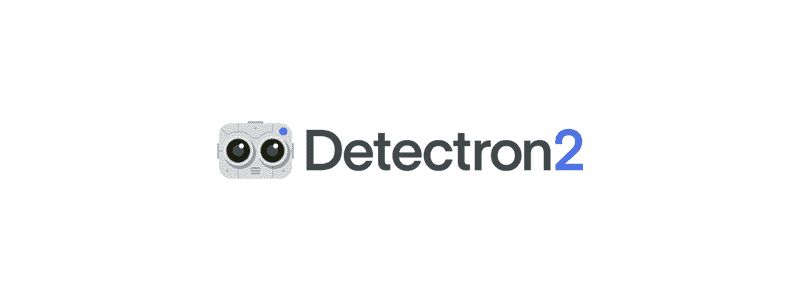
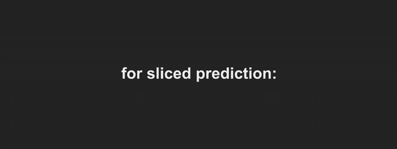
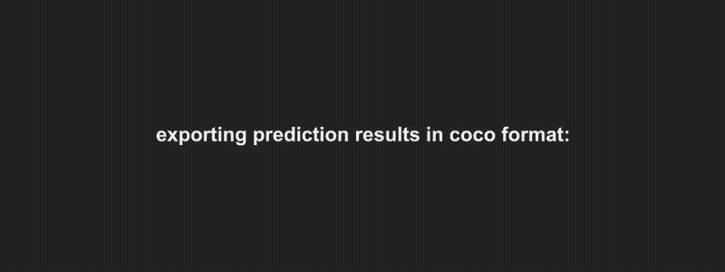
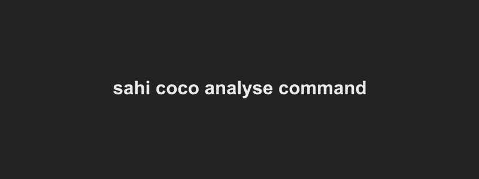
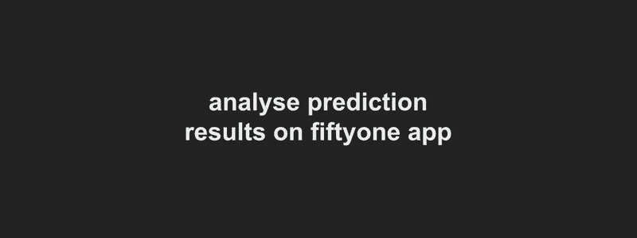

# 使用 Detectron2 模型执行切片(平铺)推理和详细的错误分析

> 原文：<https://medium.com/geekculture/perform-sliced-inference-and-detailed-error-analysis-using-detectron2-models-8d9c551953f3?source=collection_archive---------12----------------------->



*   卫星图像或高分辨率图像上的小目标检测需要切片(平铺)推理吗？
*   您的检测模型需要可解释的度量标准吗(关于可能改进的见解)？
*   你需要一个交互式用户界面来可视化错误的预测吗？
*   你依赖探测器 2 模型吗？

所有这些都有可能与 SAHI 的新探测器 2 集成🚀非常感谢卡迪尔·纳尔对《侦探 2》的贡献🔥)

[](https://github.com/obss/sahi) [## GitHub — obss/sahi:一个用于执行大规模目标检测的轻量级视觉库/…

### 目标检测和实例分割是计算机视觉中最重要的应用领域

github.com](https://github.com/obss/sahi) 

这篇文章将带你完成探测器 2 模型的**安装**、**模型准备**、**切片推理**、**误差分析**和**交互可视化**步骤。

## 安装

✔️安装 Pytorch:

```
conda install pytorch=1.10.0 torchvision=0.11.1 cudatoolkit=11.3 -c pytorch
```

✔️安装 SAHI:

```
conda install sahi -c conda-forge
or
pip install -U sahi
```

✔️安装检测器 2:

```
pip install detectron2 -f [https://dl.fbaipublicfiles.com/detectron2/wheels/cu113/torch1.10/index.html](https://dl.fbaipublicfiles.com/detectron2/wheels/cu113/torch1.10/index.html)
```

## 准备

✔️导出您的检测器 2 配置:

```
# create desired Detectron2 config
from detectron2.config import get_cfg
cfg = get_cfg()
cfg.MODEL.ROI_HEADS.NUM_CLASSES = 445 cfg.MODEL.ROI_HEADS.SCORE_THRESH_TEST = 0.5# export config as yaml
from sahi.utils.detectron2 import export_cfg_as_yaml export_cfg_as_yaml(cfg, export_path='config.yaml')
```

## 切片预测



Gif showing sliced prediction capabilities of SAHI.

✔️使用您的权重路径和导出的配置路径来执行推理:

```
sahi predict --source image_dir/ --model_type detectron2 --model_path weight.pt --config_path config.yaml --slice_height 512 --slice_width 512
```

## 误差分析图/指标

✔️使用 COCO 格式的数据集创建 COCO 格式的预测结果:



Gif showing COCO formatted dataset prediction capabilities of SAHI.

```
sahi predict --source image_dir/ --dataset_json_path dataset.json --model_type detectron2 --model_path weight.pt --config_path config.yaml --no_sliced_prediction
```

✔️使用创建的 result.json 创建误差分析图:



Gif showing error analysis capabilities of SAHI.

```
sahi coco analyse --dataset_json_path dataset.json --result_json_path result.json
```

🎯指标的含义:

**C75:**IOU 阈值为 0.75 时的结果
**C50:**IOU 阈值为 0.75 时的结果
**Loc:** 忽略定位错误后的结果
**Sim:** 忽略超类别假阳性后的结果
**Oth:** 忽略所有类别混淆后的结果
**BG:** 忽略所有假阳性后的结果

📈可能的模型改进:

**C75-C50 和 C50-Loc=** 具有更精确边界框预测的潜在增益
**Loc-Sim=** 修复超级类别混淆后的潜在增益
**Loc-Oth=** 修复类别混淆后的潜在增益
**Oth-BG=** 修复所有假阳性后的潜在增益
**BG-FN=** 修复所有假阴性后的潜在增益

## 交互式可视化

✔️安装五十一:

```
pip install -U fiftyone
```

✔️用你的预测结果启动一个 51 网络应用程序:



Gif showing interactive visualization capabilities of SAHI.

```
sahi coco fiftyone --dataset_json_path dataset.json --image_dir image_dir/ result.json
```