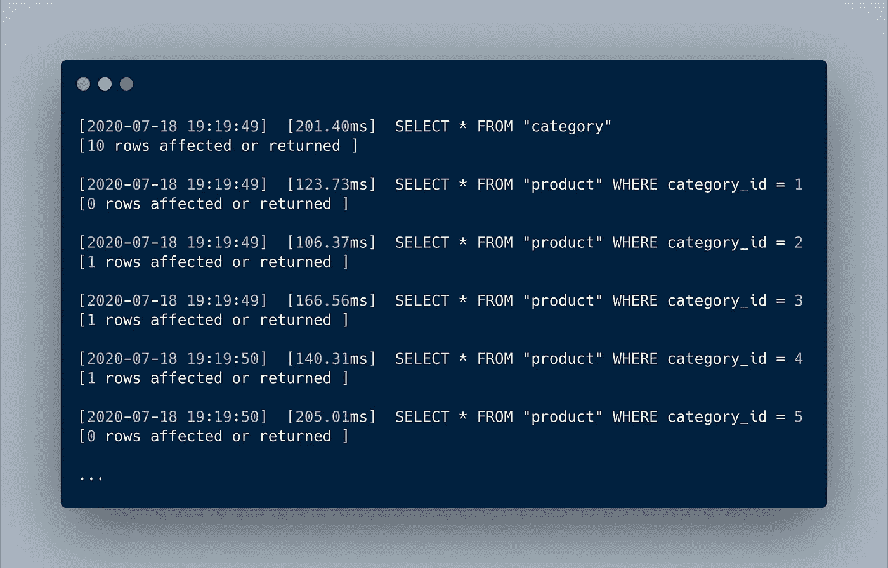
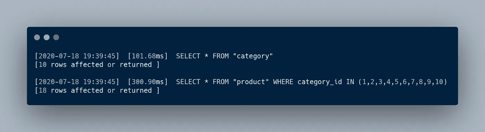

# 性能问题:N+1 问题

> 原文：<https://medium.com/geekculture/performance-matters-n-1-problem-a6a072525149?source=collection_archive---------1----------------------->

介绍 *N+1* 问题以及如何避免常见的性能陷阱。

# 什么是 *N+1* 问题？

*N+1* 查询问题是一种常见的性能反模式，当代码需要从*一对多关系*中的一个父数据加载一堆子数据时就会出现这种问题。对父记录执行查询，然后对每个子记录执行一个查询。最终对数据库进行 *N+1* 查询，以获得属于父记录的每个子记录。

# 例子

让我们假设您有一个表，调用 *"category"* 来记录您的商店中可用的类别列表。每个类别可能有一个或多个产品，记录在另一个名为“ *product* ”的表中。换句话说，*【类别】*【产品】**是一对多的关系。**

*在 ***走*** 时，通常情况下，它看起来像这些语句:*

```
**categories*, *_* := repository.GetCategories()
**for** *_*, *category* := **range** *categories* {
   *products*, *_* := repository.GetProducts(*category*.ID)
   // ....
}*
```

*假设***get categories()***有这样一个底层实现:*

```
*SELECT * FROM "category"*
```

*那么，***get products()***有一个底层实现是这样的:*

```
*SELECT * FROM "product" WHERE category_id = ...*
```

*每次执行前面的语句时，它都会发出 *N+1* 个查询，其中 *N* 是类别的数量，如下所示:*

**

*N+1 Problem Queries Sample*

# *这个例子的问题是*

*您可以看到这些查询产生了相当多的开销。请记住，运行 1 个返回 100 个结果的查询比运行 100 个每个只有 1 个结果的查询要快。如果您从运行在不同机器上的数据库或服务中获取数据，这一点尤其正确。*

*让我们假设从数据库或服务中获取数据，每次查询需要 100-200 毫秒。如果您执行 100 次查询，将需要 10.000–20.000 毫秒来获得您需要的所有数据。*

# *如何避免 N+1 问题？*

*简单来说， ***批量*** 做查询。与其运行查询 *N+1* 次，不如只运行两次，一次针对父记录，一次针对子记录。*

**

*N+1 Problem Solution Queries Example*

*瞧，我们完成了。现在你明白什么是 N+1 问题以及如何避免它们了。*