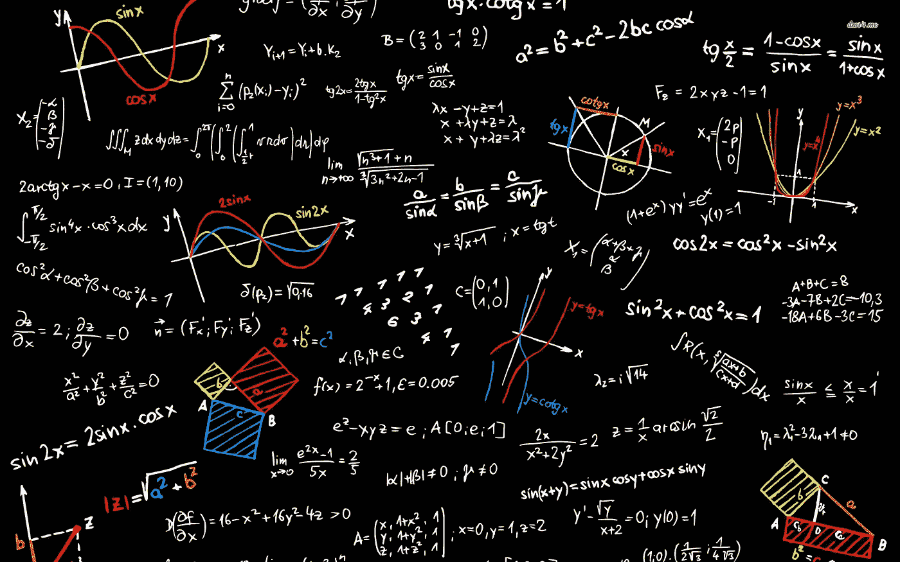
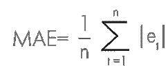
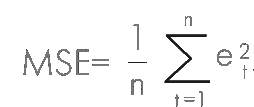
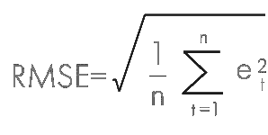

# 回归的性能度量

> 原文：<https://medium.com/geekculture/performance-measures-for-regression-fa49dbaef8cf?source=collection_archive---------13----------------------->

> *本文是一段* [*线性回归概括地说*](https://arunaddagatla.medium.com/linear-regression-in-a-nutshell-1714d5665fd2)

回归算法已被证明在许多领域进行预测是有效的。机器学习的一个关键阶段是模型的评估。评估的目的是将训练好的模型预测与测试数据集中的实际(观察到的)数据进行比较。

## 什么是度量？

度量是一种可量化的度量(可以科学地测量或计算)，用于跟踪和评估特定过程的状态，在我们的例子中是模型的性能。

它们告诉你关于模型如何运行的精确测量，并为你提出改进建议提供基础。

## 那么度量和指标之间有什么区别吗？

是的，度量和衡量是有区别的。

在数据上下文中，度量是可以求和/或求平均值的数字或值，例如温度和重量。

度量也可以称为*维度*，因为它们是可用于细分、过滤或分组的分类桶——例如销售代表、城市、产品、颜色和分销渠道。

也就是说，这是衡量标准和度量标准之间的区别:

> 度量是一个基本的或特定于单位的术语，而指标可以从一个或多个度量中派生出来。

因此，度量标准被用来衡量一个模型的性能。性能指标通常被称为误差指标。

> **误差度量**是一种用于测量预测模型的**误差**的**度量**。

它们可以为预测者提供一种定量比较竞争模型性能的方法。

回归是指涉及预测数值的预测建模问题。因此，有一些专门为评估回归问题预测而设计的误差指标。

通常，假设回归的性能度量是“**准确性”。**但这不是真的。我们无法计算回归模型的准确性

> 准确度是分类的度量，而不是回归。

## 那么回归的性能度量是什么呢？

有三种常用于评估和报告回归模型性能的误差指标。

*   平均绝对误差
*   均方误差
*   均方根误差(RMSE)

让我们分别探索一下:

## 平均绝对误差(MAE):

[*在统计学中，平均绝对误差(MAE)是表达同一现象的成对观测值之间误差的度量。*](https://en.wikipedia.org/wiki/Mean_absolute_error#:~:text=In%20statistics%2C%20mean%20absolute%20error,an%20alternative%20technique%20of%20measurement.)

在深入探讨平均绝对误差之前，让我们先了解什么是绝对误差。

> 绝对误差是测量中的误差量。它是测量值和“真实”值之间的差值。

公式:

> δx = XT-x

在哪里，

*   δx 称为绝对误差
*   xt 是实际值或真实值
*   x 是测量值或预测值

平均绝对误差(MAE)是所有绝对误差的平均值。此回归指标表示实际值和预测值之间绝对差异的平均总和。

其中:

*   n =错误的数量，
*   σ=求和符号(意思是“把它们都加起来”)，
*   et = |xt - x|即绝对误差

## 均方差(MSE):

均方差(MSE)计算所有数据点的实际值和预测值之间的平方差的平均和。

**为什么平方在 MSE？**

平方是必要的，以消除任何负号。它也给予较大的差异更多的权重。

MSE 的单位是垂直轴上绘制的任何值的平方。

其中:

*   n =错误的数量，
*   σ=求和符号(意思是“把它们都加起来”)，
*   et = |xt - x|即绝对误差

MSE 的单位是垂直轴上绘制的任何值的平方。

基本上，对于每个数据点，取该点到曲线拟合(误差)上相应 y 值的垂直距离，并对该值求平方。然后，将所有数据点的所有值相加，然后除以数据点的数量。

> MSE 衡量拟合线与数据点的接近程度。

> 均方差越小，拟合越接近数据。

**MSE 和 MAE 的比较:**

*   与 MSE 相比，MAE 对异常值不太敏感，因为它不会惩罚巨大的错误。
*   MSE 比 MAE 更准确，因为它突出了大误差而不是小误差。
*   MSE 是[可微分的](https://en.wikipedia.org/wiki/Differentiable_function)，这有助于使用数学方法更有效地找到最小值和最大值。

**MSE 中的平方问题？**

*   由于所有相关值都是平方的，因此所有负值都不会被正值补偿。
*   此外，由于这一指标的特点，错误的影响更大。

例如，如果我们最初计算的误差是 1、2 和 3，MSE 将分别等于 1、4 和 9。这导致较高的 MSE，并因此表明不准确的模型的较低性能。

所以为了克服这个问题*引入了均方根误差(RMSE)* 。

## 均方根误差(RMSE):

均方根误差(RMSE)已被用作一种标准的统计指标，以衡量模型在气象学、空气质量和气候研究中的性能。

如前所述，RMSE 是 MSE 的扩展。简直就是 MSE 的平方根。

其中:

*   n =错误的数量，
*   σ=求和符号(意思是“把它们都加起来”)，
*   et = |xt - x|即绝对误差

> 因此，RMSE 是沿垂直线测量的数据点到拟合线的平均距离。

与 MSE 相比，它很容易解释，并且它使用较小的绝对值，这有助于计算机计算。

现在，在了解了不同的错误度量之后，挫折正在回答以下问题: ***在哪里使用哪个度量来确定模型的性能？***

**何时使用 MAE:**

MAE 通常在数据中的异常值相对较低时出现，因为它对异常值不是很敏感。

它用于在连续变量数据上测量绩效，因为它给出了一个线性值，该值平均了加权的个体差异。

**何时使用 MSE:**

当数据集包含异常值或意外值(过高或过低的值)时，MSE 最有用。

当数据集包含大量噪声时，它是最没有用的，因为一个错误的预测就可能破坏整个模型的性能。

**何时使用 RMSE:**

RMSE 为较大的误差分配较高的权重，因为误差在被平均之前被平方。

这表明，当存在较大误差时，RMSE 更有用，它们会显著影响模型的性能。

## 结论:

如果数据集没有异常值，您可以使用 MAE 作为度量。对于离群值较少的数据集，MSE 将是更好的选择。

但是对于包含大量异常值和噪声的数据集，RMSE 是最佳的误差度量，因为它避免了采用误差的绝对值，这一特性在许多数学计算中非常有用。

*感谢您阅读本文！如果你有任何问题，请在下面留言。请务必关注*[*@ arunadagatla*](https://arunaddagatla.medium.com/)*，获取关于数据科学和深度学习的最新文章通知。*

> 可以在[**LinkedIn**](https://www.linkedin.com/in/arun-addagatla/)[**Github**](https://github.com/arun2728)[**ka ggle**](https://www.kaggle.com/arun2729)上与我联系，也可以通过访问[**Medium.com**](https://arunaddagatla.medium.com/)。