# 不同工作负载下哈希实现的性能

> 原文：<https://medium.com/geekculture/performance-of-hash-implementations-on-various-workloads-fedac579a39b?source=collection_archive---------19----------------------->

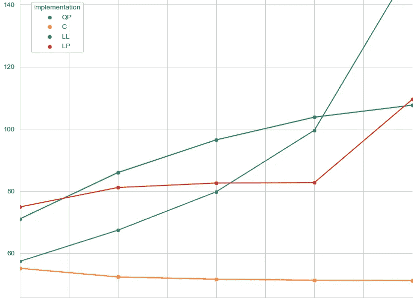

Image courtesy of [Ani Aggarwal](https://aniaggarwal.medium.com/)

# 目录

1.  [***概述***](#99a2)
2.  [***什么是哈希表？***](#f71c)
3.  [开放寻址](#fa54)
4.  [单独链接](#8747)
5.  [布谷鸟磕磕碰碰](#5dec)
6.  [***分析***](#0f34)
7.  [***摘要***](#0fc7)
8.  [***测试方法论***](#030e)
9.  [***预期结果***](#4de3)
10.  [***结果***](#f31c)
11.  [平均包含点击量](#dfd5)
12.  [平均相加](#25da)
13.  [平均驱逐](#7549)
14.  [平均包含错过](#9277)
15.  [***结论***](#8e30)
16.  [***未来工作***](#baac)

# 概观

这篇博客比较了处理哈希表中哈希冲突的几种不同方法。实现和基准测试都是用 Java 完成的，图形和分析是通过 Pandas 和 Python 中的 Seaborn+Matplotlib 完成的。实现本身包括线性探测实现、二次探测实现、基于链表的散列，以及最后的 Cuckoo 散列。我检查了四个测试:一个 contains 找到它的目标所用的平均时间，一个 add 函数，一个从 hash 中移除的 evict 函数，最后一个 contains 函数没有找到它的目标。但是，因为我没有实现二次探测驱逐方法，所以二次探测缺少 avgEvict 和 avgContainsMiss 数据点(在我编写这段代码时，它对我来说太复杂了)。在我们看比较各种散列实现的性能的实际分析之前，让我们理解什么是散列以及这些实现中的每一个是什么。

下一节将简要解释哈希表和冲突处理，所以如果你已经理解了这些概念，请随意跳到[分析](#0f34)一节。

注意:这篇博文写得很像一篇研究论文，但不要被愚弄了:为此所做的研究不够有力，不足以证明其格式，我只是想改变一下。

# 什么是哈希表？

哈希表也称为哈希映射，是将一些键映射到一些值的数据结构。它们使用散列函数将某种类型的一个键映射到某种类型的一个值。哈希表的常见实现是保存值的数组和将键映射到数组的整数索引的函数。一个好的哈希表有一个好的哈希函数和一个好的大小，有一个几乎恒定的插入、删除和查询时间，但这并不总是可能的。通常散列函数中有重叠，这意味着两个唯一的键可能经常有相同的散列值，从而导致冲突。冲突的数量随着加载因子的增加而增加，加载因子是占用表的条目数量除以表的总大小。冲突数量的增加使得查找时间增加，通常会丢失所需的常量时间。这种影响可以通过各种方法来减轻，我们将研究其中的四种方法。让我们看看这些方法是如何工作的，然后我们可以看看它们的性能。(你可以在[这篇](/omarelgabrys-blog/hash-tables-2fec6870207f)很棒的文章中找到更多信息)。

## 散列地址

在开放式寻址中，处理冲突的方法是将冲突值放在下一个可用空间中，与表中的原始空间相隔一段时间。

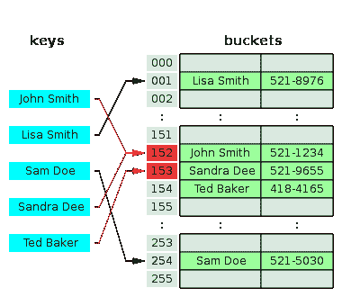

Image courtesy of [Wikipedia](https://en.wikipedia.org/wiki/Hash_table)

例如，在这张散列表中，您可以看到间隔为 1 的冲突是如何处理的。John Smith 试图将关键字放置在索引 001 处，但是它与 Lisa Smith 发生冲突。因此，John Smith 被放置在下一个可用位置，该位置恰好是 152，因为位置 002 到 151 被其他值占用。现在，约翰·史密斯已经被放置在散列表中，桑德拉·狄试图被放置，但是与约翰·史密斯的新位置冲突。所以桑德拉被安排在下一个空位置，正好是 153 号。然后，Ted Baker 试图被安排在 153 号位置，但该位置已被占用，因此他被移到 154 号位置。

这个具体的例子使用了间隔 1，这意味着冲突值被放置在紧接的下一个空位置(1 个空间之外)，并且被称为线性探测。还有另一种称为二次探测的方法，每当与给定键发生冲突时，该方法会将间隔增加某个多项式值。

## 单独链接

解决冲突的另一种方法是对链表使用单独的链接。这种方法的工作原理是用空的链表填充整个哈希表，当添加键时，它们被追加到与它们的哈希值对应的链表中。这意味着具有相同哈希值的键只是被追加到相同的列表中。

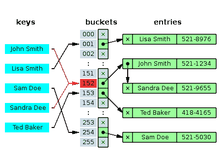

Image courtesy of [Wikipedia](https://en.wikipedia.org/wiki/Hash_table)

正如在这张照片中看到的，冲突很容易处理，但需要注意的是，随着冲突数量的增加，访问链表的恒定时间被访问链表中元素的 O(n)时间所压倒。

## 布谷鸟哈希

最后，还有一种以布谷鸟命名的哈希技术，这种鸟在孵化后将其他蛋从窝中推出。这个算法使用了大量的哈希表(在我的实现中是 2 个)，一个主要的，二级的，三级的，等等。，以及每个表的唯一散列函数。主表的功能就像普通的哈希表一样，但是当发生冲突时，新的键会占据旧键的位置，从而占用旧键的空间。然后旧的键被推入辅助表，在那里根据这个表的散列函数找到它的新散列值(因此得名)。如果在这里发生冲突，那么重复这个过程，旧的密钥现在变成新的密钥，冲突的密钥被推入下一个表。如果这种情况持续到最后一个表，那么最终的值就会绕回主表。如果这里也有碰撞，那么过程重复。如果检测到一个循环，那么所有表的大小都加倍，这迫使一个新的哈希值尝试解决该循环。更详细的解释[在这里](https://en.wikipedia.org/wiki/Cuckoo_hashing)。

# 分析

好了，现在你对哈希表有了一个基本的了解，也有了一些处理冲突的方法。我们来分析一下他们每一个人的表现。

# 摘要

当使用散列时，有许多不同的实现可以改变散列处理冲突的方式，每种实现都有自己的优点和缺点。实现线性探测、二次探测、链表散列和 Cuckoo 散列的散列都经过了测试，以确定它们各自的优点。通过分析这些差异，可以为特定的任务选择最佳的实现，从而为任何需要使用散列的给定问题提供最有效的解决方案。

# 测试方法

测试测量了四个测试所花费的时间:包含保证命中的地方、驱逐、包含保证未命中的地方以及添加新元素。这些测试中的每一个都在每个实现上执行了 10，000 次(除了下面提到的例外),以获得尽可能准确的数据。对于二次探测，不进行带有未命中的驱逐和包含，并且二次探测的添加总是试图添加已经存在的元素，而不是像所有其他实现的添加测试那样添加新元素。由于缺少数据，这将使任何关于二次探测的结论难以证明，包含命中是唯一可靠的数据。

Cuckoo 哈希的加载因子是手动计算的，因为它有增长的趋势来解决哈希冲突，所以向它添加了恒定数量的元素。这不影响结果，但应该注意。

测试数据被分成两个不同的数据集，数据集 B 和数据集 d。这两个数据集都包含 0 到 100，000 之间的整数，但是它们的分布不同。数据集 B 在其范围内具有相对相等的分布，而数据集 B 具有对称的双峰正态分布。这可以在下图中看到，该图绘制了数据集的分布，数据集 B 为蓝色，数据集 D 为绿色。这些不同分布的影响将在结果部分讨论。

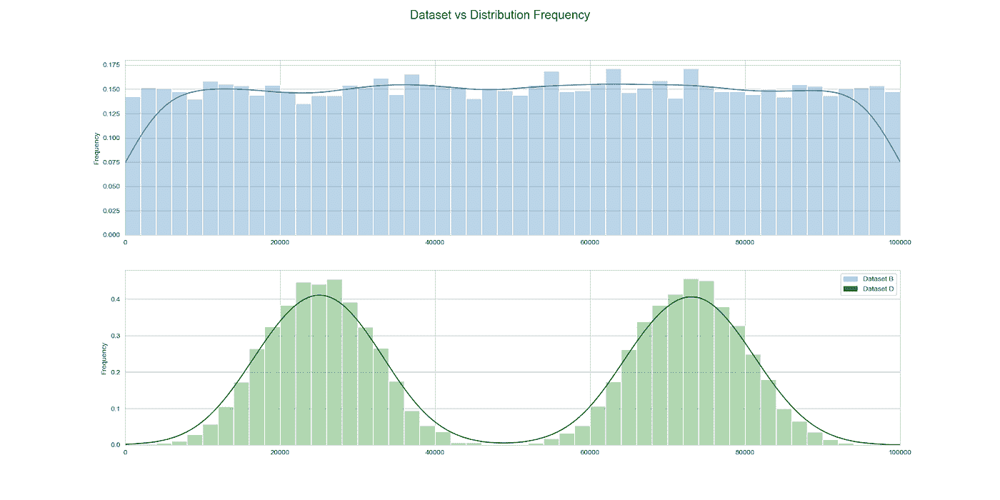

Image courtesy of [Ani Aggarwal](https://aniaggarwal.medium.com/)

# 预期结果

随着负载系数根据实施和测试方法的不同而变化，可以预期性能会有所下降和提高。

对于线性探测，随着负载因子的增加，由于所形成的集群的顺序性质，散列的性能趋向于 O(n)。这将导致 add、evict 和 contains 未命中测试的性能下降，尽管 contains 命中测试不一定如此。在包含命中测试中，哈希找到接近原始哈希位置的命中的可能性很高，因为命中是有保证的，这与包含未命中不同，即使在加载因子增加的情况下，也是如此，这意味着在此测试中，性能不会受到高负载的严重影响。

对于二次探测，contains hit 所用的时间不应受到增加的负载因子的太大影响，因为二次探测会分解集群，从而使性能不会趋于 O(n)。它的添加性能应该是相似的，并没有太多要说的驱逐或包含错过，因为他们没有经过测试。

对于链表实现，可以预期随着加载因子的增加，contains 会变慢，但是 add 会保持很快。逐出也会变慢，但是由于 Java 中链表的大量优化，与线性或二次探测相比，包含和逐出的速度降低几乎不明显。

最后，Cuckoo 实现应该有接近常数的包含和驱逐时间。Add 应该是唯一一个 Cuckoo 可能会变慢的地方，因为随着负载系数的增加和散列的被迫增长(由于自然循环)，从一个数组到另一个数组的数据复制会由于更大的数组而花费更多的时间。

# 结果

首先，在考虑数据集的影响之前，将考虑实现对性能的影响。下图按实现和数据集检查了每个测试所用的各种平均时间(以微秒计)。

## 平均包含命中

在第一张图中，我们看到了对散列进行一次肯定的 contains 调用所花费的平均时间。线性探测，缩写为 LP，随着两个数据集中负载因子的增加，性能很差，尽管它在较低的负载因子下性能一般。这是意料之中的，因为 LP 形成的簇导致接近 O(n)的复杂度。

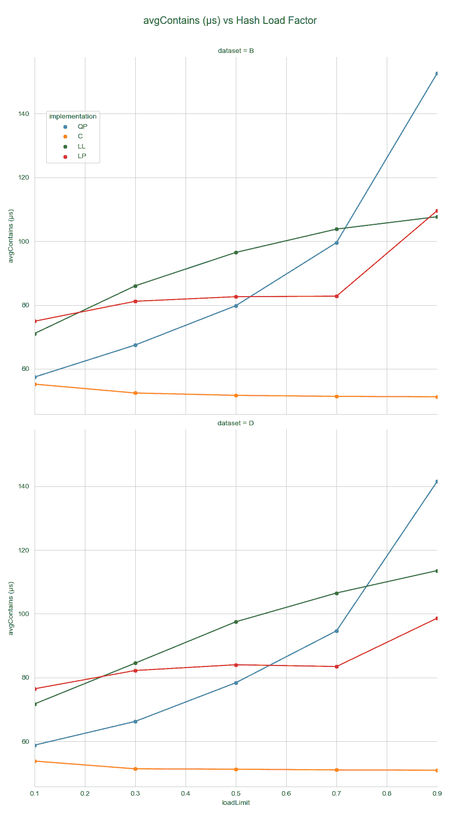

Image courtesy of [Ani Aggarwal](https://aniaggarwal.medium.com/)

二次探测，简称 QP，随着负载系数的增加，性能最差，讽刺的是几乎形成了一条二次曲线。它在低负载系数下的性能仅次于最佳，但它会迅速提高，这是意料之中的。然而，令人惊讶的是，考虑到 QP 分解集群的预期，QP 比 LP 表现得更快。可能的解释是，QP 在低负载因子下分解集群，导致低于 O(n)的性能，这优于 LP，但当负载因子增加到超过 0.5 时，QP 需要比线性探测更多的检查，因为有更少、更大的集群，这意味着线性搜索在这一点上更有效。

链表实现 LL 在加载因子和平均包含时间之间具有近乎线性的相关性。对于真正的 O(n)性能来说，这是意料之中的，尽管 Java 的本机优化在大约 0.23 以上的任何负载系数下都没有击败 LP，这有点令人惊讶。

最后是布谷鸟实现，缩写为 C，在所有场景下性能最好。由于其类似数组的性质，这种实现保持了几乎恒定的检查容器到期时间。不过，奇怪的是，对于低于 0.3 的负载系数，在大约 55 μs 建立之前，平均所需时间更长。

很明显，如果检查一个正包含所花费的时间很重要，那么为任何负载因子选择的最佳实现就是 Cuckoo。在某些负载因素下，它比其他实现快两倍以上，并且实现起来并不复杂。

至于数据集的差异，似乎很少。然而，似乎 QP 在数据集 D 上在除了 0.1 之外的所有加载因子上都表现得更好。这可能是由于数据集 D 的分布导致其自然聚类，这使得 QP 实现更加有效。LP 在两个数据集上具有相似的性能，除了在负载因子为 0.9 的数据集 B 上花费的时间要多得多。L1 和 C 在两个数据集上都有几乎相同的性能，差异归因于测量误差。

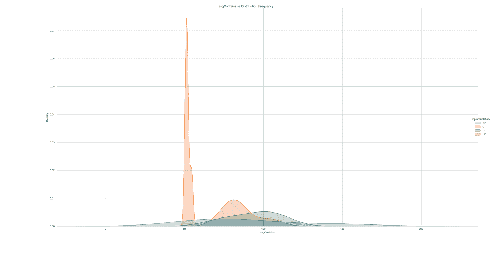

Image courtesy of [Ani Aggarwal](https://aniaggarwal.medium.com/)

从这个分布图中可以看出，C 实现始终是最低的，而 QP 的变化很大，LL 和 LP 的变化都很一般。因此，Cuckoo 哈希是 contains hit 的最佳哈希，具有一贯的较低时间。

## 平均添加

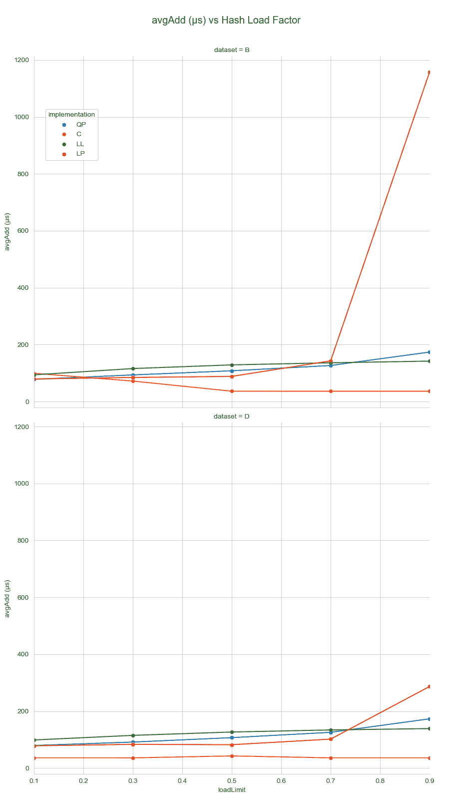

Image courtesy of [Ani Aggarwal](https://aniaggarwal.medium.com/)

LP 在负载系数为 0.1 到 0.7 之间有相当好的性能，尽管在这之后它的性能变得很糟糕。这个大峰值是意料之外的，尽管较小的峰值并非完全不合理。在这里，数据集之间存在明显的差异，数据集 B 的执行速度几乎比数据集 D 慢三倍。这可能是因为 D 中更紧密分组的数字将具有不同的键，而 B 中更大的分布将由于哈希函数的环绕性质而导致更多的重叠。

在负载系数小于 0.3 时，QP 的性能名列前茅，但在此之后，它充其量只能算一般。应该注意的是，这个针对 QP 的特定测试从不插入元素，因为它已经存在了，这可能会导致这种平庸的性能。

LL 性能接近最差，但与 LP 不同，它是可预测的。同样，由于向链表添加元素的必要性，这是一个预期的结果。

Cuckoo hash 在较高的负载系数下再次拥有令人难以置信的性能，但在 0.1 的负载系数下确实落后了。这种性能损失只发生在数据集 B 中，这可能是因为在该数据集中形成了额外的“循环”,需要通过增加散列来打破这些循环，这是一个代价高昂的过程。然后，在较高的负载系数下，这就不是问题了，因为净哈希表越大，冲突的可能性就越大。

对于主要增加的工作负载来说，最好的实现在所有情况下都是愚蠢的，除非哈希的增长永远不会超过 0.2 的负载系数。它的一致性令人难以置信，如果工作负载增加，它实际上需要查询，这也是 Cuckoo 擅长的。

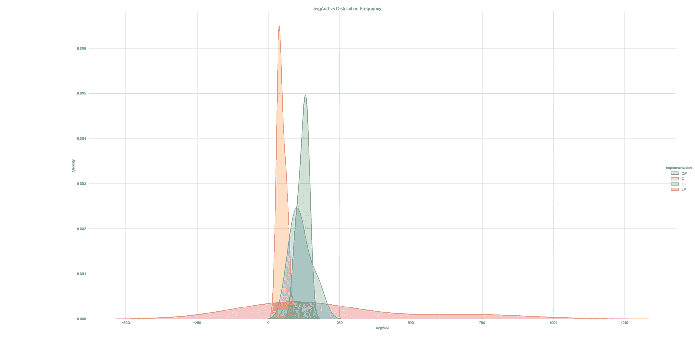

Image courtesy of [Ani Aggarwal](https://aniaggarwal.medium.com/)

最后，分布图显示，布谷鸟哈希与 LL 一样一致，QP 始终紧随其后。由于 LP 糟糕的一致性和性能，C 是这种工作负载的明显赢家。

## 平均驱逐

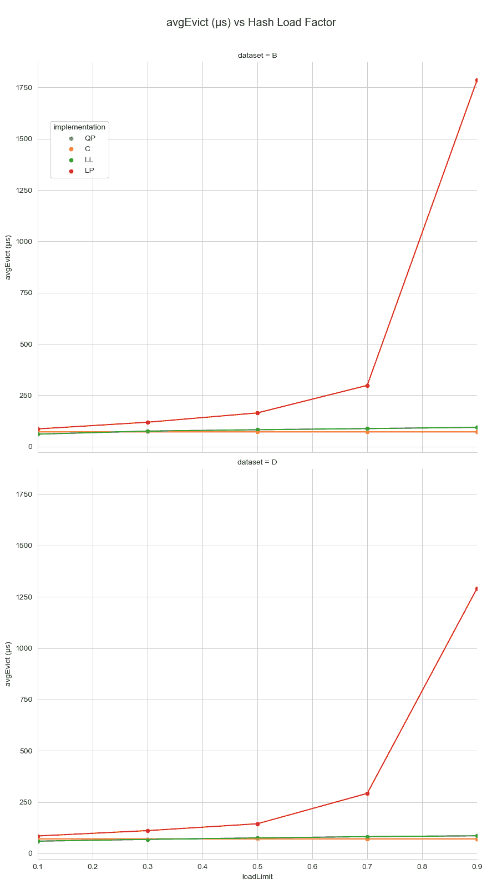

Image courtesy of [Ani Aggarwal](https://aniaggarwal.medium.com/)

LP 的性能显然是这里测试的三个实现中最差的。它增长到似乎是一个指数曲线，这并不奇怪，因为在高负荷因素下驱逐物品的复杂性。

对于 LL，性能几乎是恒定的，这在某种程度上是因为从链表中移除一个元素所花费的时间似乎会随着链表的变长而变长。然而，在这种情况下，Java 的优化似乎可以帮助 LL。

最后，C 再次具有接近恒定的性能，在负载系数为 0.1 时花费的时间略高。这是因为阵列的近瞬时响应。

数据集 D 的 LP 性能更好，数据集之间的差异很小。总体来说，表现最好的是布谷鸟，虽然 ll 也不甘落后。

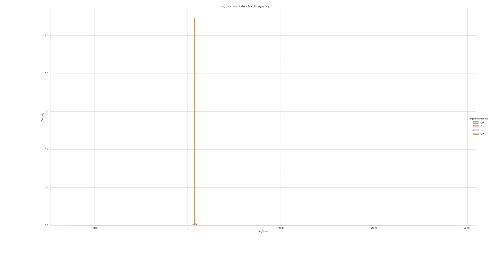

Image courtesy of [Ani Aggarwal](https://aniaggarwal.medium.com/)

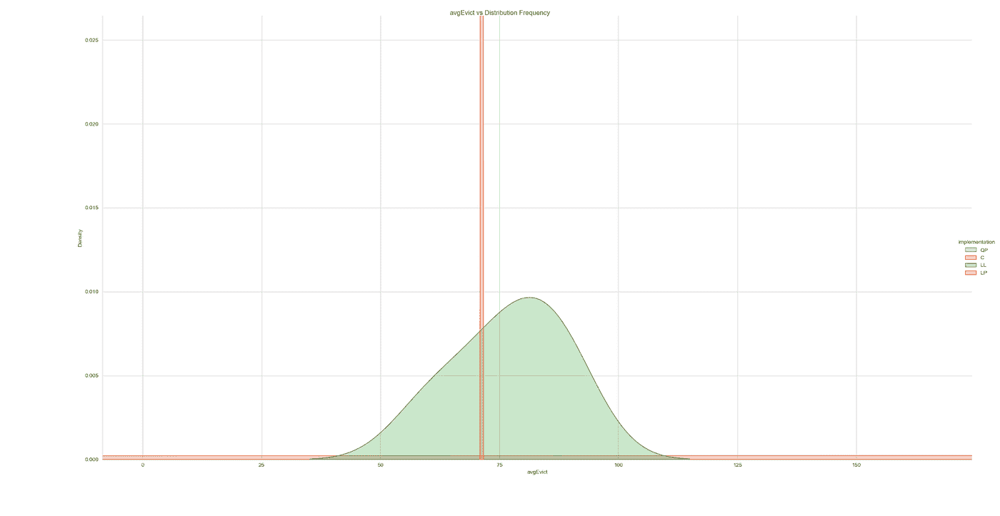

Image courtesy of [Ani Aggarwal](https://aniaggarwal.medium.com/)

在 evict 的分布图中，C hash 是如此一致，以至于我们需要放大才能看到竞争。C hash 之所以如此一致，是因为它仅仅改变了几个数组元素的值，仅此而已。LL 也不可怕，因为它经过了很好的优化，只需要移动一些指针。然而，LP 由于其复杂的驱逐过程而非常不一致。再一次，Cuckoo hash 因其一致性和出色的性能而胜出。

## 平均包含缺失

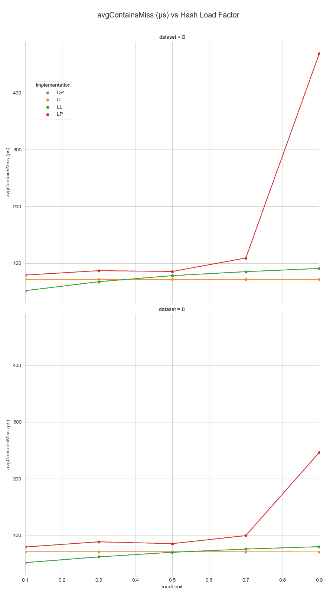

Image courtesy of [Ani Aggarwal](https://aniaggarwal.medium.com/)

LP 实现在这次测试中再次令人失望。当负载系数超过 0.7 时，它的性能非常糟糕，在所有其他负载系数下，它的性能仍然最差。这是意料之中的，contains miss 测试要求对散列进行几乎完全的搜索。在数据集 B 中花费了明显更长的时间，这可以用与过去 LP 测试中相同的原因来解释。

LL 在负载系数小于约 0.45 时具有最佳性能，之后仍具有可观的性能。很可能是由于 Java 的优化，在一个小链表上检查一个 contains 比在两个独立的数组上检查两次要快。然而，随着列表变得越来越长，这种情况会被打破。数据集之间的差异非常小，由于存在误差，可以忽略不计。

正如预期的那样，C hash 具有很好的整体性能。如果负载系数大于 0.45，则此工作负载的最佳选择是 C，如果负载系数小于 0.45，则选择 LL 实现。

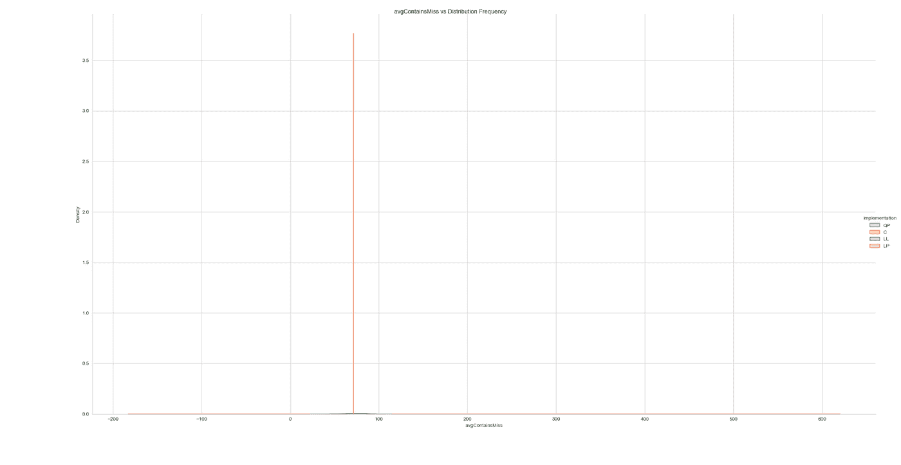

Image courtesy of [Ani Aggarwal](https://aniaggarwal.medium.com/)

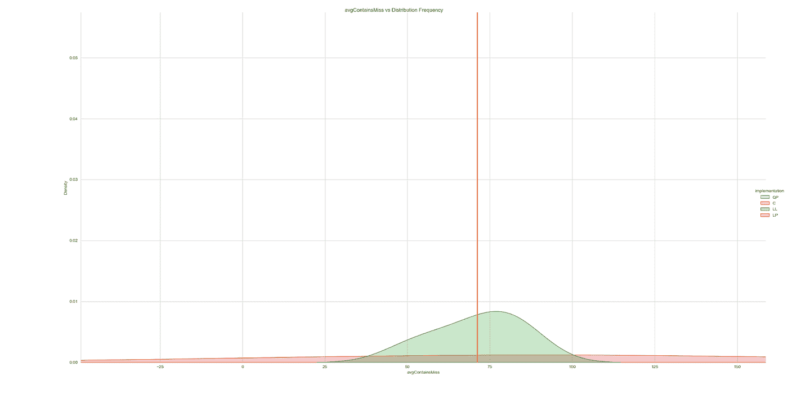

Image courtesy of [Ani Aggarwal](https://aniaggarwal.medium.com/)

同样，我们需要放大，因为基于前面讨论的原因，C 非常一致。这个分布图描绘了与平均驱逐次数相同的画面:Cuckoo 非常一致，LL 紧随其后，LP 到处都是。布谷鸟也是这里的赢家，尽管这是一场势均力敌的战斗。

# 结论

Cuckoo hash 在许多不同的工作负载、数据集和负载因素中具有最佳的性能和一致性。不管数据集的分布如何，Cuckoo 的执行时间几乎是恒定的，只是偶尔可以与之匹敌。尽管如此，在足够多的测试中，Cuckoo 以太大的优势击败了竞争对手，这并不重要。如果某个工作负载是所需要的全部，那么请参考该部分以获得最佳实现，尽管 Cuckoo 总体上是最好的。与 QP 不同，它的实施也不太复杂。

# 未来的工作

非常有趣的是，Cuckoo hash 几乎在每个方面都主宰了所有其他实现。与 QP 不同，它的概念非常简单，但也非常聪明，容易实现。QP 和 LP 对于他们平庸的表现来说都太复杂了，尽管 LP 表现如此之差令人惊讶。LP 的概念非常简单(尽管 evict 函数的实现并不简单)。这表明复杂性并不能保证良好的性能，但简单性也不能。探索更多关于 LL 实现的信息是非常有趣的，因为它有一些令人印象深刻的性能提升，深入探究 Java 对链表的优化可能会提供一些答案。探索 Java 和其他语言使用哪些实现，以及它们的实现是否根据给定的条件而变化，也是很有趣的。