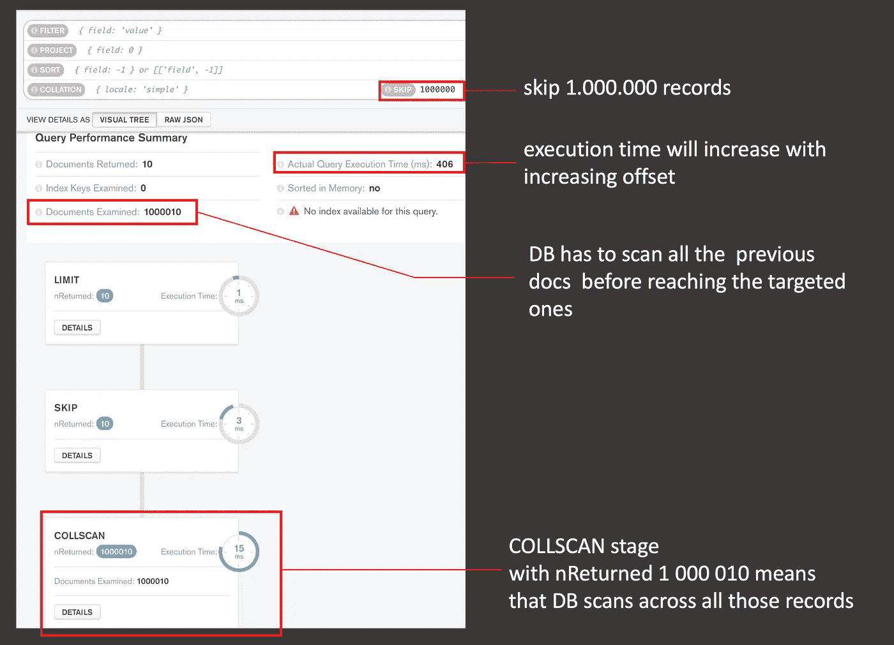

# DB 中的性能跳过操作

> 原文：<https://medium.com/geekculture/performance-skip-operation-in-db-40893bc0b531?source=collection_archive---------10----------------------->

跳过操作是数据库查询中常用的操作。当您的应用程序利用少量数据时，一切都很好，但是当应用程序数据增长时，它可能会成为瓶颈。因此，有时提前考虑是至关重要的。


# 可以使用跳过操作的功能

可能，每个开发人员已经实现的最常见的特性是偏移分页的实现。这个 MongoDB 请求应该已经很熟悉了:

```
let offset = page * itemsPerPage;
db.documents.find().skip(offset).limit(itemsPerPage)
```

例如，另一种情况是，当您的数据库包含 N 条用户投票记录，您需要从中随机选择一些获胜者。它的字面意思是通过索引提取记录，我们可以用下面的请求模拟它:

```
let randomWinnerIndex = api.random(db.documents.count());
db.documents.find().skip(randomWinnerIndex).limit(1);
```

# 跳过操作的性能问题

到目前为止还不错，直到`offset`是个小数字。这里的问题是`skip`操作在到达目标文档之前必须扫描所有以前的文档。复杂度是`O(N)`，其中`N` —是一个偏移量。让我们使用`explain` MongoDB 方法来确认这一点(图 1，使用 MongoDB Compass)。

> 关于`explain`和测量 MongoDB 性能的更多细节，你可以在这里找到。



以下是执行时间如何随着偏移量的增加而增加的一些概述:

另外，请注意，对于 SQL DB 以及此类查询也是如此:

```
SELECT * 
FROM events 
LIMIT 150000, 10
```

# 处理性能问题的方法

解决的方法来自于问题的本质。由于 SKIP 操作很复杂`O(OFFSET)`,我们需要找到降低`OFFSET`值的方法，或者根本避免使用 SKIP。

**偏移分页**

对于偏移分页，我们可以通过编程来限制这个值，但是企业应该意识到这一点，这可能是可以的。

此外，代替偏移分页，您可以考虑实现光标分页，其中您通过任何**索引字段** (nextCursor)开始查找每个新项目块，并完全消除跳过操作:

```
db.documents
  .find({_id: {$gt: ObjectID('61406b67cf5617ea60f036fd')}})
  .limit(10)
```

**从 N 条记录中随机抽取一条记录**

让我们想象一下，对于特定的比赛，我们的数据库可能包含多达 20.000.000 条用户投票记录，我们需要从中随机选择获胜者。问题将是一个随机赢家的指数何时接近尾声。

我们可以通过将所有这些记录分成几组并限制每组的票数来解决这个问题。一旦我们将用户投票分成 N 组，这意味着最大偏移量将是 20.000.000/N。我们可以以给出预期查询执行时间的方式来校准 N 值。

我们去练习吧。以下是我们的用户投票文档的近似模型:

```
{
   _id: ObjectId,
   campaignId: ObjectId,
   firstName: string,
   lastName: string,
   answer: string,
   partition: number
}
```

所有字段都应该是清楚的，只有`partition`字段需要一些解释。该字段负责将投票分散到 N 个组中以进行表现。在这种情况下，当我们选择随机赢家的索引时，我们需要计算该用户属于哪个分区及其偏移量，然后请求将是:

```
db.uservotes
   .find({
     campaignId: targetCampignId,
     partition: CALCULATED_PARTITION
   })
   .skip(offsetInPartition)
```

回想一下，在这种情况下，偏移的最大值是`NUMBER_OF_RECORDS/PARTITION_GROUP_COUNT`

请注意，您需要为`campignId`和`partition`创建一个复合索引，并优化`find`查询:

```
db.uservotes.createIndex({campaignId: 1, partition: 1})
```

怎样才能在群体之间分散选票？为此，我们可以创建另一个集合，姑且称之为`userVotesAggregation`，在这个集合中，我们将以如下结构存储记录:

```
{
   _id: ObjectId,
   campaignId: ObjectId,
   voteDistribution: number[]
}
```

`voteDistribution`是一个数字数组，这个数组应该存储与分区组数量一样多的项目。比如`voteDistribution[2]=1000`，表示 3d 分区包含 1000 个用户投票。它允许我们控制每个分区中有多少用户投票，并且当我们在集合中插入一个新的用户投票时，基于它的结构，我们可以定义将哪个分区组分配给它。

# 结论:

如果有必要在数据库查询中应用`skip`操作，那么应该向企业提出的第一个问题是数据库中应该存储多少数据。基于这个知识，我们需要定义可能的偏移量的最大值，以及我们对查询执行时间是否满意。