# 通过 Python 对笔画数据集进行探索性数据分析。

> 原文：<https://medium.com/geekculture/performing-exploratory-data-analysis-on-stroke-dataset-1b4885989030?source=collection_archive---------5----------------------->


Photo by [Myriam Jessier](https://unsplash.com/@mjessier?utm_source=unsplash&utm_medium=referral&utm_content=creditCopyText) on [Unsplash](/?utm_source=unsplash&utm_medium=referral&utm_content=creditCopyText)

# 介绍

当大脑中的血管破裂出血时，或者当大脑的血液供应受阻时，就会发生中风。破裂或阻塞会阻止血液和氧气到达大脑组织。

**本岗位旨在达到以下目的:**

> 找出中风的危险因素。
> 
> 描述发现变量是否是风险因素的技术。
> 
> 想象这些发现。
> 
> 分享见解。

该数据集([链接此处](https://www.kaggle.com/fedesoriano/stroke-prediction-dataset))用于根据输入参数，如性别、年龄、各种疾病和吸烟状况，预测患者是否有可能患中风。数据中的每一行都提供了患者的相关信息。

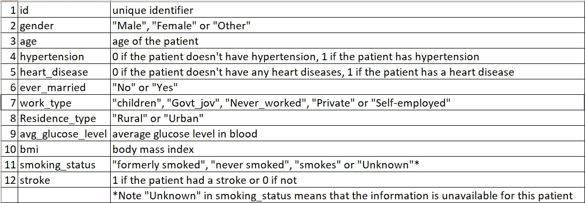

Figure 1:- Data Dictionary

**数据分析开始…**

**第一步**

导入必要的库:

```
import pandas as pd # For data manupulation.
import seaborn as sns # For visualization
import matplotlib.pyplot as plt # For visualization
import warnings # For suppressing warnings
warnings.filterwarnings("ignore")
```

**第二步**

将数据加载到 pandas dataframe 中并打印出样本。

```
# Loading data into a pandas dataframe and printing out its sample.
strokes_data = pd.read_csv("healthcare-dataset-stroke-data.csv")
strokes_data.head(10)
```

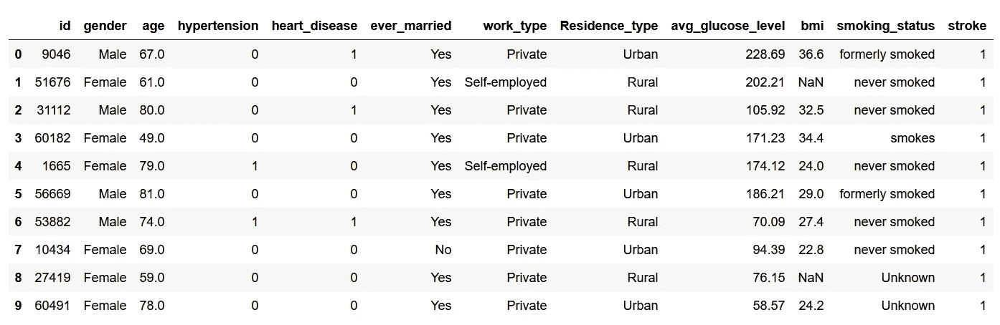

Figure 2:- Sample of the dataset.

仅仅通过查看数据集的样本，我们就可以找出列以及它们包含的数据类型。

**观察:**

*   id 列是唯一的标识符。
*   数据集包含分类列和数字列。

**分类列:**

*   **性别**:患者的性别。
*   **高血压**:患者是否患有高血压(1)，是否患有高血压(0)。
*   **心脏病**:患者是否患有心脏病(1)(0)。
*   **:患者的婚姻状况，如果已婚(是)否则(否)。**
*   ****工作类型**:患者的职业类型。**
*   ****居民 _ 类型**:患者的居住类型。**
*   ****吸烟 _ 状态:**患者多久吸烟一次(如果有)。**

****数值列:****

*   ****年龄**:患者的年龄**
*   ****平均葡萄糖水平**:患者的平均葡萄糖水平。**
*   ****bmi** :患者的身体质量指数。**

****输出栏**:**

*   ****中风**:患者是否可能中风(1)或不中风(0)。**

****第三步****

**通过打印形状来了解数据点的大小。**

```
# Printing the shape of data to know its size.
strokes_data.shape # 5110 rows and 12 columns
```

****第四步****

**生成描述性统计数据**

**我们可以应用“describe”命令来生成数据集的描述性统计数据。**

```
strokes_data.describe()
```

**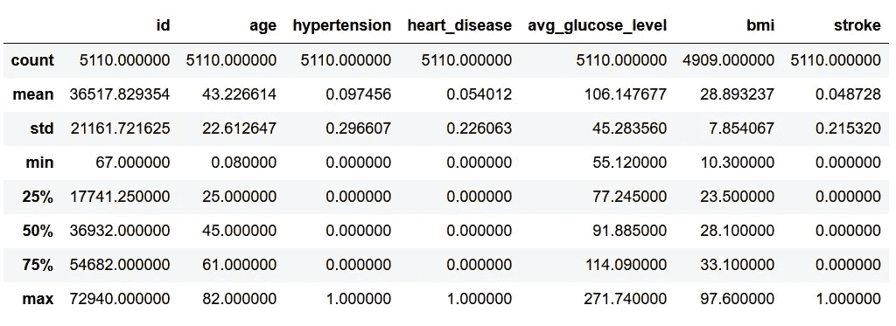**

**Figure 3:- Descriptive statistics of the dataset.**

****观察**:**

*   **bmi 列中有一些空值。因为它的计数与该列的总行数不匹配。**
*   **在给定的数据集中，患者的平均年龄为 43 岁。**
*   **高血压列和心脏病列的平均值明显低于 0.5(平均值为 0.1)。这意味着在给定的数据集中，几乎没有任何患者患有这些疾病。**
*   **平均葡萄糖水平在 100 左右，也可以认为是健康的。**
*   **笔画平均值的最大值为 1，最小值、第 25 个百分点值、第 50 个百分点值和第 75 个百分点值为 0。这意味着，列中的大多数值都是 0。**

****第四步****

**注意 NA 值**

**由于 bmi 列的给定数据集中有一些 NA 值，我们需要注意它们。一种这样的策略是简单地删除包含空值的行。但是，在此之前，让我们看看相关的行是否包含任何 stroke 状态为 1 的行。**

**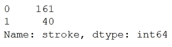**

**Figure 3:- Count of rows that have stroke as 0 and 1 respectively when bmi is null.**

**由于数据集中有一些 bmi 为空但 stroke 为 1 的行，我们将不删除这些行，而是用列的平均值对其进行估算。**

```
mean_value = strokes_data['bmi'].mean()
strokes_data.fillna(mean_value, inplace = True)
```

****第五步****

**可视化输出列的频率。**

**我们将用一个计数图来说明这一点。计数图用于使用条形显示每个分类箱中的观察值计数。**

**计数图可被视为分类变量而非定量变量的直方图。**

```
# Count of Patients that suffer from stroke along with those that did not.
sns.set(rc={'figure.figsize':(18,10)})
seaborn_plot = sns.countplot(strokes_data['stroke'])
seaborn_plot.set_xlabel("Stroke",fontsize=20)
seaborn_plot.set_ylabel("Count of Patient",fontsize=20)
```

**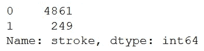****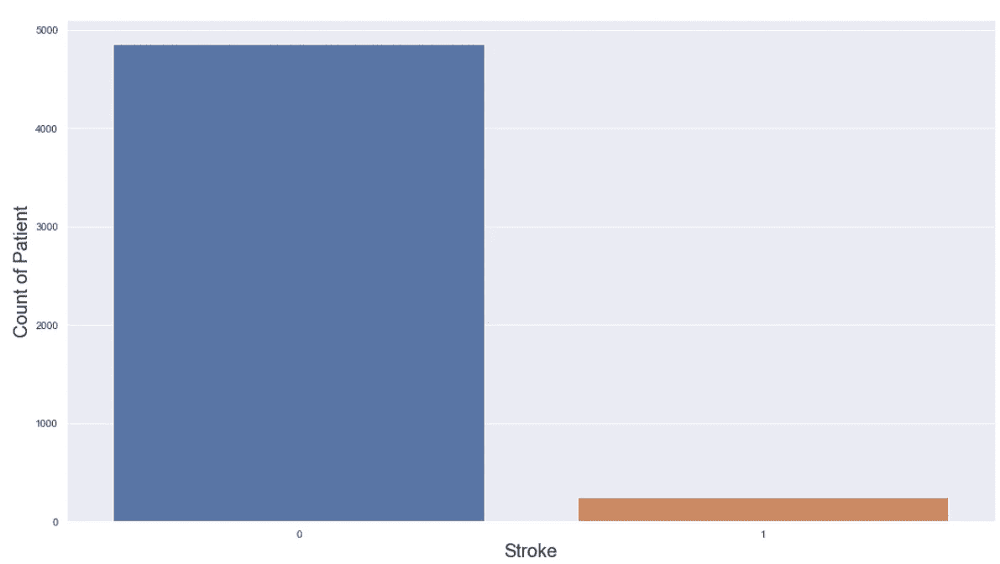**

**Figure 4:- Countplot for patients.**

****观察:****

*   **在这个数据集中有两个结果:0 和 1 表示中风的可能性。**
*   **这是一个不平衡的数据集，因为与未患中风的患者人数相比，可能患中风的患者人数较少。**

****第六步****

**单独研究变量并评估它们对输出列的影响。**

```
print(strokes_data['ever_married'].value_counts())
sns.countplot(strokes_data['ever_married'],hue = strokes_data['stroke'])
```

**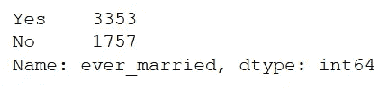****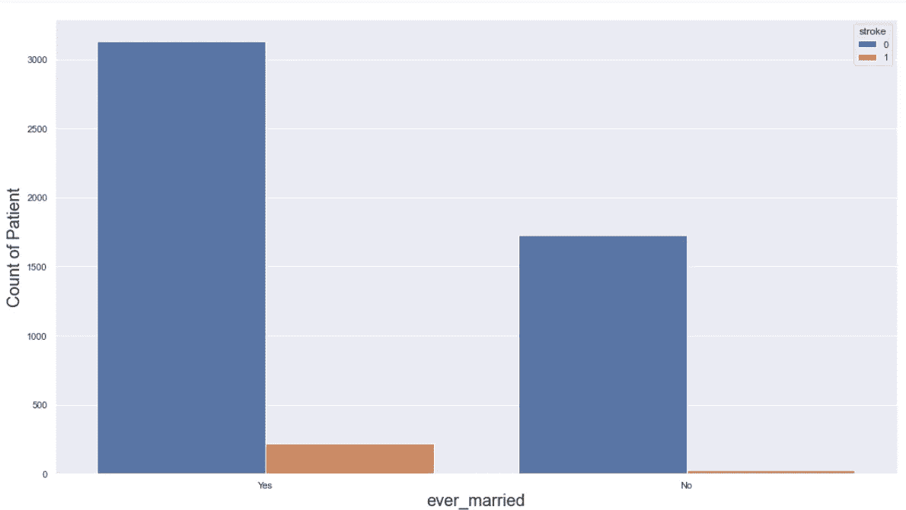**

**Figure 5:- Count of patients based on their marital status.**

****观察**:**

*   **在给定的数据集中，大多数患者是已婚的。**
*   **婚姻状况本身并不是预测中风可能性的重要因素。**

```
print(strokes_data['gender'].value_counts())
sns.set(rc={'figure.figsize':(18,10)})
seaborn_plot = sns.countplot(strokes_data['gender'], hue = strokes_data['stroke'])
seaborn_plot.set_xlabel("gender",fontsize=20)
seaborn_plot.set_ylabel("Count of Patient",fontsize=20)
```

**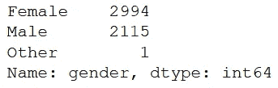****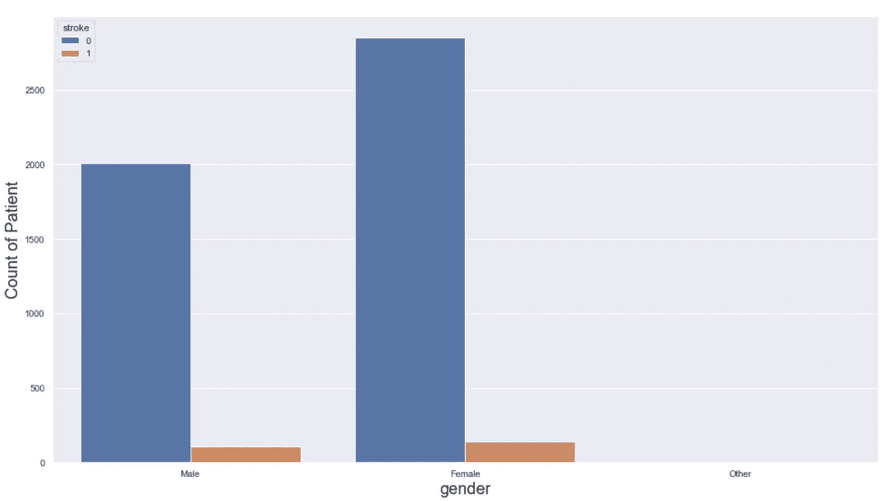**

**Figure 6:- Count of patients based on their gender status.**

****观察**:**

*   **在这两种情况下，女性患者的数量都多于男性患者的数量。**
*   **性别变量本身不足以预测中风的可能性。**

```
print(strokes_data['heart_disease'].value_counts())
sns.set(rc={'figure.figsize':(18,10)})
seaborn_plot = sns.countplot(strokes_data['heart_disease'], hue = strokes_data['stroke'])
seaborn_plot.set_xlabel("heart_disease",fontsize=20)
seaborn_plot.set_ylabel("Count of Patient",fontsize=20)
```

**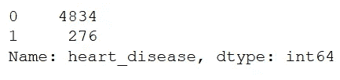****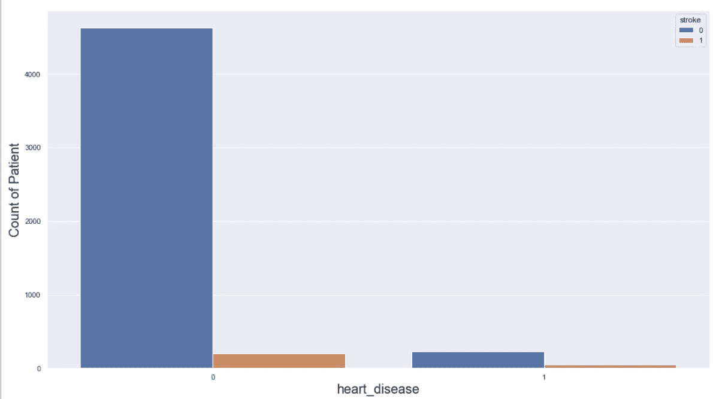**

**Figure 7:- Count of patients based on whether they suffer from heart_disease.**

****观察**:**

*   **与不患心脏病的病人相比，患心脏病的人数相当少。**

```
print(strokes_data['work_type'].value_counts())
sns.countplot(strokes_data['work_type'], hue = strokes_data['stroke'])
```

**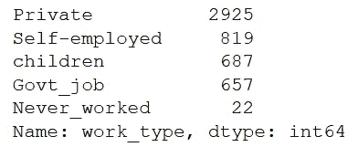****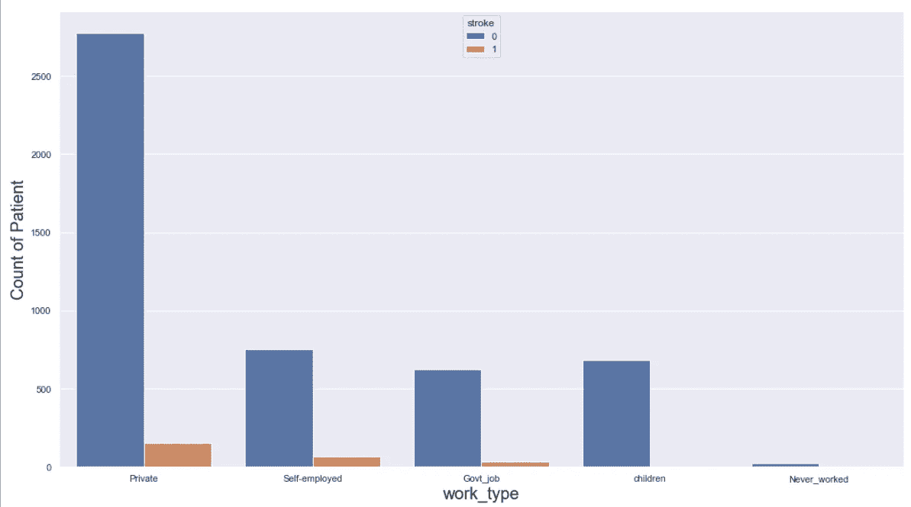**

**Figure 8:- Count of patients based on their profession.**

****观察:****

*   **我们没有太多关于从未工作过的患者的数据，也没有太多关于那些从未患过中风的患者的数据。**
*   **儿童类别也不包括任何患有中风的患者。**
*   **上述发现并不意味着上述类别不会遭受中风，它只是意味着我们有一个小的数据集。当然，儿童患中风的情况极其罕见。**
*   **work_type 变量本身将为我们提供一个不适合的模型。**

```
print(strokes_data['Residence_type'].value_counts())
sns.set(rc={'figure.figsize':(18,10)})
seaborn_plot = sns.countplot(strokes_data['Residence_type'], hue = strokes_data['stroke'])
seaborn_plot.set_xlabel("Residence_type",fontsize=20)
seaborn_plot.set_ylabel("Count of Patient",fontsize=20)
```

**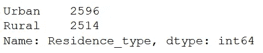****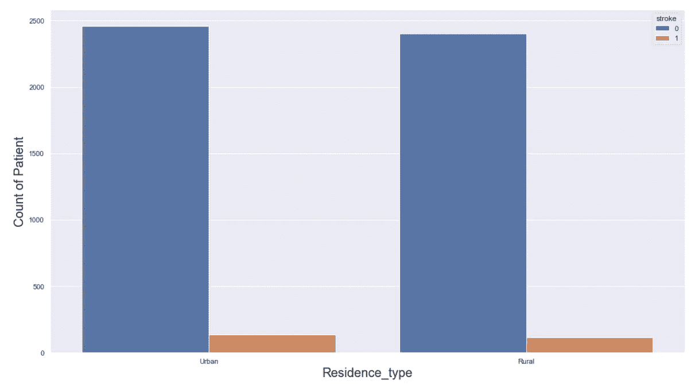**

**Figure 9:- Count of patients based on their residence.**

****观察**:**

*   **相当数量的患者生活在城市和农村地区。**
*   **Residence_type 列本身也不够好。**

```
print(strokes_data['smoking_status'].value_counts())
sns.countplot(strokes_data['smoking_status'], hue = strokes_data['stroke'])
```

**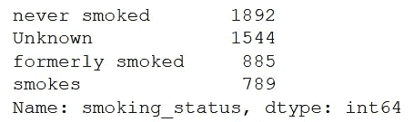****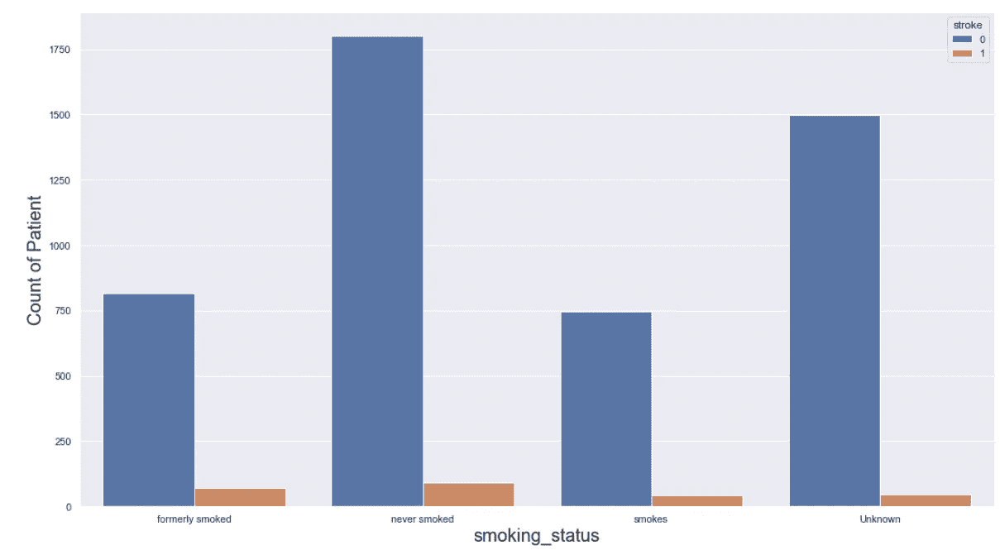**

**Figure 10:- Count of patients based on their smoking habits.**

****观察**:**

*   **吸烟状态本身也不是患者是否可能患中风的良好指标。**

```
print(strokes_data['hypertension'].value_counts())
sns.set(rc={'figure.figsize':(18,10)})
seaborn_plot = sns.countplot(strokes_data['hypertension'], hue = strokes_data['stroke'])
seaborn_plot.set_xlabel("hypertension",fontsize=20)
seaborn_plot.set_ylabel("Count of Patient",fontsize=20)
```

**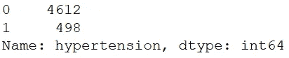****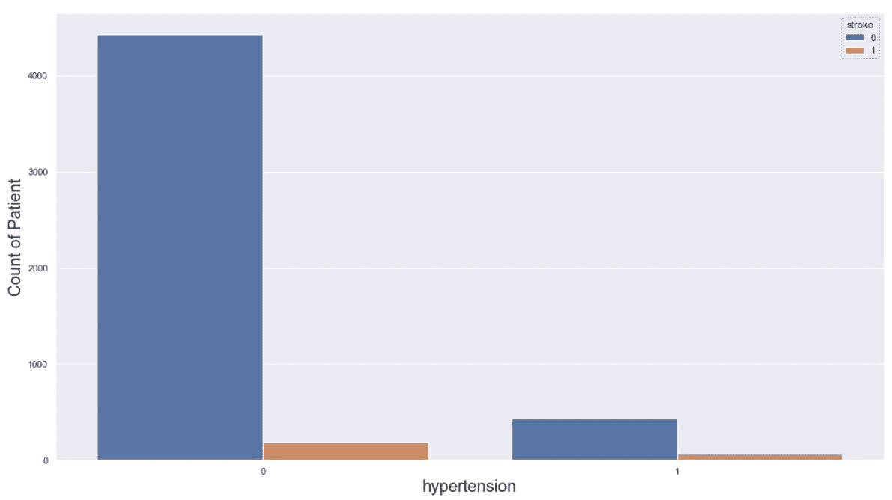**

**Figure 11:- Count of patients based on whether they have hypertension.**

****观察**:**

*   **高血压本身也不是一个足够好的变量。**

**现在我们已经分析了所有的分类变量，让我们看看数字变量的相关性。**

**我们可以借助热图来做到这一点。热图是数据的二维图形表示，矩阵中包含的各个值用颜色表示。seaborn python 包允许创建带注释的热图。**

```
fig, ax = plt.subplots(figsize=(7, 7))heatmap = sns.heatmap(strokes_data[['age', 'avg_glucose_level', 'bmi']].corr(), vmax=1, annot=True,ax = ax)heatmap.set_title('Correlation Heatmap')
```

**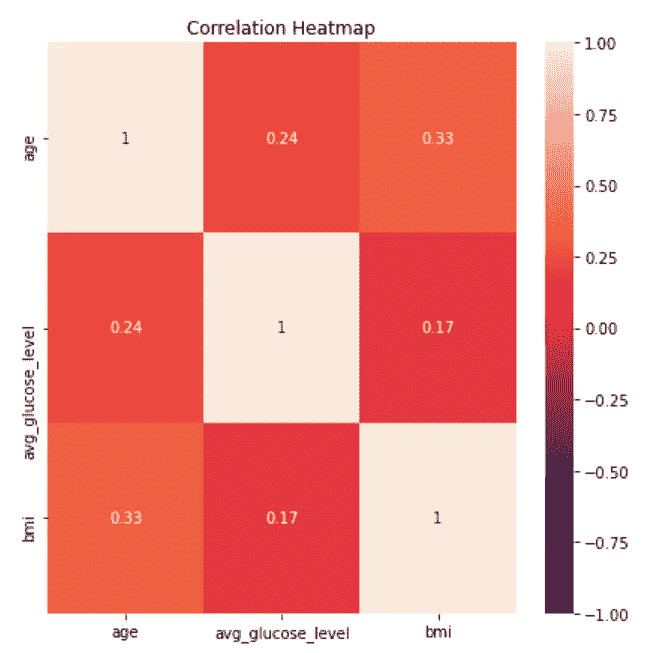**

**Figure 12:- Heatmap of numerical variables present in the dataset.**

****观察**:**

*   **年龄和 bmi 有一定的正相关关系。**
*   **总的来说，这三个变量彼此正相关。然而，年龄和 bmi 显示出更强的相关性。**

**我们将绘制数字变量的散点图，并使用颜色编码来确定所用变量的组合是否对输出类有任何影响。**

```
sns.set_style("whitegrid")
sns.FacetGrid(strokes_data, hue="stroke", height=5).map(plt.scatter, "age", "avg_glucose_level").add_legend()
plt.title('Age vs avg_glucose_level')
plt.show()
```

**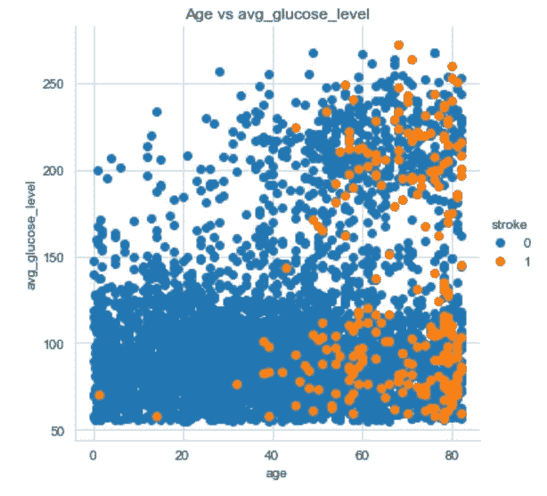**

**Figure 13:- Scatterplot of Age and avg_glucose_level**

****观察**:**

*   **年龄越大，患中风的可能性越大。**
*   **我们可以看到几乎所有的黄点都是 40 后。然而，值得注意的是，许多蓝色斑点也出现在 40 岁以后。**
*   **年龄变量在创建模型时会很有用。**

**Seaborn distplot 允许您显示一个带线条的直方图。这可以表现在各种各样的变化中。我们将 seaborn 与 Python 绘图模块 matplotlib 结合使用。distplot 绘制观察值的单变量分布。**

```
sns.FacetGrid(strokes_data, hue="stroke", height = 8).map(sns.distplot, "age").add_legend()
plt.title("Distplot for patients' age")
plt.show()
```

**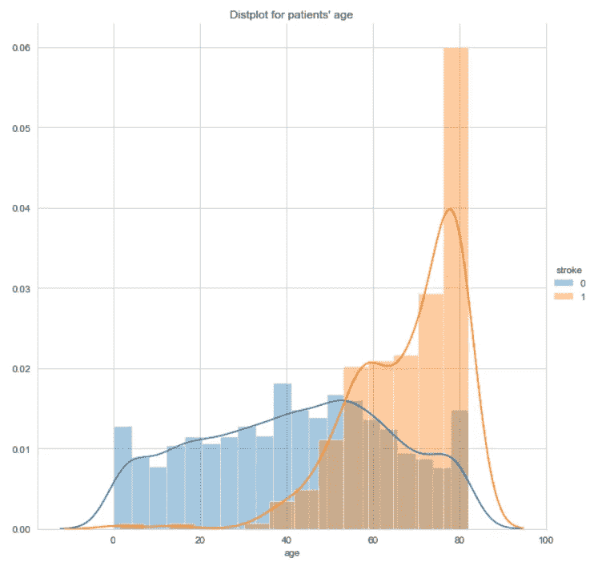**

**FIgure 14:- Distplot for age.**

****观察**:**

*   **一般来说，年龄越大，中风的可能性越大。**

```
sns.FacetGrid(strokes_data, hue="stroke", height = 8).map(sns.distplot, "bmi").add_legend()
plt.title("Distplot for patients' bmi")
plt.show()
```

**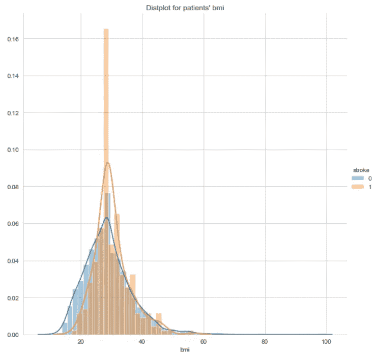**

**Figure 15:- Distplot for patient’s bmi.**

**观察:**

*   **bmi 栏本身不能用来预测中风的可能性。**

```
sns.FacetGrid(strokes_data, hue="stroke", height = 8).map(sns.distplot, "avg_glucose_level").add_legend()
plt.title("Distplot for avg_glucose level")
plt.show()
```

**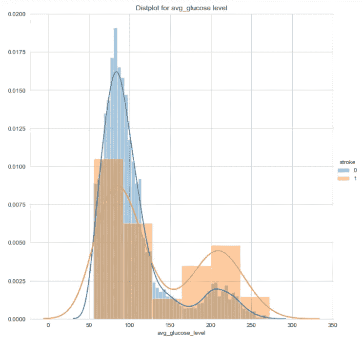**

**Figure 16:- Distplot for avg_glucose_level of patient**

****观察**:**

*   **avg_glucose_level 列本身不能用于预测中风的可能性。**

**盒须图是一种在区间尺度上总结一组测量数据的方法。它常用于解释性数据分析。这种类型的图形用于显示分布的形状、中心值及其可变性。**

**注意:在下面的图中，一种叫做四分位间距的技术被用于绘制胡须。下图中的触须与最小值和最大值不对应。**

```
sns.set(rc={'figure.figsize':(18,10)})
sns.boxplot(x='stroke',y='age', data=strokes_data)
seaborn_plot.set_xlabel("stroke",fontsize=20)
seaborn_plot.set_ylabel("age",fontsize=20)
plt.show()
```

**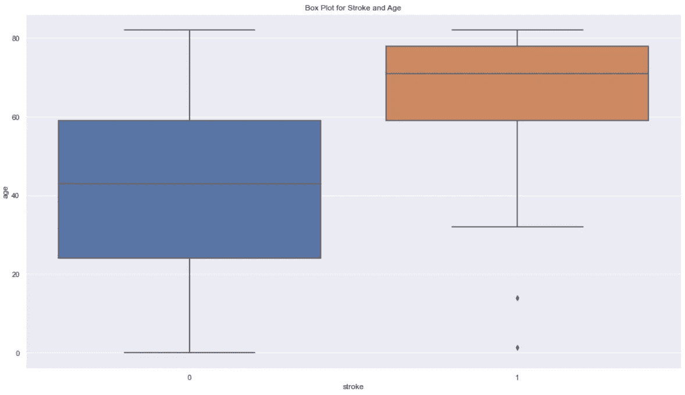**

**Figure 17:- Box Plot for Stroke and Age**

****观察**:**

*   **未患中风的患者的第 75 百分位相当于患中风的患者的第 25 百分位。**
*   **当与第 25 百分位和第 50 百分位相比时，可能患中风的患者的第 50 百分位和第 75 百分位具有较小的差距。**

****violin plot** 是一种绘制数字数据的方法。它类似于一个[盒子图](https://en.wikipedia.org/wiki/Box_plot)，在每一侧增加了一个旋转的[内核密度图](https://en.wikipedia.org/wiki/Kernel_density_estimation)。**

**Violin 图类似于[箱线图](https://en.wikipedia.org/wiki/Box_plot)，除了它们也显示不同值的数据的[概率密度](https://en.wikipedia.org/wiki/Probability_density_function)，通常由[核密度估计器](https://en.wikipedia.org/wiki/Kernel_density_estimator)平滑。通常情况下，violin 图将包括盒图中的所有数据:数据中值的标记；指示四分位范围的方框或标记；并且如果样本数量不太高，可能包括所有的样本点。**

```
# Violin Plot for Age and Stroke
sns.set(rc={'figure.figsize':(18,10)})
seaborn_plot = sns.violinplot(x='stroke',y='age', data=strokes_data)
seaborn_plot.set_xlabel("Stroke",fontsize=20)
seaborn_plot.set_ylabel("Age of Patient",fontsize=20)
```

**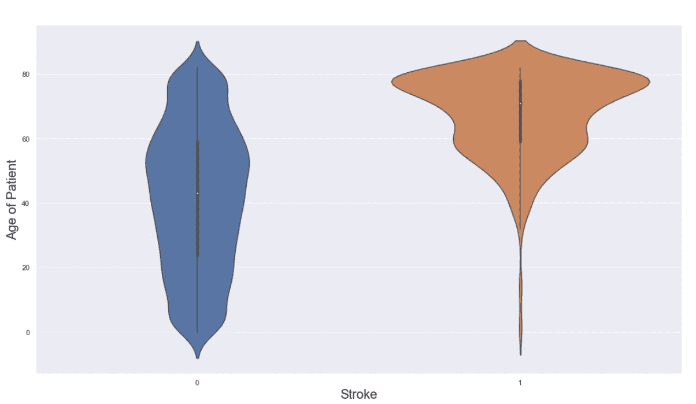**

**Figure 18:- Violin Plot for Age and Stroke**

****观察:****

*   **当患者年龄在 75-80 岁左右时，中风的可能性最大。**

****结论****

*   **当使用多列时，我们可以预测中风的可能性。**

**你可以从[这里](https://github.com/kami71539/EDA_Stroke_Dataset)下载我的 jupyter 笔记本，玩玩它或者创建你自己的。**

# **参考资料:**

**[https://seaborn.pydata.org/generated/seaborn.countplot.html](https://seaborn.pydata.org/generated/seaborn.countplot.html)**

**[https://pythonbasics.org/seaborn-distplot/](https://pythonbasics.org/seaborn-distplot/)**

**[https://blog . quantin STI . com/creating-heat map-using-python-seaborn/](https://blog.quantinsti.com/creating-heatmap-using-python-seaborn/)**

**[https://www . webmd . com/diabetes/QA/什么是正常血糖水平](https://www.webmd.com/diabetes/qa/what-are-normal-blood-sugar-levels)**

**关于这篇文章或任何其他数据科学的东西，请随时通过 Linkedin 联系我。**