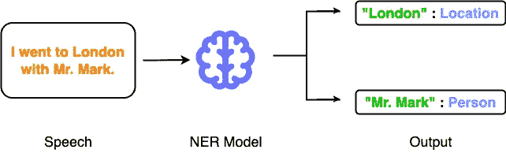
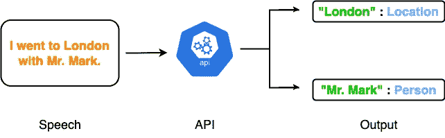
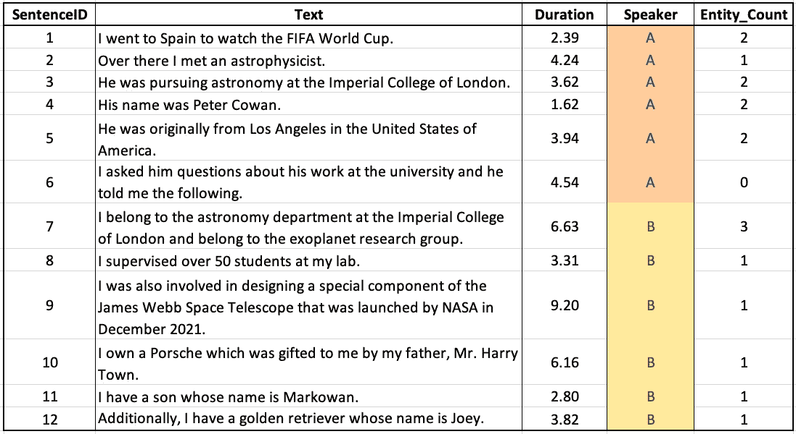
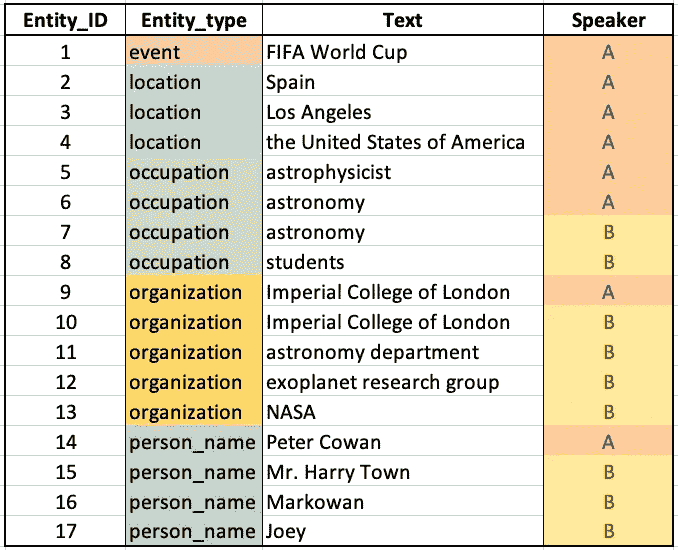

# 对音频数据执行命名实体识别

> 原文：<https://medium.com/geekculture/performing-named-entity-recognition-on-audio-data-6e321843d270?source=collection_archive---------6----------------------->

## 从语音中提取命名实体


Photo by [Bee Balogun](https://unsplash.com/@bee_balogun?utm_source=medium&utm_medium=referral) on [Unsplash](https://unsplash.com?utm_source=medium&utm_medium=referral)

命名实体识别(或简称 NER)被定义为从给定的信息中识别现实世界实体的任务。NER 是机器学习中的一个流行任务，它是使用各种自然语言处理(NLP)技术来解决的。具体到文本数据，目标是训练一个模型，该模型可以理解给定的一段文本，并识别和提取指代现实世界实体的单词。这些真实世界的实体也称为命名实体。

下图显示了 NER 系统的高级概览。



An overview of the NER model (Image by author)

NLP 研究团体已经提出了许多专门针对文本数据的 NER 方法。这个领域中两个最广泛实验的数据集是 [CoNLL 2003](https://paperswithcode.com/sota/named-entity-recognition-ner-on-conll-2003) 和 [OntoNotes](https://paperswithcode.com/sota/named-entity-recognition-ner-on-ontonotes-v5) 数据集。然而，由于基于语音的交互工具的广泛采用，最近，我们看到研究人员和组织也在语音领域探索和构建 NER 系统。

因此，这篇文章将展示如何使用 **AssemblyAI API** 和 **Python** 在语音数据上构建命名实体识别系统。端到端系统在严格的语言理解、摘要和关键词提取方面具有广泛的适用性，这使得它成为一个需要解决的重要且有价值的问题，尤其是在语音领域。我将用一个全面的分析来结束这篇文章，让你解释获得的结果，并从数据中得出适当的见解。

你可以在这里找到这篇文章的代码。此外，文章的亮点如下:

[**对音频数据进行实体检测**](#3f04)[**实体检测结果**](#7ea6)[**实体检测见解**](#802b)

我们开始吧🚀！

# 音频数据的实体检测

在这一节中，我将演示如何使用 AssemblyAI API 从预先录制的音频文件中识别和提取命名实体。此外，提取的实体将被分类到它们各自的实体类别中，例如:`person`、`location`、`organisation`、`date`、`event`、`occupation`等。，与下图中“伦敦”被归类为`location`的方式类似:



An overview of the NER model through an API (Image by author)

## 步骤 1:安装要求

要从本地机器调用 AssemblyAI API 并构建实体检测模块和实体分类器，您需要 Python 中的`[requests](https://pypi.org/project/requests/)`包，它可以按如下方式安装:

```
pip install requests
```

## 步骤 2:生成您的 API 令牌

下一步是让您的 API 键访问 AssemblyAI 的语音到文本模型。您可以通过在 [AssemblyAI](https://app.assemblyai.com/signup) 网站上免费创建一个帐户来完成此操作。

## 步骤 3:上传音频文件

您想要转录和提取命名实体的音频文件应该可以通过 URL 访问。因此，在调用语音到文本模型之前，您需要将音频文件上传到文件托管服务。选项包括 AWS S3 桶，音频托管服务，如 SoundCloud 或 AssemblyAI 的自托管服务等。对于本教程，我上传了音频文件到 SoundCloud。

## 步骤 4:执行实体检测和分类

在这一步，我们已经满足了从音频文件中检测实体的所有必要的先决条件。现在，我们可以调用 API 来提取命名实体。这是一个进一步的两步过程，在下面的小节中演示。

## 步骤 4.1:提交文件进行转录

第一步是通过调用 HTTP Post 请求来触发语音到文本模型。POST 请求将音频文件作为`audio_url`，并使用`entity_detection`标志指示模型执行命名实体识别。由于音频文件包含多个扬声器，我将`speaker_labels`标志设置为`True`。

收到的 JSON 响应表明 post 请求的`status`是`queued`，意味着文件在等待转录的队列中。

而且`entity_detection`标志也是 JSON 响应中的`True`。然而，`entities`键对应的值为**无，**为当前状态`queued`。

## 步骤 4.2:获取转录结果

为了检查 POST 请求的状态并查看转录结果，我们需要使用上面收到的 JSON 响应中的`id`键发出 GET 请求。我们通过从 POST 请求接收的`response_id`来检查转录状态。

> **注**:只有`*status*`键变为`*completed*`键，转录结果才可用。人工智能模型进行转录和执行下游 NLP 任务(如本例中的 NER)所花费的时间很大程度上取决于音频文件的大小和持续时间。因此，您必须定期重复发出 GET 请求来检查转录状态:

# 实体检测结果

一旦`status`变为`completed`，您将收到类似于下面提到的响应。

1.  我们将 JSON 响应中的`status`视为`completed`。这表示音频转录成功。
2.  `text`键将输入音频文件的转录保存为字符串，不区分扬声器级别。总共有 12 个句子。
3.  由于音频文件由多个扬声器组成，我们将`words`键中的所有`speaker`键视为**非空**。`speaker`键为“A”或“b”
4.  `confidence`分数突出了模型在转录单个单词和整个转录文本时的信心。范围从 0 到 1——“0”为最低,“1”为最高。
5.  使用 JSON 响应的`entities`键，可以访问音频中 12 个单独句子中检测到的实体的结果。
6.  音频文件中标识的实体数量是 17。
7.  对应于每个实体，我们得到一个`entity_type`,它描述了被检测实体的类别。

# 实体检测洞察

由于 JSONs 通常难以阅读和解释，我们可以通过将上面的实体检测结果转换为数据帧来使数据在视觉上更具吸引力。这也将有助于有效地进行进一步的分析。我们将存储句子的`text`、句子的`duration`、句子的`speaker`和句子的`entity_count`。这在下面实现:

用上面的代码片段生成的 DataFrame 如下图所示。这里，我们有音频文件中说出的 12 个句子，以及相应的说话者标签(“A”和“B”)，它们的持续时间(以秒为单位)，以及一个描述句子中实体数量的字段。



Sentences in the audio file (Image by author)

接下来，我们生成另一个数据帧，它接受音频文件中标识的实体。这在下面实现，在代码块后生成数据帧:



Entities in the audio file (Image by author)

## #1 演讲者-句子分布

首先，让我们计算音频文件中所有单个说话者说出的句子数量。这可以使用如下所示的`value_counts()`方法来完成:

要查看两个扬声器的百分比分布，我们可以将`normalize = True`传递给`value_counts()`方法，如下所示:

## #2 发言者持续时间分布

接下来，让我们找出所有单个发言者的总发言时间。如下所示:

我们使用`groupby()`方法，将总时长计算为单个句子的`duration`的`sum`。就持续时间而言，说话者“B”是占优势的说话者。

## #3 扬声器实体-计数分布

在音频文件中总共提到了 17 个实体，其中 9 个由说话者“A”说出，其余的由说话者“B”说出。

## #4 实体类型分布

接下来，让我们分析音频文件中各个实体类型的分布。这通过使用`value_counts()`方法实现如下:

## #5 扬声器实体类型分布

最后，让我们评估一下每个说话者所说的实体类型的数量。这里，为了更好的可视化，我们将使用`crosstab()`，而不是使用`groupby()`方法。下面演示了这一点:

总之，在这篇文章中，我们使用 AssemblyAI API 在预先录制的音频文件上构建了一个命名实体识别模块。最后，我们对检测到的实体进行了广泛的分析。从 API 获得的结果突出显示了在输入音频文件的 12 个单独句子中识别的 17 个实体。

你可以在这里找到这篇文章的代码。

下次见。感谢阅读。