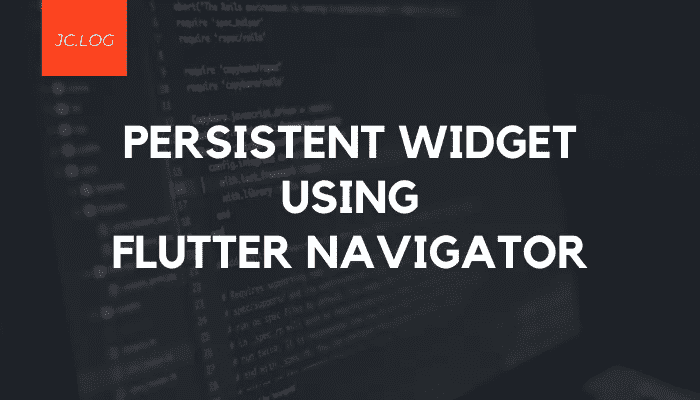
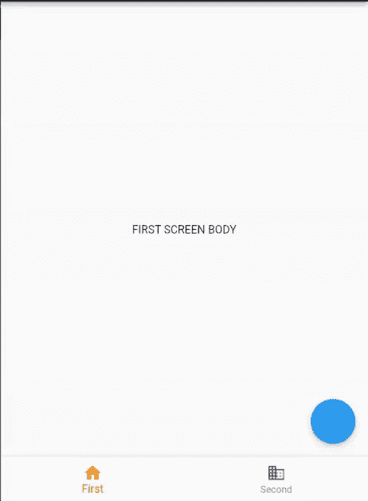
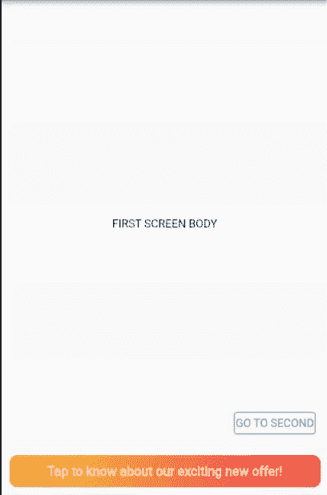

# 使用 Flutter Navigator 在所有屏幕上持续显示小部件

> 原文：<https://medium.com/geekculture/persistent-widget-across-all-screens-using-flutter-navigator-45e6b2e57cf7?source=collection_archive---------6----------------------->



今天的大多数应用程序都有底部导航栏或侧边导航栏，有时我们需要在导航到新屏幕时坚持使用。

但正常的颤振导航的问题是，当你推一个新的路线，底部导航不是坚持与它。我举个例子给你看。



另一个用例，对于一个 web 应用程序，如果我们需要一个侧边导航栏，我们通过改变当前显示的屏幕来实现它，那么用户将无法直接导航到特定的选项卡。不会有每个标签附加的网址。
举例:[https://www.facebook.com/](https://www.facebook.com/)和[https://www.facebook.com/watch](https://www.facebook.com/watch)是 facebook 的两个不同的标签页，可以使用 url 直接访问，也可以通过点击导航栏来访问。

还有一个用例，如果您希望在每个屏幕旁边都显示一个小部件，该怎么办？在每个屏幕上放置相同的小部件是可行的，但这是一个有点乏味的任务。

为了解决这些问题，我们将使用 flutter 提供的`Navigator` widget。使用这个小部件，我们将能够控制脚手架应该使用屏幕的哪个部分来导航。

让我们通过一个简单的例子来看看如何做到这一点。

我们将在这里创建两个东西:
1。BaseWidget
2。持久性小部件

# BaseWidget

该小部件接受子小部件，并在一列中显示子小部件和持久小部件。您可以在这个小部件中使用自己的布局。

传递的`child`是导航屏幕，我们需要它覆盖整个空间，所以它被一个`Expanded`小部件包装。

```
class BaseWidget extends StatelessWidget {
  final Widget **child**;
  const BaseWidget({this.child});
  [@override](http://twitter.com/override)
  Widget build(BuildContext context) {
    return Scaffold(
      body: Column(
        children: [
          Expanded(child: **child**),
          **PersistentWidget()**,
        ],
      ),
    );
  }
}
```

# 持久性小部件

这是我们希望在所有屏幕中显示的小部件。我已经创建了一个小工具，让用户从任何屏幕上检查报价。

```
class PersistentWidget extends StatelessWidget {
  [@override](http://twitter.com/override)
  Widget build(BuildContext context) {
    return Container(
      height: 40.0,
      margin: EdgeInsets.all(10.0),
      decoration: BoxDecoration(borderRadius: BorderRadius.all(new Radius.circular(10.0)),
        gradient: LinearGradient(colors: [Colors.yellow[700], Colors.redAccent],
          begin: Alignment.centerLeft, end: Alignment.centerRight, tileMode: TileMode.clamp)),
      child: Center(child: Text('Tap to know about our exciting new offer!', style: TextStyle(fontSize: 16.0, color: Colors.white70, fontWeight: FontWeight.bold), ), ),
    );
  }
}
```


我创建了三个虚拟屏幕，分别名为`FirstScreen`、`SecondScreen`和`ThirdScreen`。第一个和第二个屏幕有导航到下一个屏幕的按钮。

# 主要部分

`MaterialApp`提供了一个构建器，它将为我们提供当前的导航屏幕小部件。我们可以通过我们的`BaseWidget`传递这个小部件来得到我们想要的布局。

```
class MyApp extends StatelessWidget {
  [@override](http://twitter.com/override)
  Widget build(BuildContext context) {
    return **MaterialApp**(
      title: 'Flutter Demo',
      debugShowCheckedModeBanner: false,
      **builder: (context, child) => BaseWidget(child: child),**
      initialRoute: '/',
      routes: {
        '/': (context) => FirstScreen(),
        '/second': (context) => SecondScreen(),
        '/third': (context) => ThirdScreen(),
      },
    );
  }
}
```

我定义了命名路线，初始路线为`FirstScreen`。

现在，当堆栈中的任何一个屏幕被压入时，它都会经过我们的`BaseWidget`。`BaseWidget`将屏幕和`PersistentWidget`排成一列。

# 结果



如您所见，PersistentWidget 存在于所有屏幕中，即使我们导航到另一个屏幕。

相同的逻辑可以用于实现持久的底部导航栏或持久的侧边栏。

我希望这个简短的教程对你有所帮助。

感谢您阅读至此。请务必留下任何建议和评论👏为了这个故事。