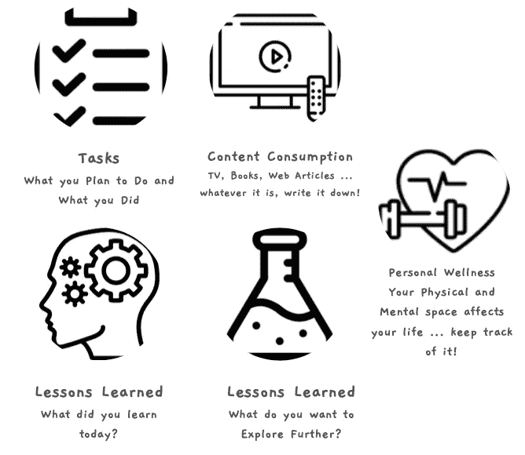

# 个人知识管理与个人生产力系统:都是关于元数据的

> 原文：<https://medium.com/geekculture/personal-knowledge-management-vs-personal-productivity-systems-its-all-about-the-metadata-cf2ffab3dd68?source=collection_archive---------2----------------------->

每天我都以漫游研究开始我的一天。我用我的日常模板来决定我的一天会是什么样子，那天我有多少任务，以及有多少时间会花在会议上。我也会回顾前一天，看看我实际上花了多少时间在会议上，我实际上完成了多少任务。这样，我可以跟踪是否…