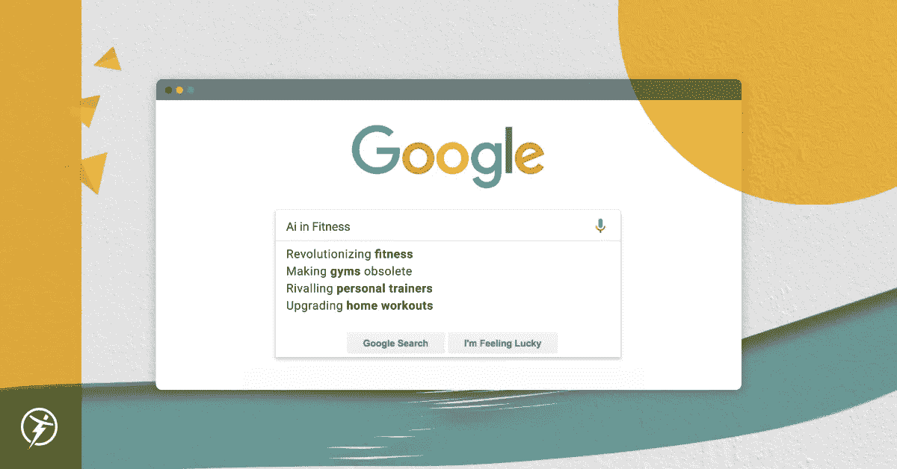
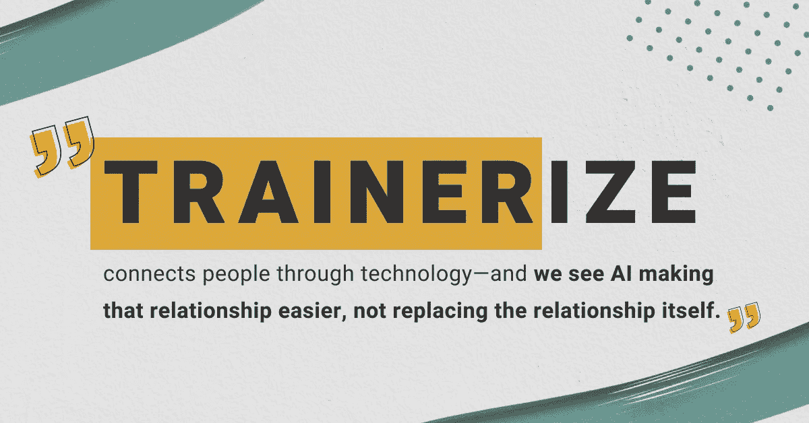
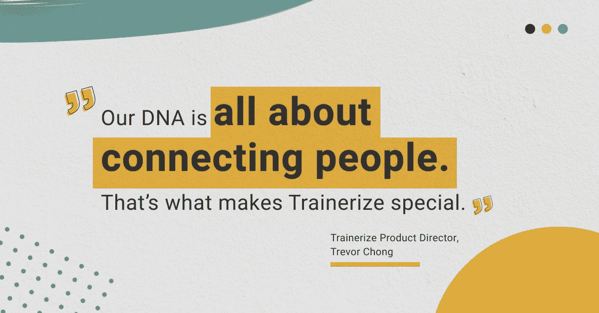
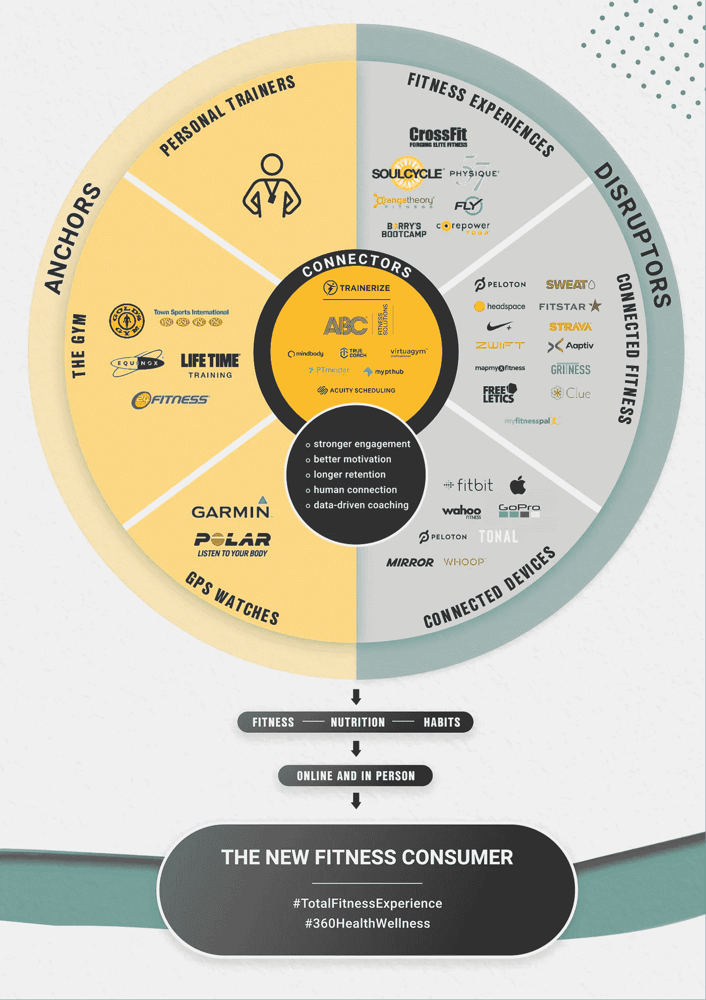

# 私人教练+人工智能:健身技术的完美组合

> 原文：<https://medium.com/geekculture/personal-trainers-ai-the-perfect-pair-in-fitness-tech-242f6b7aedc6?source=collection_archive---------41----------------------->

如果你在谷歌上搜索“人工智能在健身中”，结果是可以预见的:一堆标题，对人工智能将如何改变世界有不同程度的绝对性。

*革新健身运动*

*淘汰健身房*

*媲美私人教练*

*升级家庭健身程序*

我肯定会选择一个吸引人的标题，但我认为人工智能融入未来健身的方式比“接管健身行业”要复杂得多。

> 主要原因是人际关系。

我们基于关系的概念建立了 Trainerize 将人们与私人教练联系起来，并在会员和健身房之间建立更牢固的关系。Trainerize 通过技术将人们联系起来——我们看到人工智能使这种关系变得更容易，而不是取代这种关系本身。

# **行业领袖 x 艾**

去年秋天，据报道, [Mindbody 正在对人工智能](https://www.fittechglobal.com/fit-tech-news/Mindbody-ZeeZor-artificial-intelligence-machine-learning/346622)进行重大投资，我称之为网飞健身模型——专注于基于用户先前偏好的[建议](https://www.mindbodyonline.com/business/education/video/why-artificial-intelligence-good-thing),算法在正确的时间为正确的客户提供正确的程序和服务。

同样，Peloton [最近收购了](https://www.bnnbloomberg.ca/peloton-buys-wearables-ai-hardware-companies-in-deal-flurry-1.1580810)一些人工智能技术——但他们的重点是数字语音技术，允许画外音。苹果健身+是我最近最喜欢看的，它是苹果努力发展消费者健康的一部分。可以猜测，当谈到健身领域的人工智能时，他们的优先考虑是可穿戴设备和医疗数据分析。

所有这三种方法都与我们如何看待人工智能在未来几年影响 Trainerize 的业务有关。为了更深入地研究我们的计划，我请来了我们的产品总监 Trevor Chong 来进行一次人工智能对话。

# **Trainerize x AI**

在 Trainerize，我们看到人工智能指导教练和私人教练如何高度个性化他们的在线客户端程序，分析数据并提供更强有力的建议。

> 特雷弗说:“我们希望真正意识到人工智能是一种能够解决问题的工具。“这是一个流行词，我们不想随便用这个词。我们希望思考训练者面临的大问题——他们浪费时间做的事情——并使用人工智能作为解决这些问题的工具。”

这是我们人工智能方法的核心:针对培训师的业务方面，帮助他们更高效、更具战略性。

例如，我们看到模式识别技术管理客户保留。

> “会流失或取消的客户资料是什么样的？人工智能可以识别这些模式，找到这些相关性，并在为时已晚之前为培训师识别提供额外帮助的机会。这是一个定义明确的商业问题，人工智能可以解决，”特雷弗解释道。

Trevor 还看到人工智能支持培训师做出决策，如为客户识别改进机会或跟踪他们的进展。它可以处理教练的数据方面(展现有价值的信息和见解)，教练可以管理心理/情感方面。这个人的因素对我们非常重要。

> 让我说清楚——我们不认为人工智能应该取代训练员。在 Trainerize，我们希望突出和庆祝人际关系！

特雷弗同意。“我们的 DNA 就是将人们联系在一起。这就是 Trainerize 的特别之处。”

人工智能可以帮助培训师利用只有机器才能提供的管理和数据分析效率来扩展他们的业务，因此培训师可以在培训的人力方面花更多时间。

用户需要真正的动力——来自真实的人。一些家用健身技术缺乏责任心。最近的数据显示[疫情期间数字健身](https://dataconomy.com/2021/05/artificial-intelligence-changing-landscape-fitness/)的大规模采用，但消费者仍然发现动力来自与你的老师或教练的真实关系——不想让别人失望的愿望。我们把真正的教练和真正的人联系起来，用技术来促进这种关系，而不是取代它。

# **2021 年艾**

在更大的健身技术领域中思考人工智能是很有趣的——在互联健身空间中有不同层次的人类互动。当解决方案——Peloton、AI、B2C 应用、B2B 应用——都如此不同时，我们不能概括“互联健身”。(我在我最近的文章 [*颠覆者、锚、连接器*](https://sharad-mohan.medium.com/disrupters-anchors-and-connectors-why-i-love-the-change-happening-at-the-intersection-of-9131f4fb8ea8) *中更多地谈到了这一点)。*

我喜欢 Trainerize 和我们的竞争对手 Mindbody 之间的区别——这两个品牌服务于相同的市场，但在做完全不同的事情——以及我们如何看待人工智能支持我们的业务向前发展的两种不同观点。我们在同一个空间竞争，但我们每个人都大胆地站在自己的立场上，看待人工智能将提供的机会。

这种协同作用与我们最近与 Mindbody 的产品合作关系完全一致，这种合作关系使工作室和健身房能够通过 Mindbody 和 Trainerize 在线扩展他们的业务。工作室可以超越他们的四面墙，走 T2 的路，包括在线培训课程，视频电话预约，在两个平台之间无缝同步。通过这样做，工作室将利用人工智能的两种方法，这是我很期待看到的。