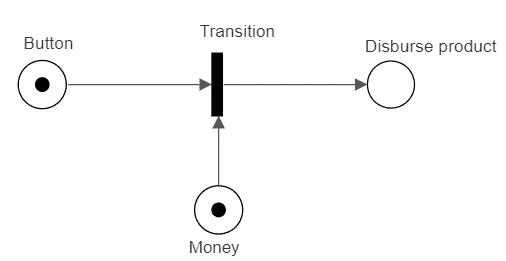
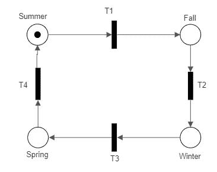

# 简化的 Petri 网

> 原文：<https://medium.com/geekculture/petri-net-simplified-3460a27cb1dd?source=collection_archive---------17----------------------->

Petri 网导论。

Photo by [Joanna Kosinska](https://unsplash.com/@joannakosinska?utm_source=medium&utm_medium=referral) on [Unsplash](https://unsplash.com?utm_source=medium&utm_medium=referral)

**Petri 网**是用来描述有限系统的数学模型。这种数学模型被用来以方程或矩阵的形式解释现实世界的问题。

它是由 ***地点*** (圆圈) ***转场*** (条形或矩形框) ***弧线*** (箭头)和 ***记号*** (圆点)组成的二分(包含两种类型的节点:在本例中为地点和转场)有向图。

> 位置用于定义系统的各种状态。转换代表一个动作。箭头连接地点和过渡，表示系统的流向。令牌存在于位置内部，当所有输入节点都有令牌时被触发。

**但是解雇是什么意思呢？输入和输出节点是什么？**

激发只是将一个令牌从一个位置转移到另一个位置，它是相对于转换节点来观察的，这意味着每个转换都有自己的一组输入和输出位置。输入节点是放置令牌的地方，从那里开始触发，输出节点是那些令牌最终被传输的地方。

让我们看一些例子来理解它是如何工作的…

**例 1:自动售货机**

Photo by [Kenny Eliason](https://unsplash.com/@neonbrand?utm_source=medium&utm_medium=referral) on [Unsplash](https://unsplash.com?utm_source=medium&utm_medium=referral)

Photo by Author

> **该系统的州/地方:**选择饮料的按钮(S1)，饮料的钱(S2)，处理饮料(S3)
> **转换:**检查用户是否已经选择了饮料并提供了钱(T)
> **令牌:**如果用户选择了饮料，则令牌或点出现在 S1，如果用户为饮料插入了钱，则令牌或点出现在 S2。

**例 2:一年的四季**

Photo by [Mike Scheid](https://unsplash.com/@mscheid?utm_source=medium&utm_medium=referral) on [Unsplash](https://unsplash.com?utm_source=medium&utm_medium=referral)

Photo by Author

> **该系统的状态/地点:**夏季(S1)、秋季/秋季(S2)、冬季(S3)、春季(S4)
> **过渡:**从一个季节变化到另一个季节(T1、T2、T3、T4)
> **令牌:**这是一个循环系统，每个状态都依赖于前一个状态。如果该令牌出现在 S1，则它成为系统的初始状态，暗示当前季节是夏季。

*感谢您的阅读。不要被 Petri 网石化了。XD*