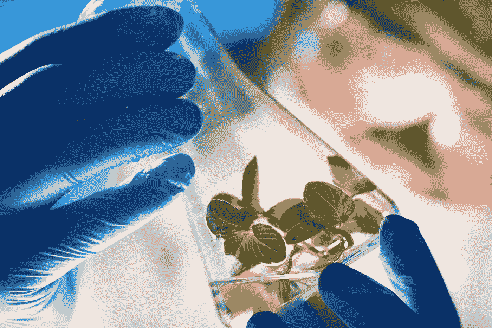

# 制药:有计划地生产药品

> 原文：<https://medium.com/geekculture/pharming-producing-pharmaceuticals-with-plans-a1d18565a346?source=collection_archive---------33----------------------->

## 医药**和**制药的绿色新时代

# 基因**工程和生物技术**

今天，多亏了基因工程，可以创造植物来生产药物。好处是多方面的:它们很容易处理，给农业的初级部门带来了强劲的发展，最终成本降低了十分之一…