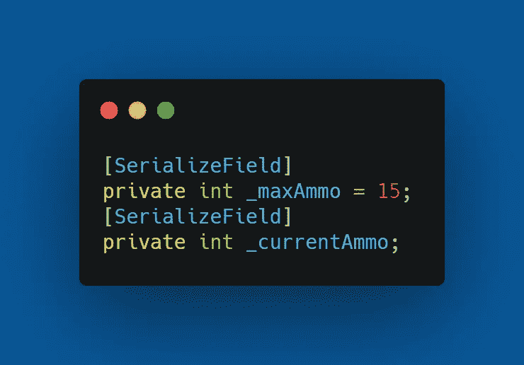
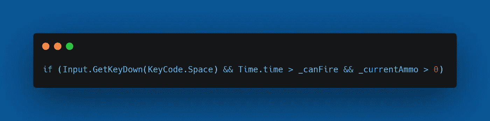
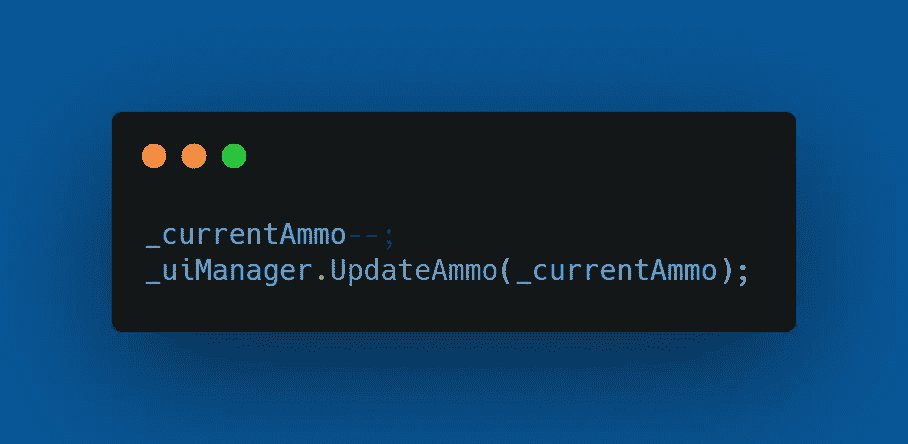
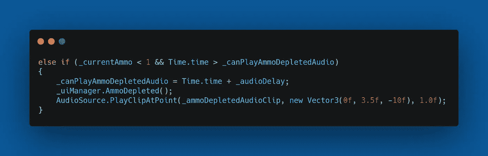
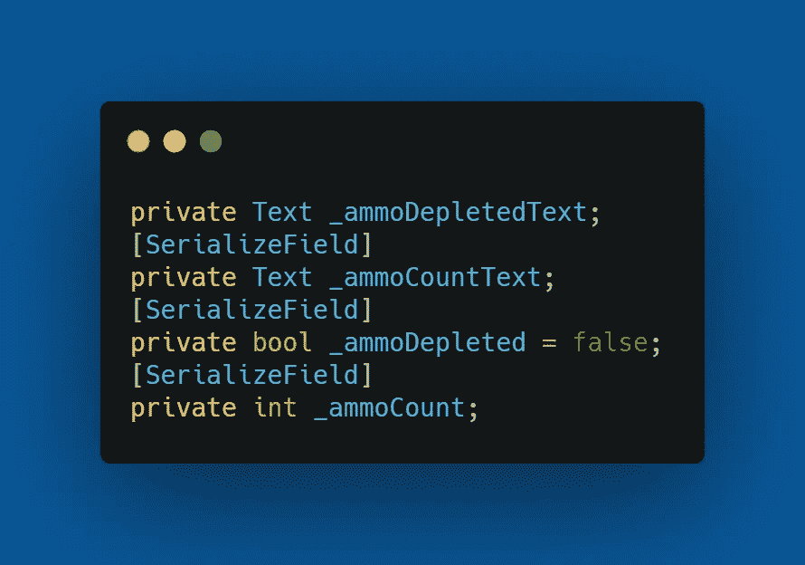
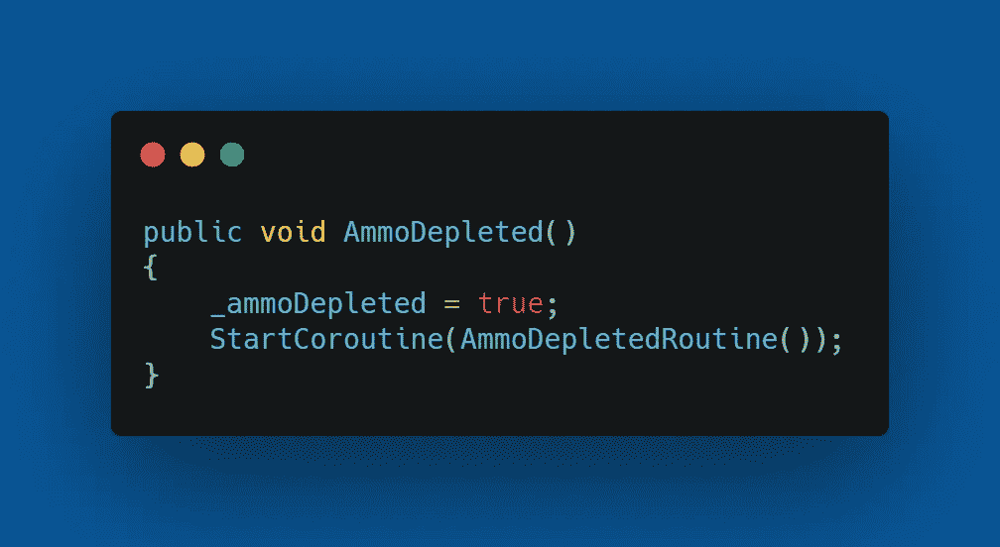
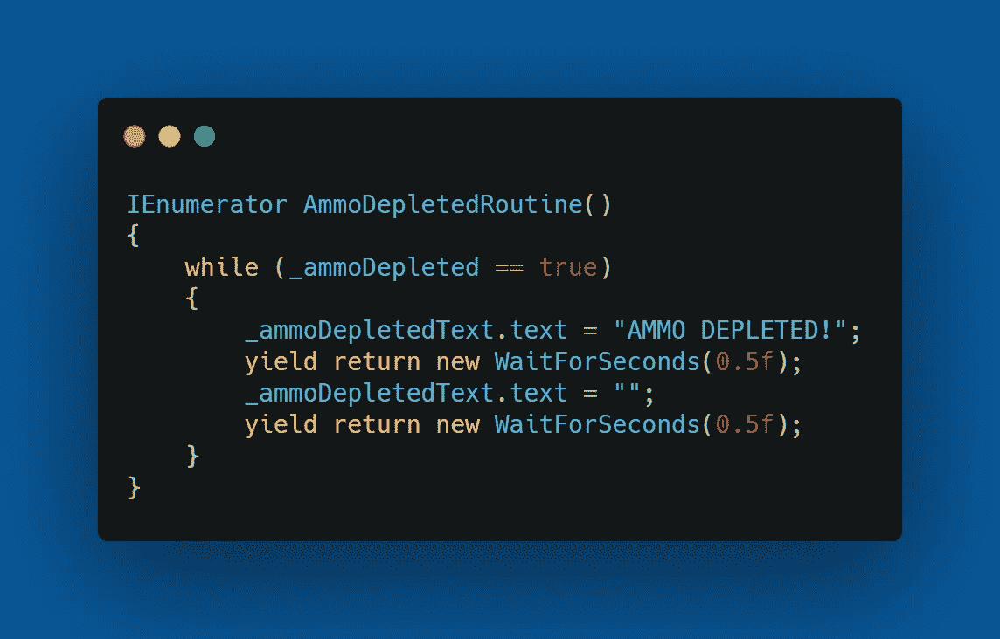

# 第一阶段:清点弹药

> 原文：<https://medium.com/geekculture/phase-i-ammo-count-c080cfe5e7f0?source=collection_archive---------69----------------------->

今天的目标是限制玩家的弹药。我将设置玩家可以持有的最大弹药为 15 发，并在弹药耗尽时提供屏幕计数器和声音提示。

首先，我需要给播放器添加两个变量。我将添加一个 _maxAmmo 和一个 _ currentAmmo 变量。最大弹药将被设置为 15。两者都将是私有的和连载的，如下所示。

在 LaserControl()方法中，我将添加一个检查，检查 _ currentAmmo 是否大于 0，如下所示。

这将确保玩家只有在有弹药可用的情况下才能开火。同样，在条件语句中，我们添加了下面两行。一种是每次发射激光时将 _ current amo 减 1，另一种是用 _ current amo 更新 _uiManager。

在第一个条件之后，我们添加一个 else if，它将控制没有弹药可用时会发生什么。我将使用一个名为 _ canPlayAmmoDepletedAudio 的私有浮点来查看如果播放器弹出 fire 键，是否有足够的时间再次播放音频剪辑。此外，我将在 UIManager 上调用一个名为 AmmoDepleted 的方法，只要没有弹药，它就会在屏幕上闪烁一条消息。它会演奏 _ ammoDepletedAudioClip。整个“else if”如下所示。

现在，在 UIManager 中，我添加了以下变量。

我还将添加一个名为 AmmoDepleted()的方法和一个名为 AmmoDepletedRoutine()的 IEnumerator。AmmoDepleted()方法会将 _ammoDepleted bool 更改为 true，并启动 AmmoDepletedRoutine()。

当 _ammoDepleted 为 true 时，AmmoDepletedRoutine()运行。它会在屏幕上闪现一条信息，让玩家知道他们没有弹药了。

这包括了我如何实现弹药数量限制和当玩家弹药耗尽时的通知。在下一篇文章中，我将建立一个收藏品来补充玩家的弹药。

下次再见，祝你在编码之旅中好运。