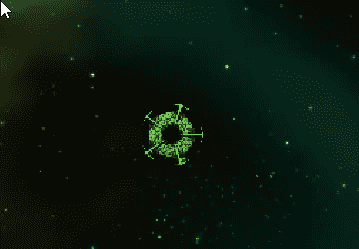
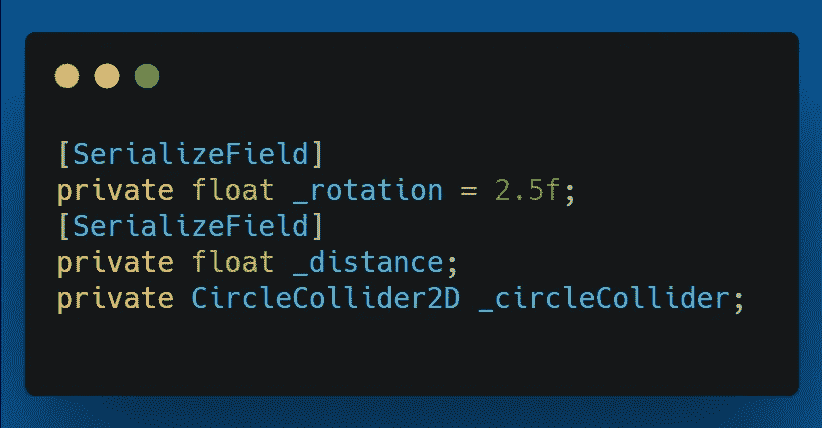
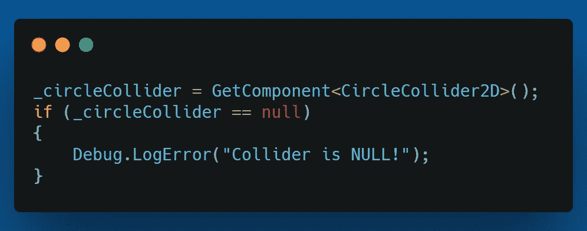
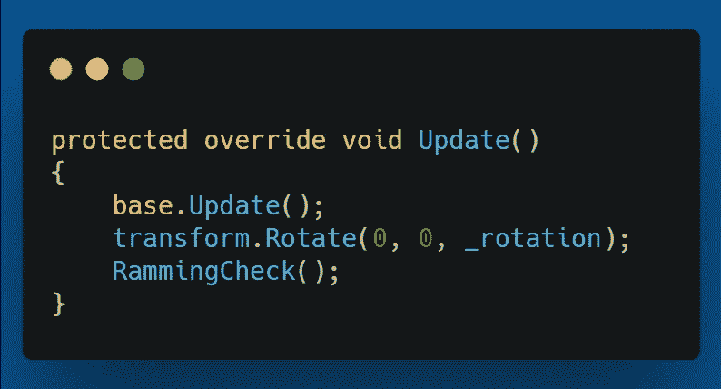
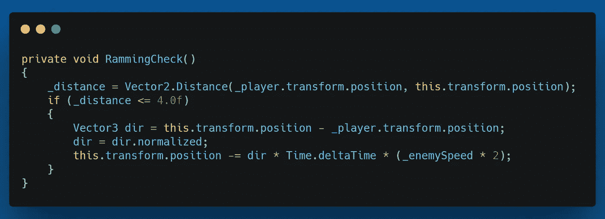
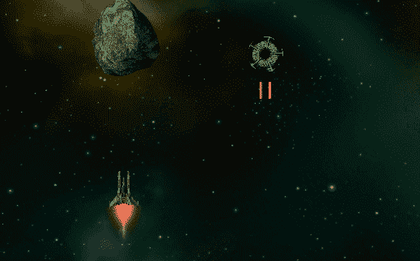

# 第二阶段:侵略型敌人

> 原文：<https://medium.com/geekculture/phase-ii-aggressive-enemy-type-874abdd8ce64?source=collection_archive---------77----------------------->

目标:游戏的最新目标是增加一个攻击性的敌人，当它在一定范围内时会撞向玩家。

有了新的敌人类型，就有了新的敌人图像。对于进攻的敌人，我会用下面的。

Ramming Enemy

它看起来有点像素化，但我会在最终发布前替换它和大多数其他的。

所以，和之前的一样，这一个将从 BaseEnemy 类继承。我还将在几个方法上使用覆盖，并添加以下变量。

我让这个敌人在移动的时候旋转，所以我可以通过序列化变量很容易地试验不同的旋转速度。_distance 浮动将用于敌人和玩家之间的距离。我也将对这个敌人使用 CircleCollider2D，而不是 box collider。

首先，我将在 Start()方法中进行重写。我会打电话给基地。Start()方法，然后我将进行空检查并获取对 CircleCollider2D 的引用。

接下来，我重写了 Update()方法。我再一次给基地打电话。Update()，因为我仍然需要那里的主要功能。我需要为这个敌人添加额外的行为。

打电话给基地后。Update()方法我使用 _rotation 变量为速度设置敌人在 z 轴上旋转。然后我调用 RammingCheck()方法，接下来我将介绍这个方法。

RammingCheck() method

在 RammingCheck()方法中，我在第一行中获取到玩家的距离。然后，如果距离小于 4.0f，我通过从玩家的位置减去敌人的变换位置来设置 Vector3 方向。然后我使用归一化变量，它将方向归一化，在我们的计算中使用。然后我们把敌人的变形向玩家的方向移动，让它以两倍的速度移动。

我知道有一个敌人会和玩家一起玩神风敢死队，为了集体的利益而牺牲自己。

我希望您能发现这些信息，并一如既往地祝您在自己的编码之旅中一切顺利。