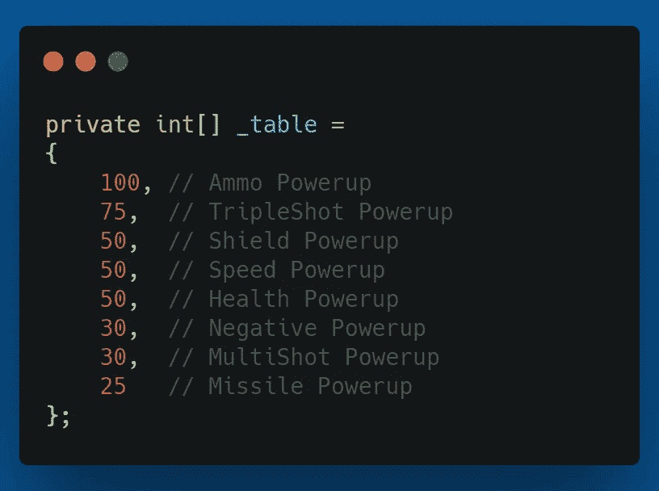
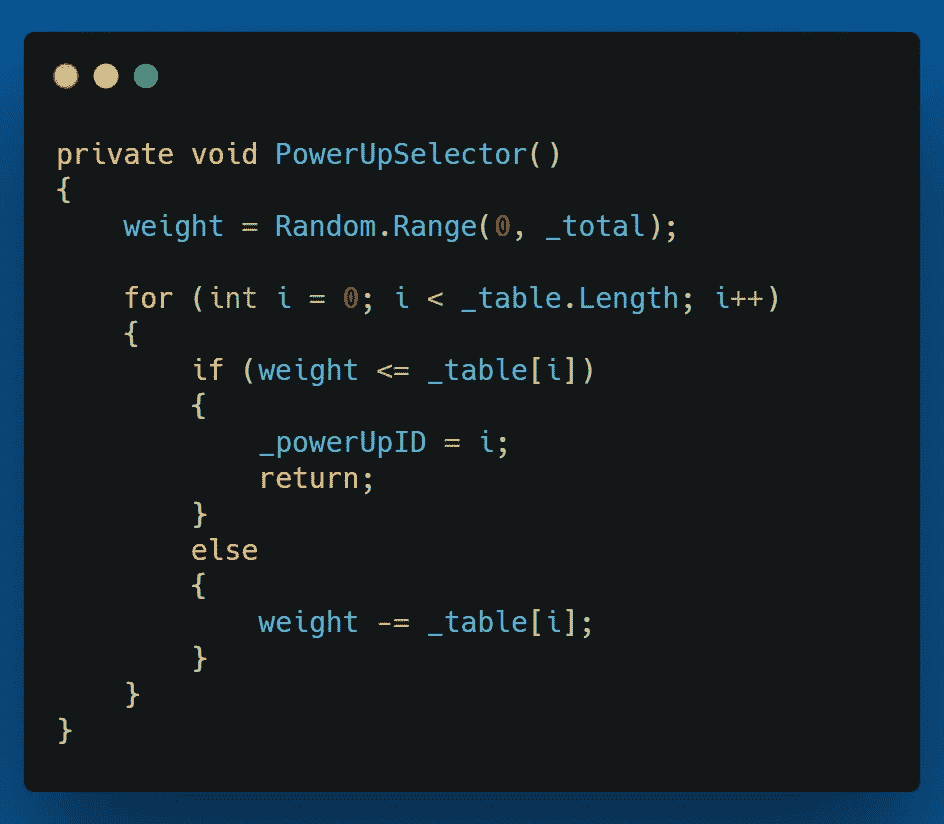
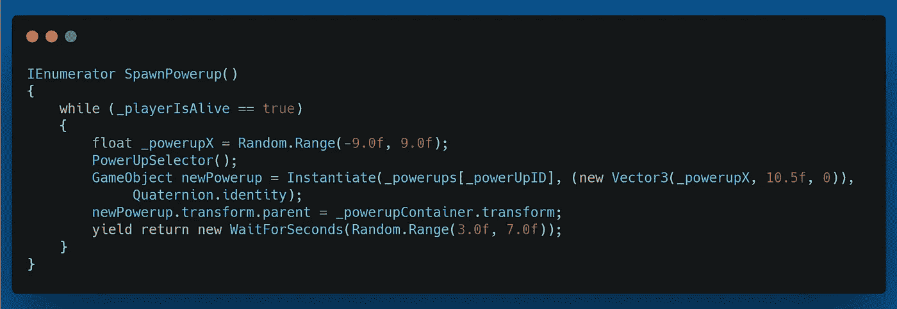
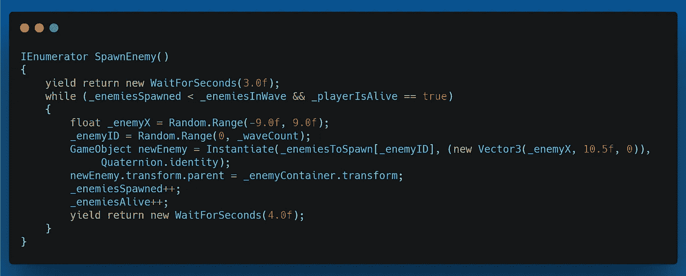

# 第二阶段:平衡产卵

> 原文：<https://medium.com/geekculture/phase-ii-balanced-spawning-14ac9c08d972?source=collection_archive---------57----------------------->

**目的:**打造平衡的产卵系统。像弹药这样的拾取应该更频繁，而像健康这样的拾取应该更少。

为了这个目标，我将设置一个加权系统来让能量产生，我将把敌人的产生与当前的波联系起来，这样随着波数的增加，更多类型的敌人将会产生。

我已经建立了一个表，为权力的加权产卵。我给弹药最大的机会掉落，然后逐渐减少其他弹药掉落的机会。这是他们的机会表。

我使用一个 **PowerUpSelector()** 方法使用加权系统从表中选择 powerup。

PowerUpSelector() method

在这个方法中，我从表中选择一个介于 0 和所有权重之和之间的随机权重。然后我遍历这个表，检查随机数是否小于每个权重。如果是这样，我用它作为加电 ID，然后从方法返回。否则，我从权重中减去 current _table[i]并再次检查。下面的 **SpawnPowerup()** 协程中调用了**powerupselectee()**方法。

SpawnPowerup() Coroutine

首先，我要确保玩家还活着。然后我设置了一个随机的 X 位置，在那里能量将会产生。接下来，我调用上面讨论的 **PowerUpSelector()** 方法。然后，我在游戏区域和选定的 X 位置上实例化选定的加电。我还将它生成到一个***_ power up container*****game object**中，以保持层次结构的整洁。最后，我随机等待 3 到 7 秒，并处理另一个加电的种子。

对于敌人，老实说，我没有那么详细。我有一个 SpawnEnemy()方法来负责繁殖敌人。我在方法中做的一件事是随机生成一个 _enemyID，通过生成一个 0 和 _waveCount 变量之间的随机整数来选择要繁殖的敌人。因为我有 6 种敌人类型，所以我现在会使用 6 种波。这将需要修改时，我添加了老板，更模块化和可扩展性。下面是 SpawnEnemy()方法，您可以看到我是如何设置它的。

SpawnEnemy() Coroutine

我希望你觉得这很有趣，也许还能提供一些信息。接下来，我将为游戏制作 Boss 遭遇战。在那之后，我会做一些润色，一些代码清理，可能还有一点重构。然后我将最终发布我的第一个游戏到互联网的荒野。祝我好运吧，在下一次之前，我一定会祝你在自己的编码之旅中好运。