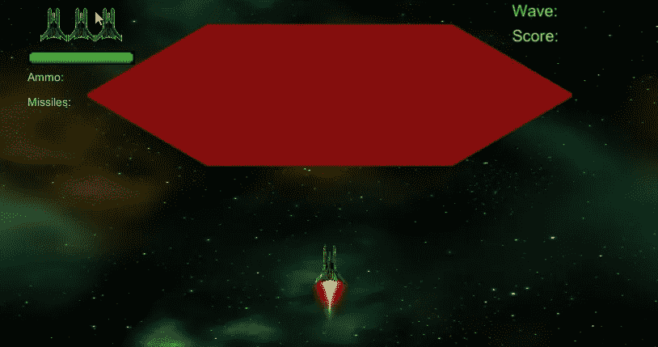
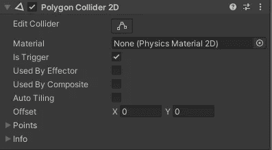
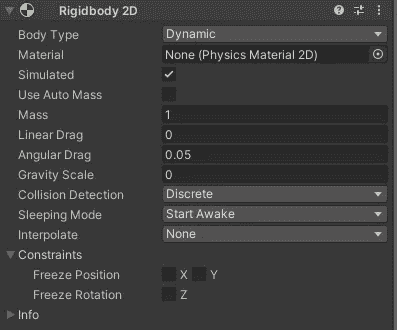
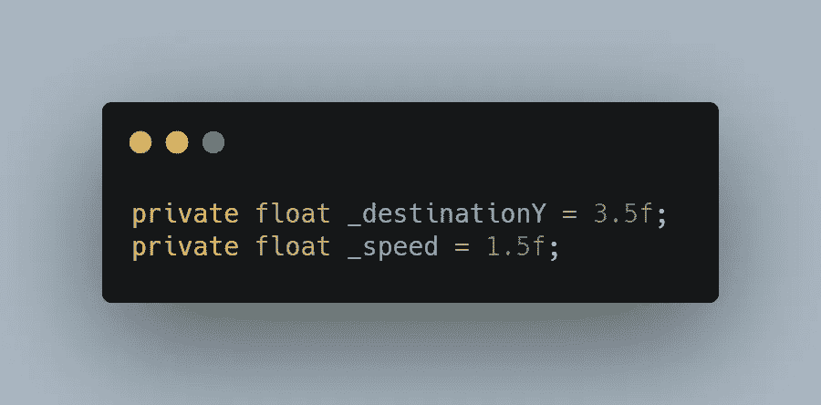
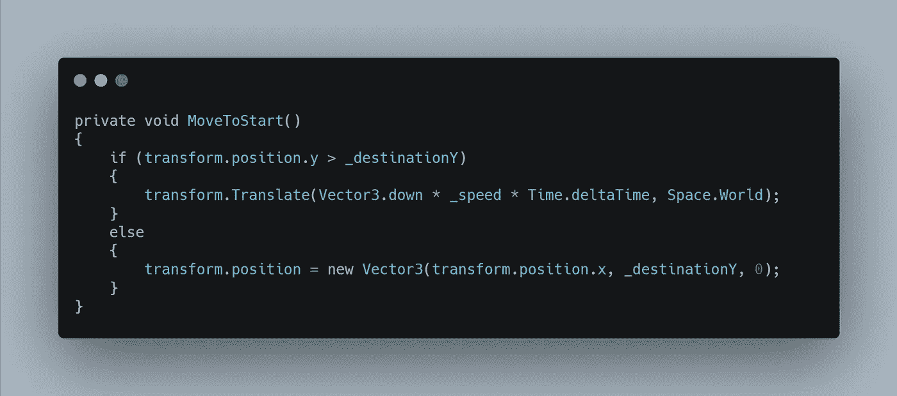

# 第二阶段:Boss 敌人，第 1 部分

> 原文：<https://medium.com/geekculture/phase-ii-boss-enemy-part-1-6fd3f5a3d62b?source=collection_archive---------42----------------------->

**目标:**在最后一波后增加一个 Boss 敌战。

作为一个占位符的老板敌人，我使用了 2D 原始六边形延长看起来更像一个母舰大小。

Screenshot with Boss Enemy placeholder.

我还添加了一个多边形碰撞器 2D 设置为 IsTrigger 来检测沿其正确形状的碰撞。

Polygon Collider 2D

然后我添加了一个刚体 2D，并将重力比例设置为 0。

下一步是给 Boss 敌人添加脚本。我把它命名为老板行为。现在脚本已经添加好了，我可以开始研究老板将如何工作了。

一旦 Boss 敌人被实例化，首先要做的就是让他们进入攻击位置。为此，我创建了以下变量。

敌人首领将沿着屏幕中央直线移动，而 ***_destinationY*** 将在那里停下来准备开始一次常规攻击。我已经玩过了，看起来 1.5 是一个移动到位的好速度。我通过创建一个方法 **MoveToStart()** ，来实现这一点，我从 **Start()** 方法中调用这个方法。

现在 Boss 敌人已经就位，我可以开始练习攻击程序和处理玩家的伤害了。这些将在下一篇文章中讨论。

虽然这篇文章有点短，但我真的希望你觉得有趣。下一篇会有更多的肉。

在那之前，我祝你在自己的编码之旅中一切顺利。