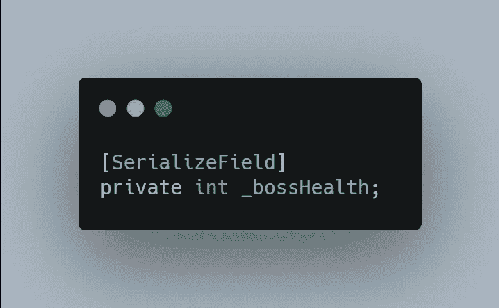
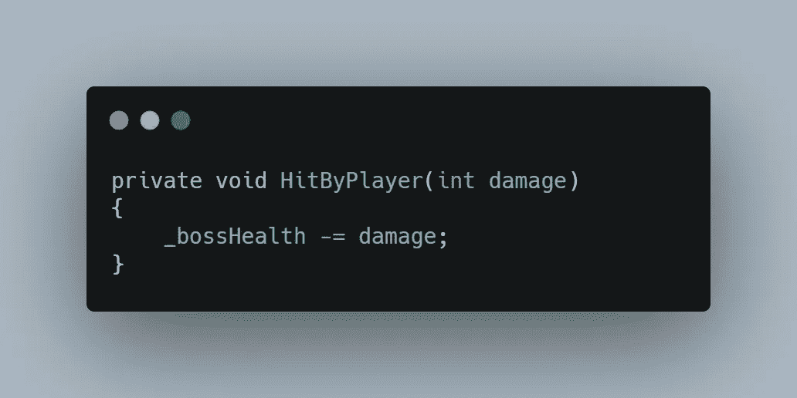
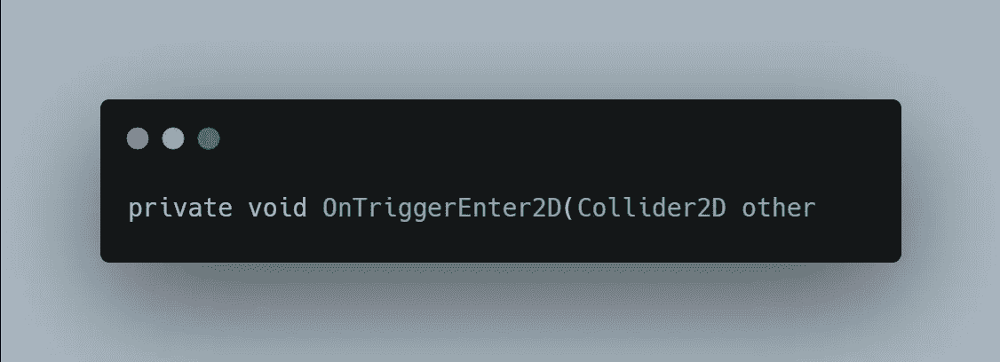
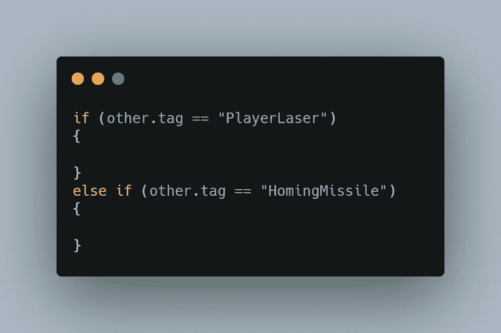
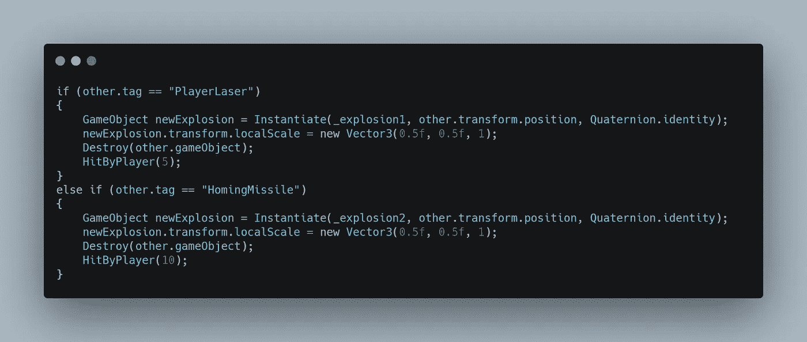
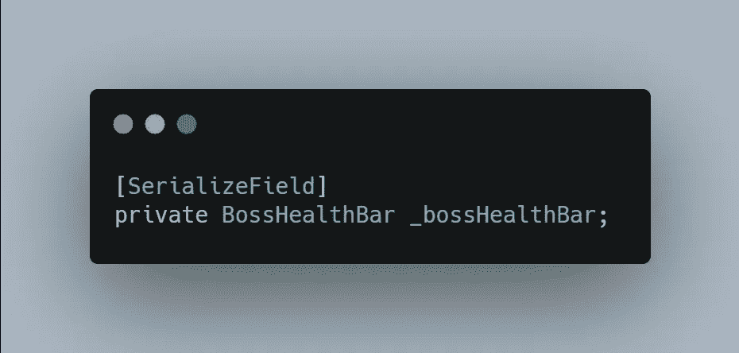
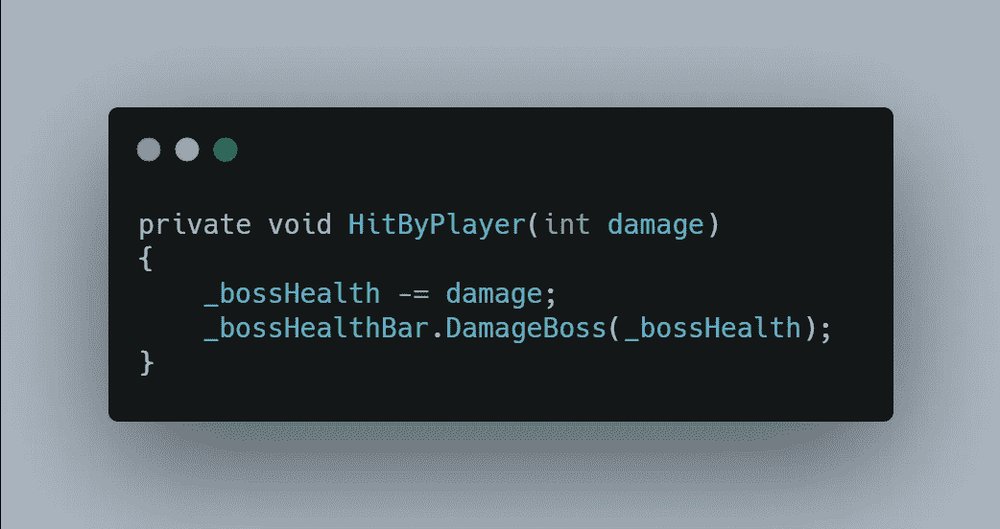
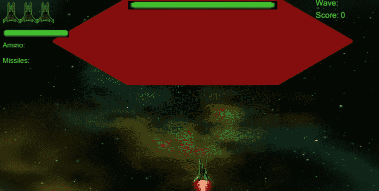

# 第二阶段:Boss 敌人，第二部分

> 原文：<https://medium.com/geekculture/phase-ii-boss-enemy-part-2-98188d853045?source=collection_archive---------52----------------------->

今天，我继续在 2D 射击游戏的老板敌人上工作。

**目的:**为 Bos 敌人设置一个生命值系统，检测 Bos 何时被玩家武器击中，显示 Bos 被击中的时间和地点的爆炸，并创建一个将显示 Bos 生命值的 UI 显示。

卫生系统很简单。首先，我需要为敌人的 boss 创建一个健康变量，然后每当 Boss 被击中时减少这个值。

这是我将用于老板健康的变量。我会将其序列化，以便可以在检查器中轻松地更改它，以便为老板微调健康水平。

接下来我会用一个方法递减 Boss 的生命值，在 Boss 被打中的时候调用。

现在为 Boss 设置了基础生命值系统，我想检测一下玩家的武器何时击中 Boss 敌人。为此，我将使用 OnTriggerEnter2D 事件。

因为我对我的玩家武器使用了两种不同的标签，它们要么适用于激光，要么适用于寻的导弹，所以我将分别检测它们。这也将允许我为每一个使用不同外观的爆炸。

然后，在每个条件中，我将实例化相关的爆炸游戏对象，将其比例更改为大约 0.5 原始，破坏另一个游戏对象，然后调用一个方法 **HitByPlayer()** ，该方法将减少 Boss 敌人的生命值，激光为 5，导弹为 10。

拼图的最后一块是提供一个 UI 显示来显示老板受到了多大的伤害。我将重新使用我创建 [**推进器 UI**](https://reisuj.medium.com/phase-i-thruster-scaling-bar-hud-8c730713f823) **时使用的工具条。**我复制一下，把名字改成 **BossHealth。**

然后，我将为 BossHealth 滑块创建一个新脚本。

在这个脚本中，我有两个方法。第一个**setbosshhealth()**将滑块设置为 Boss 的起始健康，第二个 **DamageBoss()** 调整 Boss 的健康。这个会在他们被打击的时候从老板那里打过来。

在 boss 的脚本中，我为 Boss 获得了一个关于生命值条的句柄。

然后最后我修改 boss 中的 **HitByPlayer()** 方法来调用 slider 上的 **DamageBoss()** 方法。

这给了我一个为 boss 工作的伤害系统，有特效和 UI 来显示 Boss 受到的伤害。

对于本文来说就是这样。在下一篇文章中，我将开始为老板设置攻击来摧毁玩家。目标是有两个基本攻击和一个更强大的特殊攻击。

我希望您觉得这很有趣，下次再见，祝您在编码之旅中好运。