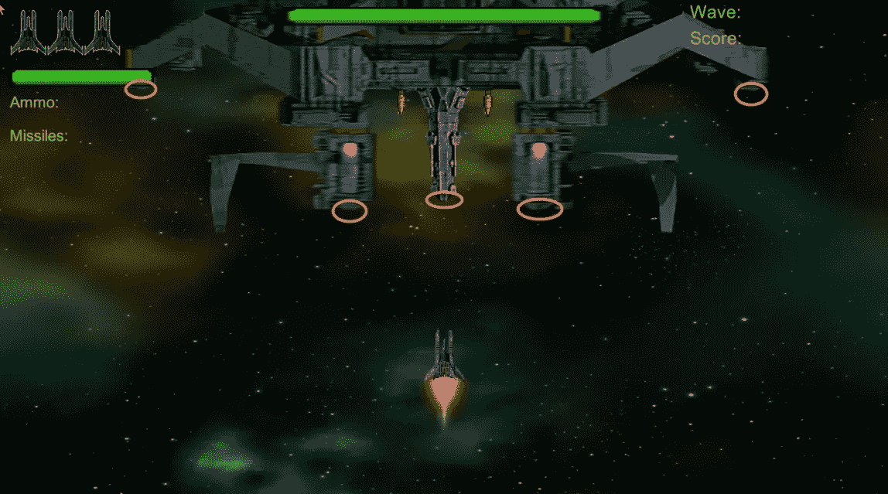
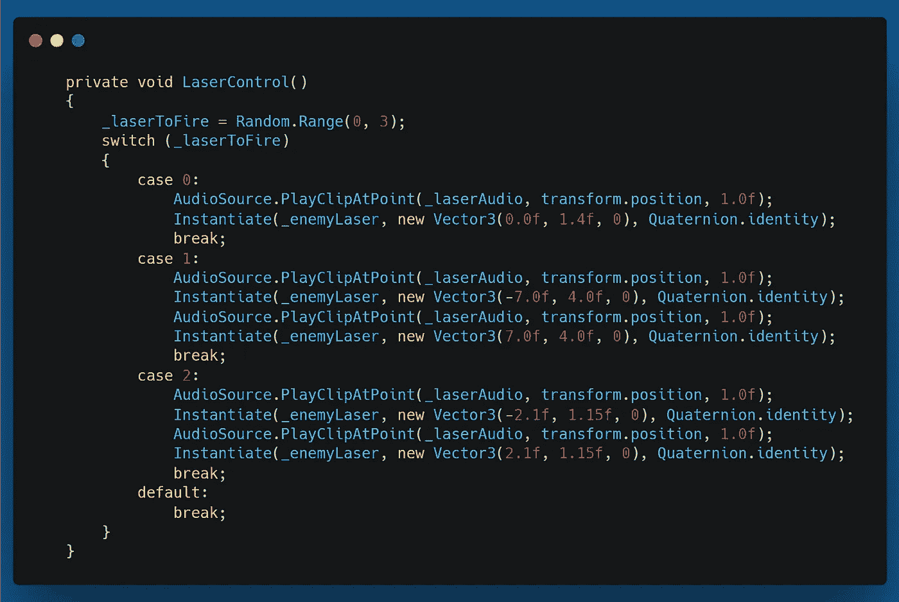
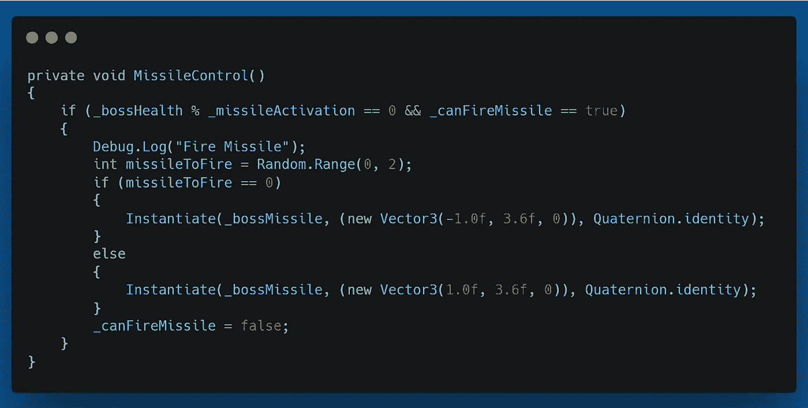
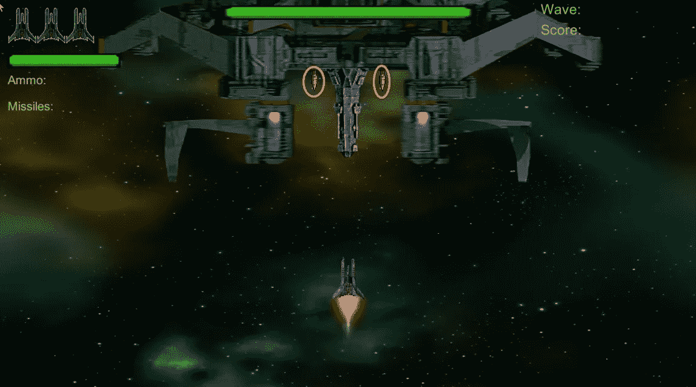
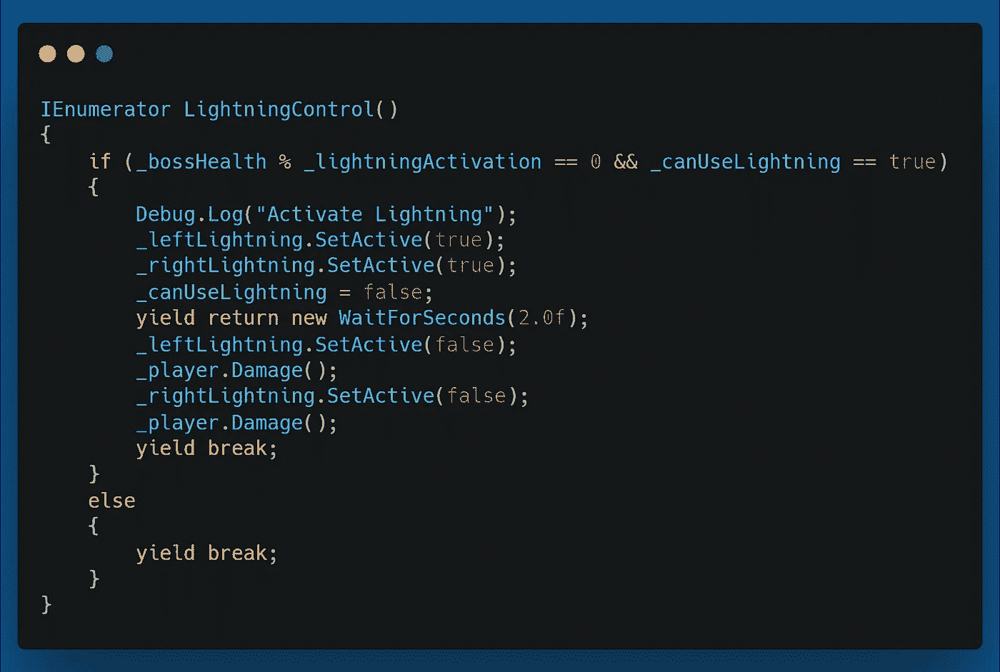
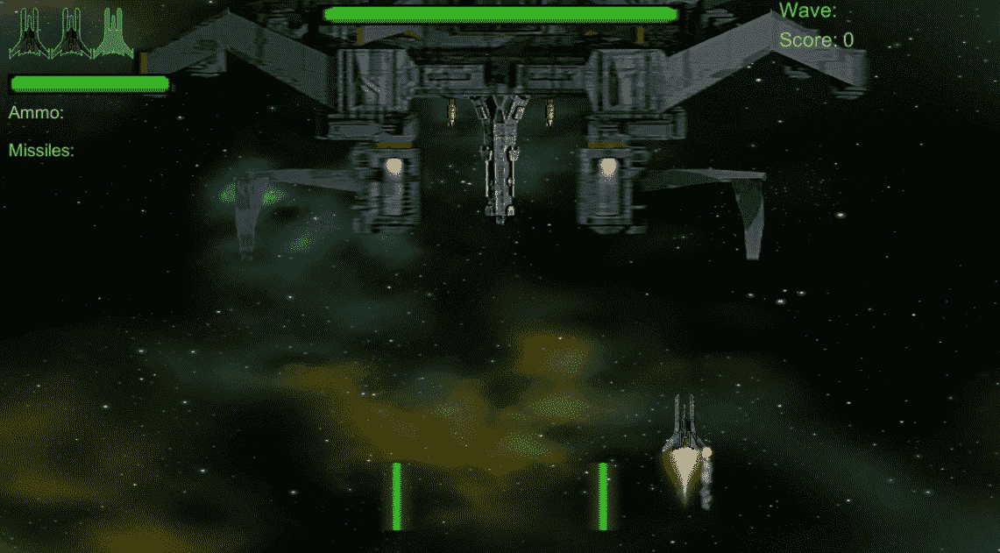
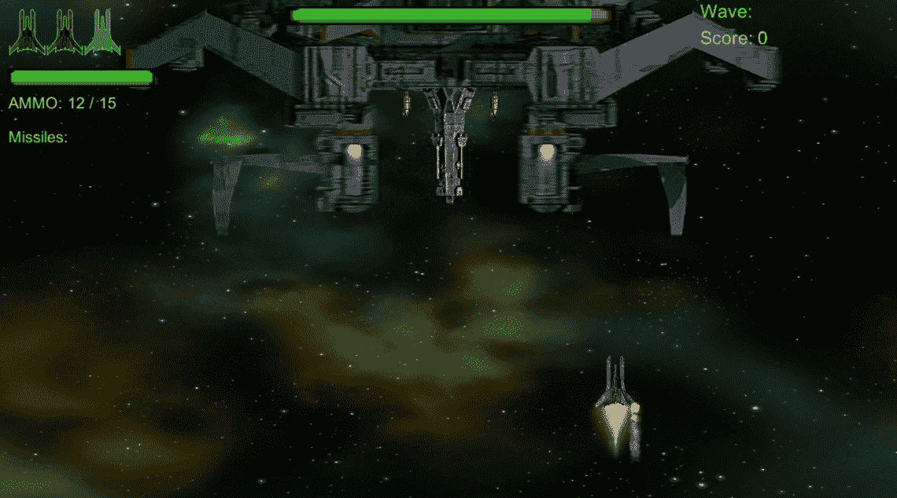
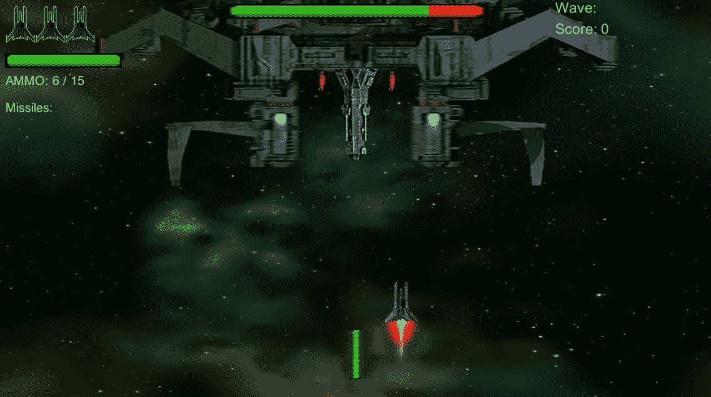

# 第二阶段:Boss 敌人，第 3 部分

> 原文：<https://medium.com/geekculture/phase-ii-boss-enemy-part-3-8bec0aa66efb?source=collection_archive---------79----------------------->

**目标:**给 Boss 敌人攻击使用在玩家身上，两次基本攻击，一次特殊攻击。

我目前的目标是拥有从 Boss 上五个位置发射的敌方激光，瞄准玩家位置的导弹，特殊攻击将是 Boss 船上两个避雷针不可避免的闪电攻击。

我做的第一件事是为老板创建一个新的资产，而不是红色的六边形。我在 Photoshop 中把现有的玩家和敌人的精灵切碎，然后以不同的方式放在一起。这是老板和玩家在屏幕上的样子。

接下来是安装激光器让老板发射。我想让它们看起来和普通的敌人激光有点不同，所以我为 Boss 激光创建了一个单独的预制组件。然而，我仍然能够使用现有的 EnemyLaserBehaviour 脚本。

我想让激光从船上的 5 个不同的地方发射，如下所示。

然而，我不想让他们同时开火。我想让两个一起开火，两个在末端，一个在中间。所以有三种不同的射击模式。我随机选择了。在我的 LaserControl()方法中，范围和开关语句如下所示。

LaserControl() method

对于 Boss 导弹，我重新设计了寻的导弹及其代码。此外，我改变了导弹的颜色，并设置为 BossMissile 预置。带有代码的 MissileControl()方法如下所示。

MissileContol() method

我把发射导弹和即将到来的闪电攻击和老板的健康联系在一起。目前，Boss 每受到 20 点伤害就会发射一枚导弹。导弹从下面显示的位置发射。

下面是闪电攻击的方法和代码。为此，我使用了 Unity 资产商店中的一项资产。

LightningControl() method

我用了一个 IEnumerator，因为一旦激活，我会让闪电预置持续 2 秒，然后关闭它。这个 _lightningActivation 的 int 是 50，所以当 Boss 的生命值可以被 50 整除，并且他们可以使用闪电时，它会激活预设 2 秒，然后停用它。

下面是每个效果的样子。首先是激光。

Boss Lasers

接下来是 Boss 导弹。

Boss Missile

最后，这是闪电攻击。

Lightning Attack

我就是这样给 Boss 敌人加了三次攻击的。我将做一点代码清理，并很快发布到 itch.io 上。

我希望你喜欢这个，也许会觉得有趣。下次再见，祝你在编码之旅中一切顺利。