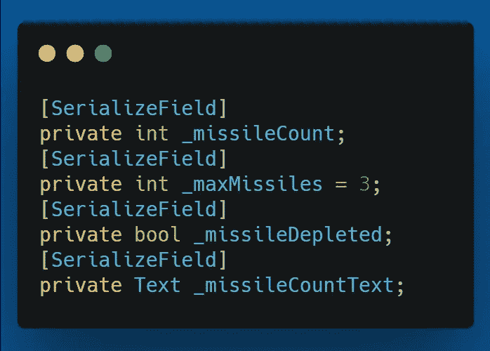
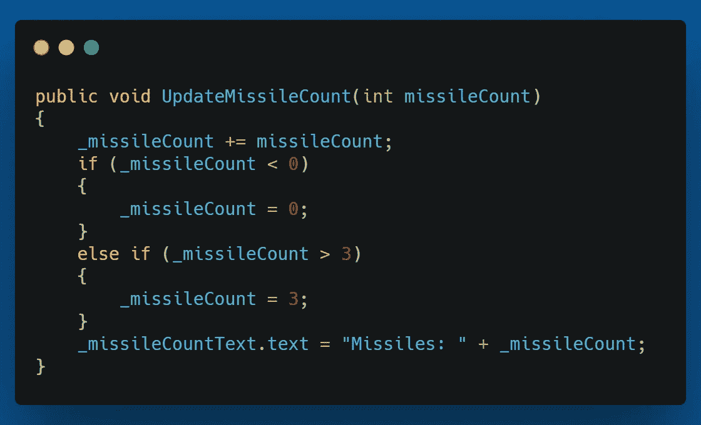
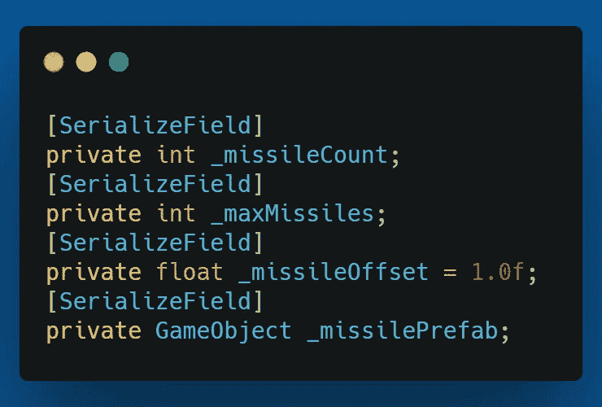
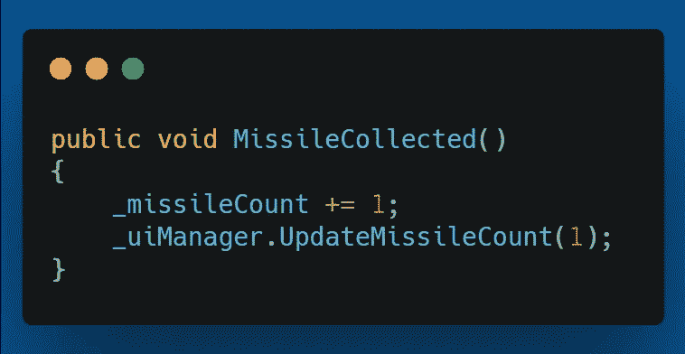
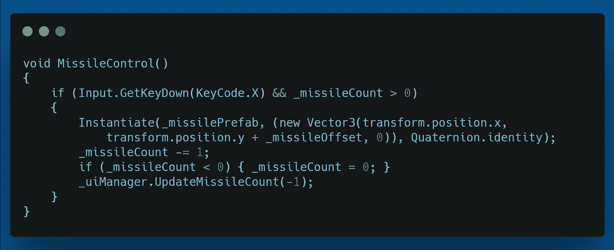
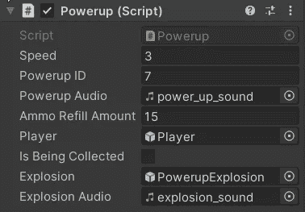

# 第二阶段:寻的导弹，第一部分

> 原文：<https://medium.com/geekculture/phase-ii-homing-missile-4fecae0a6d90?source=collection_archive---------86----------------------->

目标:我们的下一个特点将是一个自动寻的导弹，玩家可以在通电的情况下捡起来。

我会让玩家在每次收集能量时最多持有三枚导弹，提供一枚。另外，我会让玩家按“x”键发射导弹。

首先，我需要向 **UIManager** 脚本添加一些新变量。

接下来，在 **UIManager 中，**我创建了一个 **UpdateMissileCount()** 方法来更新 UI 上的导弹数量。这也检查导弹计数是低于 0 还是高于 3，并重置为最小或最大值。

UpdateMissileCount() method.

这应该就是 UIManager 的变化。现在我将为玩家创建导弹功能。首先，我添加所需的变量。

我还添加了两个新方法。一个是 **MissileCollected()** ，它将更新播放器上的导弹数量，并调用 **UIManager** 上的 **UpdateMissileCount()** 方法来更新显示。

MissileCollected() method.

另一个新方法是 **MissileControl()** 。这个方法检查玩家是否按了“x”键，以及玩家是否有导弹。如果是这样的话，它会在玩家的变换位置实例化一个导弹，并有一个小的偏移量，然后将导弹数设置为零，以防导弹数低于。最后，它用-1 调用 **UIManager** 上的 **UpdateMissileCount()** 方法来减少导弹计数显示。

MissileControl() method.

我需要做的最后一件事是创建 powerup 并将其添加到 powerup 脚本中。我在 powerup 脚本的 switch 语句中添加了另一个 case 来调用播放器上的 **MissileCollected()** 方法。

然后我创造了动力。我创建了下面的精灵来使用它。

Missile Powerup Sprite

所以我把精灵拉进层次结构，然后放回预设文件夹来创建一个预设。之后，我添加了一个 **CircleCollider2D** 、一个 **RigidBody2D** 和 **Powerup** 脚本到预设中，并通过检查器确保所有设置正确。

这包括设置电源，更新显示，并让玩家拿起电源和发射导弹。剩下的就是制造导弹，并对其进行编程，使其瞄准最近的敌人。我将在下一篇文章中讨论这个问题。

所以在那之前，我希望你觉得这很有趣，并祝你在编码之旅中一切顺利。