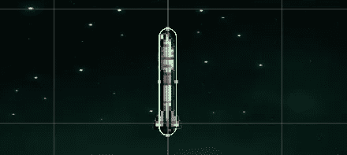
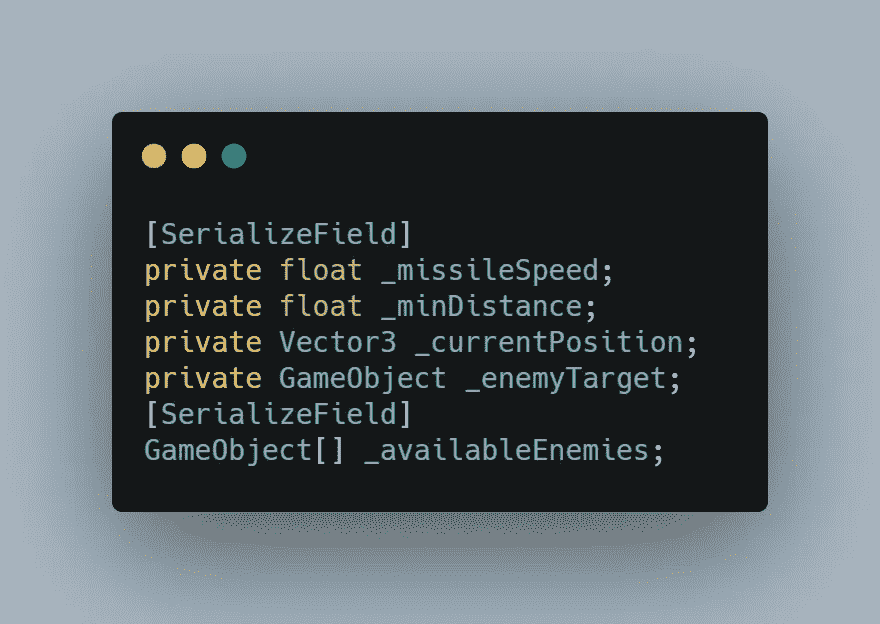
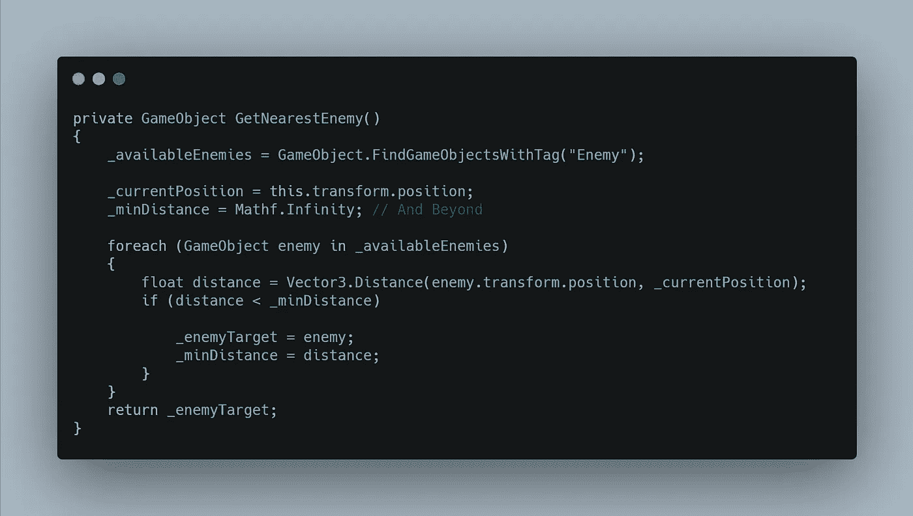
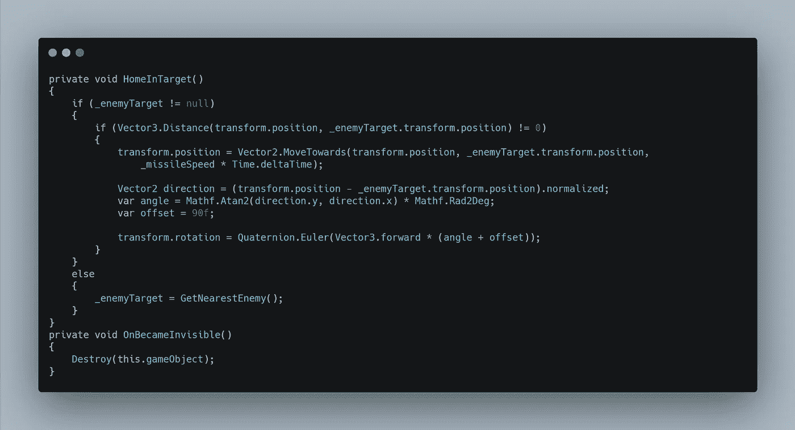
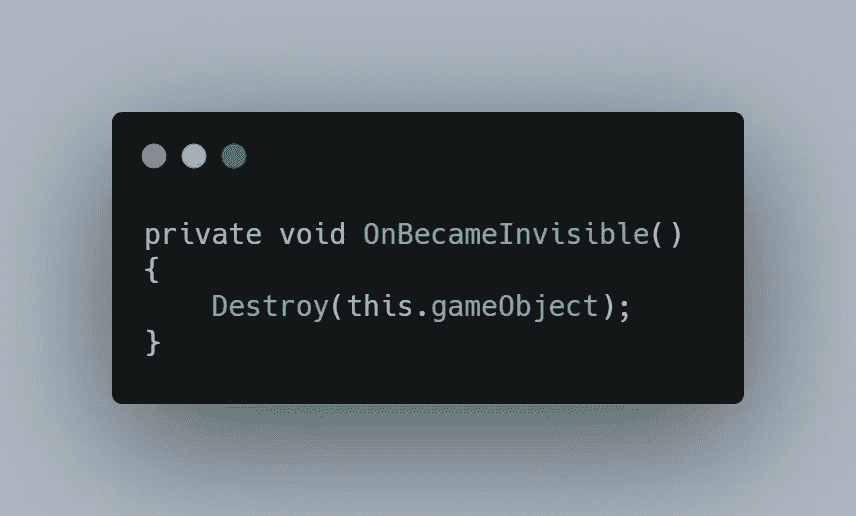
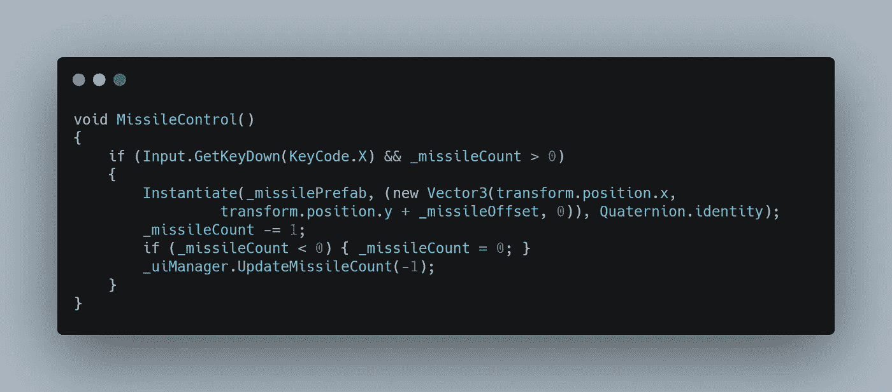
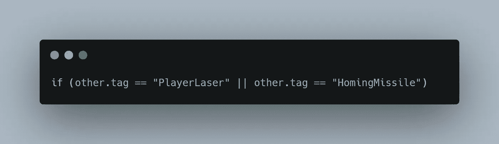
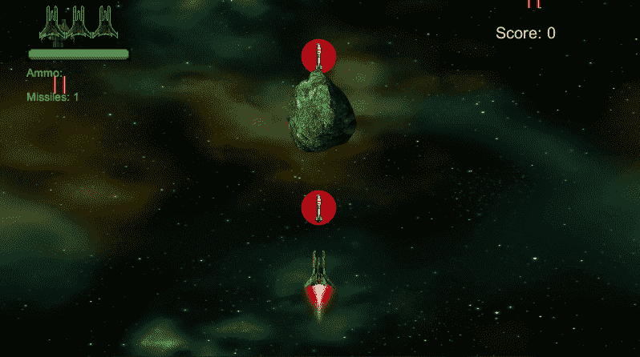

# 第二阶段:寻的导弹，第二部分

> 原文：<https://medium.com/geekculture/phase-ii-homing-missile-part-2-cd0be12d3323?source=collection_archive---------46----------------------->

目标:现在我已经完成了剩下的功能，我需要创建一个导弹预置，并编程让它向最近的敌人移动。

这是我用在寻的导弹上的图像，以及它和玩家飞船的相对大小。

一旦我创建了一个寻的导弹的预设，我添加了一个刚体和一个胶囊碰撞器，并为导弹调整了碰撞器的大小。

A missile with Capsule Collider

然后我创建一个 HomingMissile 脚本，并将其添加到预设中。

第一件事是添加一些我需要的变量。

Variables for the Homing Missile

我将创建两个方法:GetNearestEnemy()，它执行它所说的并获得最近的敌人，然后它将返回一个名为 _enemyTarget 的游戏对象类型。这个方法将从 Start()方法调用一次。完整方法如下。

GetNearestEnemy() method

在此方法中，我们执行以下操作:

*   通过找到所有被标记为敌人的物体来填充数组元素
*   将变量 for _currentPosition 设置为导弹的 transform.position
*   开始时将 _minDistance 变量设置为无穷大(当我们遍历数组中的敌人时，这个变量会被修改)
*   然后，我们循环遍历 _availableEnemies 数组，检查导弹和敌人之间的距离，并将 _enemyTarget 依次设置为每个敌人，并将 _minDistance 设置为到该敌人的距离。
*   最后，一旦我们检查了所有可用的敌人，我们返回 _enemyTarget，这将是最近的一个。

下一个方法是 HomeInTarget()。这个方法将在 Update()中被调用，并控制导弹向目标的移动。完整方法如下。

HomeInTarget() method

首先，我检查 _enemytarget 是否为空。如果它不为空，我就进入 If 语句。否则，我转到 else 语句，该语句通过再次调用 GetNearestEnemy()来设置 s _enemyTarget。

如果敌人不为空，我检查以确保距离不为 0，然后继续朝着目标移动和旋转导弹。

在 HomeInTarget()方法之后，我还添加了一个回调 OnBecameInvisible()，它检查对象是否对摄像机不再可见，然后销毁它。

我需要做的最后一件事是在玩家脚本中设置功能来实例化导弹和敌人，以知道他们何时被击中。

因此，在播放器脚本中，我添加了一个从 Update()方法调用的 MissileControl()方法。

这将检查玩家是否按下了“x”键，以及他们是否有导弹。如果两者都是真的，那么它就会实例化导弹预置。之后，它将 _missileCount 减 1，然后检查 _missileCount 是否小于 0。如果是，它将计数更改为 0。

我需要为敌人做的只是在 OnTriggerEnter2D()事件中添加一个标记“HomingMissile”的检查。

这给了我一个功能性的寻的导弹。玩家可以通过加电收集最多三枚导弹，并可以使用“x”键分别发射导弹和激光。

你甚至可以看到，如果一个敌人在导弹到达之前被摧毁，它就会寻找另一个目标。所以我对这个结果很满意。

好了，我希望您觉得这很有趣，下次再见，祝您在编码之旅中一切顺利。