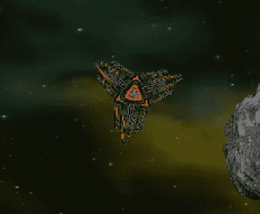
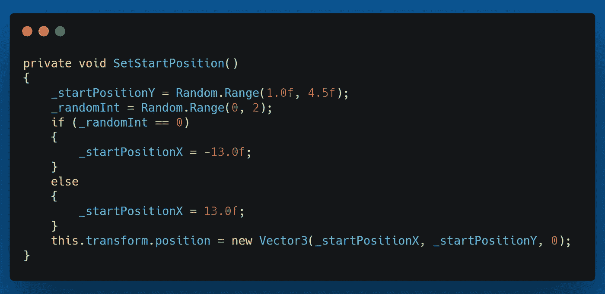
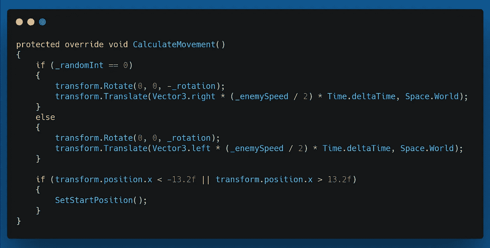
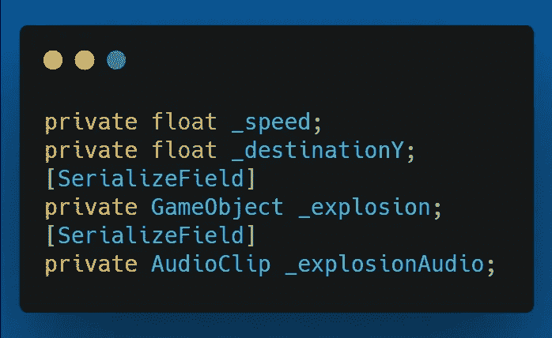
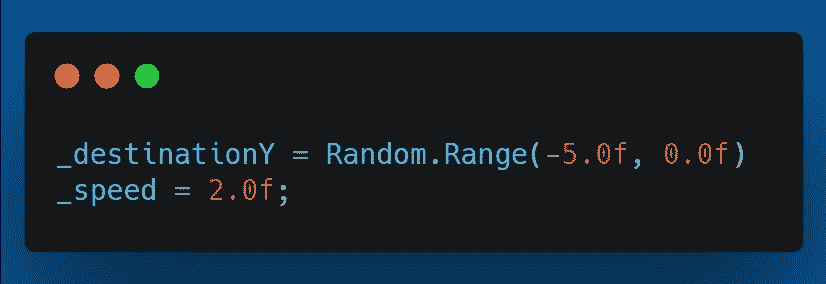
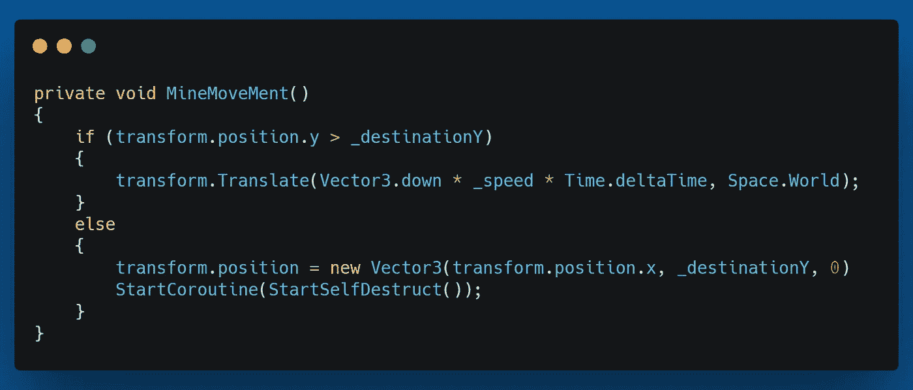
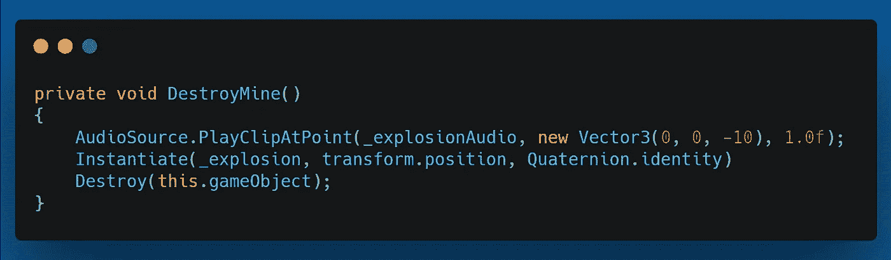
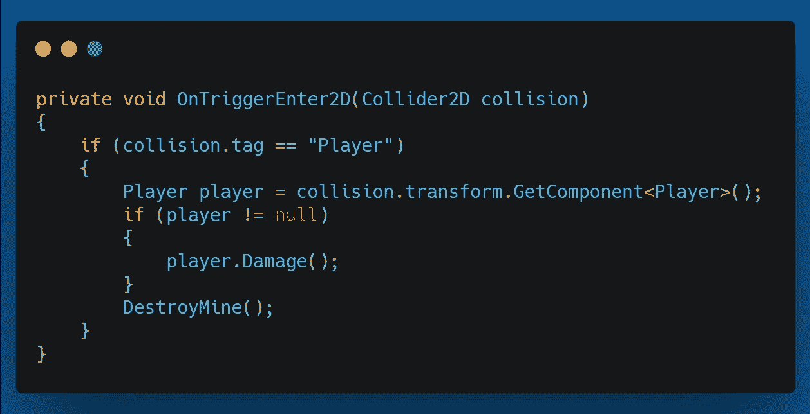
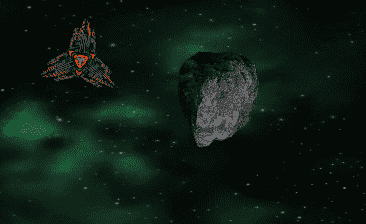
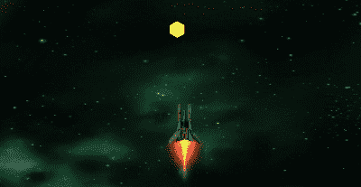

# 第二阶段:新的敌人——布雷者

> 原文：<https://medium.com/geekculture/phase-ii-new-enemy-mine-layer-3acf75b5b94d?source=collection_archive---------60----------------------->

在今天的文章中，我回顾了我是如何添加一个新的敌人，一个布雷者。

目标:让一个敌人从一边到另一边穿过屏幕，并在玩家的区域内放下地雷。如果玩家与它们相撞，它们会爆炸并伤害玩家。

这就是我们的布雷器的样子。

Mine-Layer

我将让地雷层从屏幕的左侧或右侧随机开始，并让它从 1 到 4.5 的位置开始，给它一些变化。我通过创建一个从 **Start()** 方法调用的 **SetStartPosition()，**来实现这一点。

SetStartPosition() method

首先，该方法设置敌人的 y 位置。然后我为 ***_randomInt*** 生成一个值，该值将给出 0 或 1。如果值为 0，我从屏幕左侧开始对敌。否则，我从屏幕右侧开始对敌。

接下来，我重写了 **CalculateMovement()** 方法。

Override CalculateMovement() method

我刚刚为地雷创建了一个新的预置，并把它放在地雷层的**敌人激光**预置的地方。这样一来，它投放地雷的速度与发射激光的速度相同。

对于地雷，我创建了一个名为 MineBehaviour 的脚本，它控制地雷移动的距离，它们与玩家的碰撞，以及特定时间后的自毁。

我使用以下变量。

Variables for mine.

在 **Start()** 方法中，我设置了矿井的目的点。这是矿井将停止的 y 位置。它在 0 和-5 之间随机化。我也把地雷的速度设定的很体面。

为了控制移动，我创建了一个 **MineMovement()** 方法，它包含以下内容。

MineMovement() method

我首先检查矿井的 Y 位置是否大于目的地的 Y 位置。如果是的话，我就搬下来了。当它经过目的地位置时，我将它设置到那个位置，并调用**startselfdastrol()**协程，我将在下面展示它。

StartSelfDestruct() coroutine

这会设置一个介于 10 到 20 秒之间的计时器，然后运行下面的 **DestroyMine()** 方法。

DestroyMine() method

该方法播放爆炸音频，实例化爆炸预设，然后销毁游戏对象。

最后，我使用 **OnTriggerEnter2D()** 事件来控制与玩家的碰撞。

OnTriggerEnter2D() event

如果玩家撞上了地雷，我就呼叫**玩家。对玩家伤害()**法，然后调用雷上的 **DestoyMine()** 法。

下面是一些例子。此外，我为矿井使用了一个占位符图形。

如果地雷层可以释放足够多的地雷，这可以让玩家在躲避其他敌人和他们的激光时移动起来有点困难。

我希望你对这篇文章感兴趣，下次再见，我祝你在编码之旅中一切顺利。