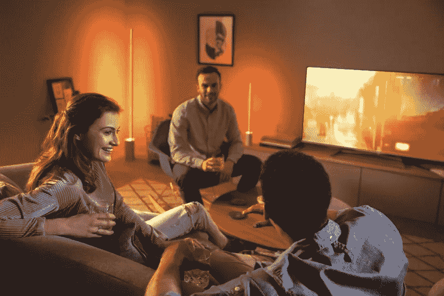

# 飞利浦 Hue:立即开始

> 原文：<https://medium.com/geekculture/philips-hue-getting-started-right-now-8780664f4c56?source=collection_archive---------22----------------------->

Source [morehue.com](https://morehue.com/philips-hue-getting-started/)

飞利浦 Hue 比其他任何智能灯泡都要早。早在 2012 年 10 月，第一款用 app 可控的飞利浦 Hue LED 灯就出现了。支持 Apple HomeKit 后不久，范围变得越来越广泛。现在，每个照明愿望都有一个合适的灯或灯具。因此，你可能需要一些帮助来知道如何开始。但是没问题，我们很开心…