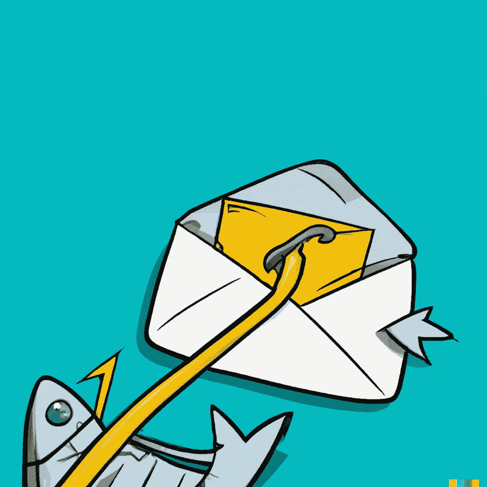

# 网络钓鱼攻击

> 原文：<https://medium.com/geekculture/phishing-attacks-7395ca93bf75?source=collection_archive---------13----------------------->

如果你遇到一个看起来像脸书的网站，并要求你输入你的凭据，该怎么办？或者银行的人给你打电话询问你的个人信息？或者你收到一封电子邮件，说你的帐户已经被泄露，你可以通过邮件中提供的链接来更改你的密码。这个链接看起来可疑，但你还是点击了它。