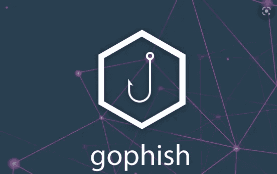

# 云端网络钓鱼

> 原文：<https://medium.com/geekculture/phishing-from-the-cloud-68c8e3e497e?source=collection_archive---------1----------------------->

## Gophish AWS 基础设施部署

H ello 世界。在本文中，我将向您展示如何使用 Terraform 在云中部署基础设施，并使用 Gophish 进行渗透测试来执行网络钓鱼活动。

这里是 [GitHub 文件夹](https://github.com/binexisHATT/CyberSecurity/tree/master/Phishing/Gophish)，其中包含所有的 Terraform 脚本，电子邮件模板，以及我将在这次演示中使用的登陆页面。