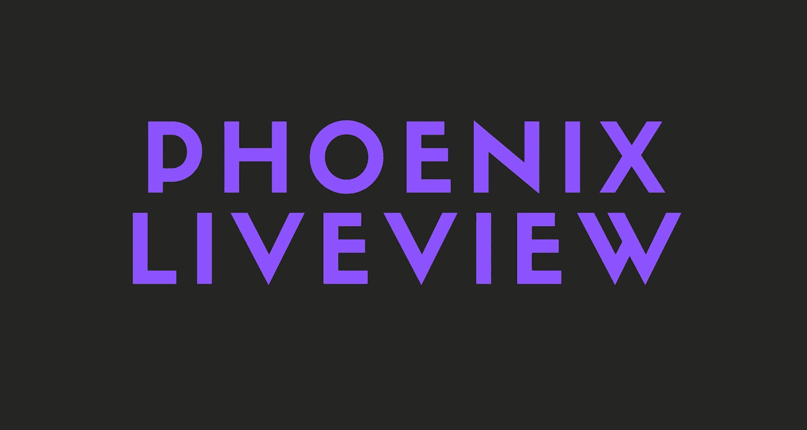
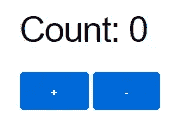
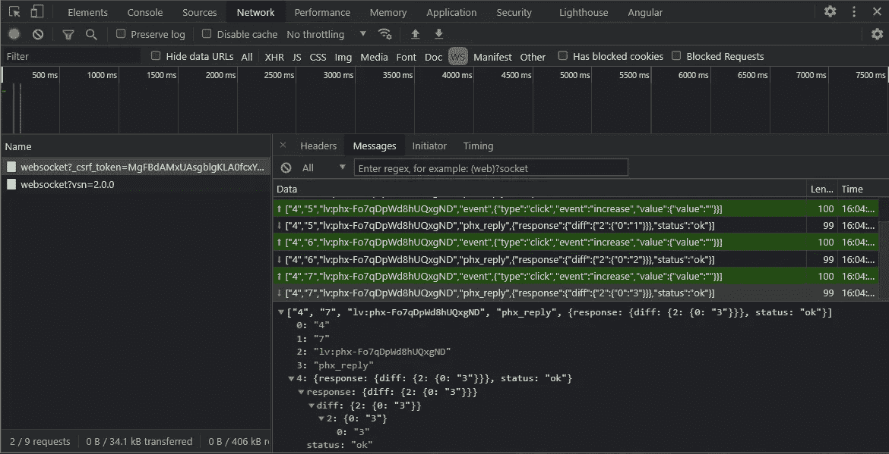

# Phoenix LiveView -不用 JavaScript 构建 Web 应用程序

> 原文：<https://medium.com/geekculture/phoenix-liveview-building-web-apps-without-javascript-ce7bd01f2ed5?source=collection_archive---------20----------------------->

毕竟构建 web 应用不需要 JS。



在这个故事中，您将了解什么是凤凰城实时景观，以及它是如何工作的。然后，我们将使用 LiveView 构建一个小型柜台应用程序。

我假设您已经安装了 Phoenix、Elixir/Erlang 和 Node.js。如果没有，那么一定要安装它们。

开始吧！

# 什么是凤凰 LiveView？

LiveView 是 Phoenix web 框架中最激动人心的特性之一。

这是一种不需要编写 JavaScript 就能产生流畅、实时、快速和可扩展的 web 界面的新方法。

## 没有 JavaScript

是的，你没听错。没有 JavaScript。使用 LiveView 构建 web 应用程序不需要任何 JavaScript。尽管如此，你仍然需要它来制作动画。

> LiveView 编程模型是声明性的:不是说“一旦事件 X 发生，就在页面上改变 Y”，LiveView 中的事件是可能导致其状态改变的常规消息。一旦状态改变，LiveView 将重新呈现其 HTML 模板的相关部分，并将其推送到浏览器，浏览器以最高效的方式进行自我更新。
> 
> *-凤凰文档*

凤凰是这样解释 LiveView 的。

基本上，我们不需要使用像`onClick()`这样的东西来做一些事情，我们可以让消息在它们的值/状态改变时做一些事情。

还有 Phoenix 说“ *LiveView 会重新渲染其 HTML 模板*的 ***相关部分*** *”。这意味着，LiveView 不会更新整个页面，而只会更新页面的相关部分(如关注人数)。*

这使得 LiveView 非常高效快速。

## 它是如何工作的

LiveView 首先作为常规 HTTP 请求的一部分静态呈现，除了帮助搜索和索引引擎之外，它还为“第一次有意义的绘制”提供了快速时间。

然后，使用 WebSockets 在客户机和服务器之间建立持久连接。

因此，使应用程序更快，因为与无状态请求相比，要做的工作更少，要发送的数据更少，而无状态请求必须对每个请求进行身份验证、解码、加载和编码。

另一方面，与无状态请求相比，LiveView 使用更多的服务器内存。

## 迷茫？

如果你很困惑，不要着急。下面的视频解释了 LiveView 的工作原理。即使你什么都懂，我还是建议你看视频。

## 我的想法

我个人很喜欢 LiveView。编码既简单又有趣。我不认为在 JS 生态系统中有任何替代品可以提供相同的性能和开发速度。

不管怎样，理论到此为止。我们写点代码吧！

# 一个简单的计数器应用

让我们构建一个简单的计数器应用程序。我们将从搭建我们的项目开始。

## 创建新的 Phoenix LiveView 项目

要创建新的 LiveView 应用程序，只需运行以下命令。

```
mix phx.new counter --live --no-ecto
```

这个命令基本上是创建一个新的 Phoenix 项目，添加 LiveView 并删除 Ecto。

我们为什么要移除埃克托？嗯，对于一个简单的计数器应用程序，我们真的不需要 DB 交互。因此，我们只需添加`--no-ecto`标志，不必配置任何东西，并减少我们的应用程序的大小。

此外，添加`--live`标志为我们增加了一些配置，但我不会在这里解释它。如果你想了解更多关于 LiveView 配置的信息，你可以查看文档。

 [## 凤凰城。live view-Phoenix live view v 0 . 15 . 7

### LiveView 通过服务器渲染的 HTML 提供丰富的实时用户体验。LiveView 编程模型是…

hexdocs.pm](https://hexdocs.pm/phoenix_live_view/Phoenix.LiveView.html) 

## LiveView

你会看到在`lib/liveview_web`目录下有一个`live`文件夹。里面有两个文件。一个模板和一个`page_live.ex`文件。您可以删除模板文件，因为我们通常在`*_live.ex`文件中呈现模板。当然，您可以随时从模板文件进行渲染。

## 路由器

如果你看看路由器文件，你会看到有一个为我们添加的实时路由。

```
live "/", PageLive, :index
```

这基本上指定了该路线服务于实况视图。

# 构建我们的应用

我们回顾了通过运行`mix phx.new counter --live --no-ecto`命令创建的文件。现在让我们开始编写我们的应用程序。

转到`lib/liveview_web/live/page_live.ex`文件，将其更改为下面的代码。

让我们一行一行地检查代码。

## mount/3

`mount/3`回调连接渲染视图所需的 socket assign。我们正在创建值为 0 的`:count`。并返回套接字。

## render/1

`render/1`回调接收`socket.assigns`并负责返回呈现的内容。

看到我们在那里的表现了吗？这就是我们如何从 LiveView 中的套接字获取值。

另外，你可以看到我们的按钮上有`phx-click`绑定。这就是我们点击发送事件的方式。第一个按钮发送一个`increase`事件，第二个发送一个`decrease`事件。

## handle_event/3

我们在`handle_event/3`回调中接收事件。并更新我们的套接字分配。每当套接字的赋值发生变化时，就会自动调用`render/1`，并将更新发送到客户端。

如果我们得到的事件是`increase`，第一个`handle_event`将被执行，计数将增加。

但是，如果我们得到的事件是`decrease`，第二个`handle_event`将被执行，计数将减少。

# 运行我们的应用

```
mix phx.server
```

这个命令将启动服务器，如果一切正常，你将能够在`http://localhost:4000`看到你的应用程序。

如果你现在访问`[http://localhost:4000](http://localhost:4000)`，你会看到你的计数器应用程序，增加或减少按钮点击计数。



Our Simple Counter App

那很容易，不是吗？

## 它是如何工作的？

如果你去`DevTools -> Network -> WS`，你会看到每次你点击一个按钮，数据就会通过网络套接字发送并即时更新。



Our Websocket Log

很酷吧？我们完全不用 JavaScript 就完成了所有这些工作！

# 最后的想法

您刚刚学习了 LiveView 的基础知识，不用 JavaScript 就构建了一个简单的计数器应用程序！我希望这个故事对你有所帮助。下一个故事再见！

# 仅此而已。感谢您阅读这个故事！

如果你喜欢这个故事，一定要为它鼓掌！你想问我什么都可以。

在 Twitter 上关注我:

[](https://twitter.com/Re_allyedge) [## re _ ally 边缘

twitter.com](https://twitter.com/Re_allyedge) 

在 Patreon 上支持我:

[](https://www.patreon.com/allyedge) [## 阿里木阿尔斯兰卡亚是创造编程故事和教程。帕特里翁

### 今天就成为阿里木阿尔斯兰卡亚的赞助人:在世界上最大的…

www.patreon.com](https://www.patreon.com/allyedge)