# Phoenix:了解如何播种数据。

> 原文：<https://medium.com/geekculture/phoenix-understanding-how-to-seed-data-c2be863ddd1d?source=collection_archive---------10----------------------->

利用测试夹具，如玛奇纳和 Faker 来创建高质量的测试和开发数据。


Photo by [Binyamin Mellish](https://www.pexels.com/@binyaminmellish?utm_content=attributionCopyText&utm_medium=referral&utm_source=pexels) from [Pexels](https://www.pexels.com/photo/man-planting-plant-169523/?utm_content=attributionCopyText&utm_medium=referral&utm_source=pexels)

## 什么是播种？

播种是数据库中数据的初始创建，通常在测试之前运行，或者创建一个方便的开发人员或 QA 测试环境。但是，您也可以在生产或其他环境中播种。

## 你为什么要在乎？

通过学习如何有效地创建种子数据，您可以极大地提高测试的可靠性、可重用性和可读性。

更重要的是，您将提高开发周期的速度和质量，以发布更多的功能和更少的错误。

# 使用[的示例博客应用](https://github.com/BrooklinJazz/phoenix_seeding)

以下所有概念和示例都可以应用于任何 phoenix 应用程序。如果您愿意，可以在[示例博客应用程序中看到所有的代码示例。](https://github.com/BrooklinJazz/phoenix_seeding)

# 全局种子数据

在任何使用 mix 生成的 phoenix 应用程序中，都应该有一个`seed.exs`文件。

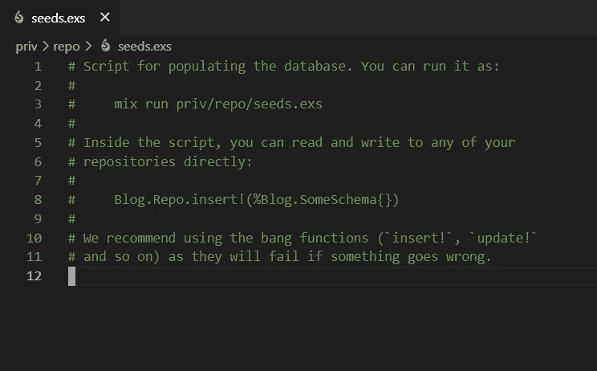

您可以在这个文件中创建您想要在所有测试或开发环境中预先存在的数据。

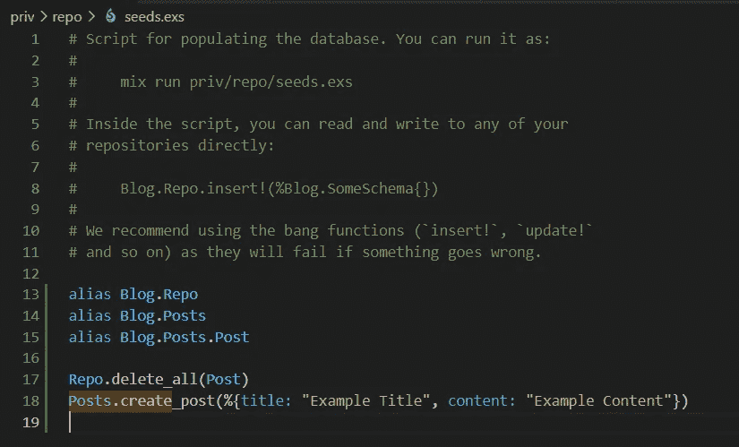

注意`Repo.delete_all(Post)`线。除非您希望种子文件反复重新创建现有数据，否则您可能需要考虑删除任何已经存在的数据，以便种子数据保持一致。

您可以使用以下方式运行种子文件:

```
mix run priv/repo/seeds.exs
```

使您在运行种子数据时处于正确的环境中。

```
# on mac or linux:
MIX_ENV="test" mix run priv/repo/seeds.exs # for test env
MIX_ENV="dev" mix run priv/repo/seeds.exs # for dev env# On windows you'll have to set the env first using either: $env:MIX_ENV="test"
$env:MIX_ENV="dev"# then run the seed command like normal
mix run priv/repo/seeds.exs
```

## 配置不同的测试和开发种子文件。

`seed.exs`文件被自动配置为以`mix ecto.setup`别名运行。

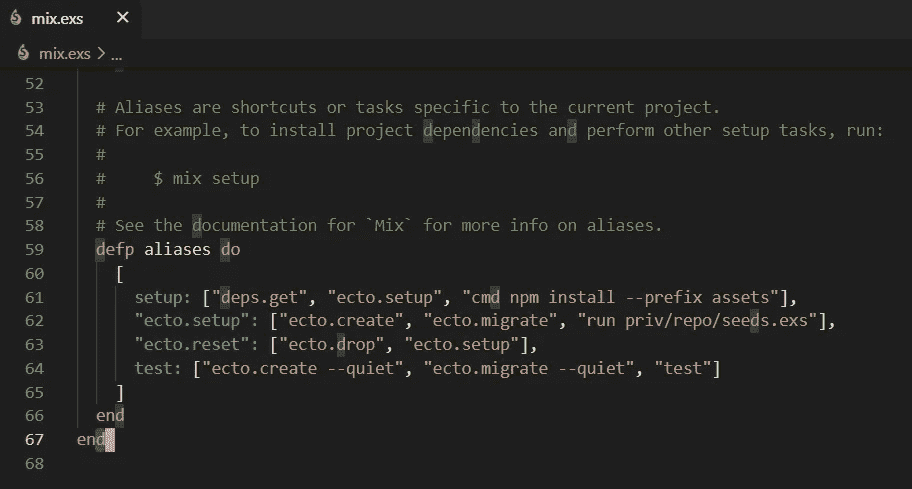

您可以根据您所处的环境使用`Mix.env()`变量为您的全局种子文件配置不同的行为。

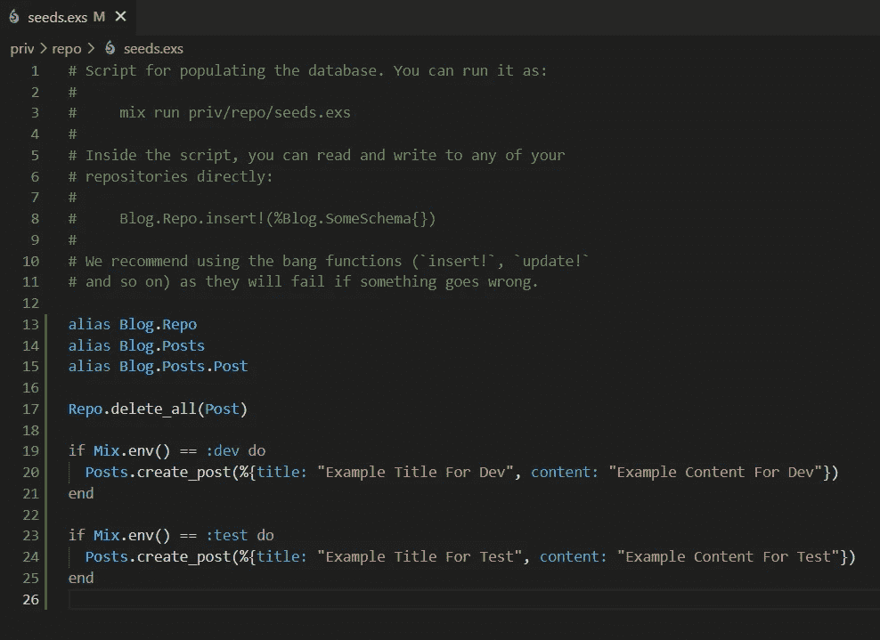

如果您想在测试中使用这个全局数据，您可以将运行种子文件的命令添加到您的`mix test`别名中。

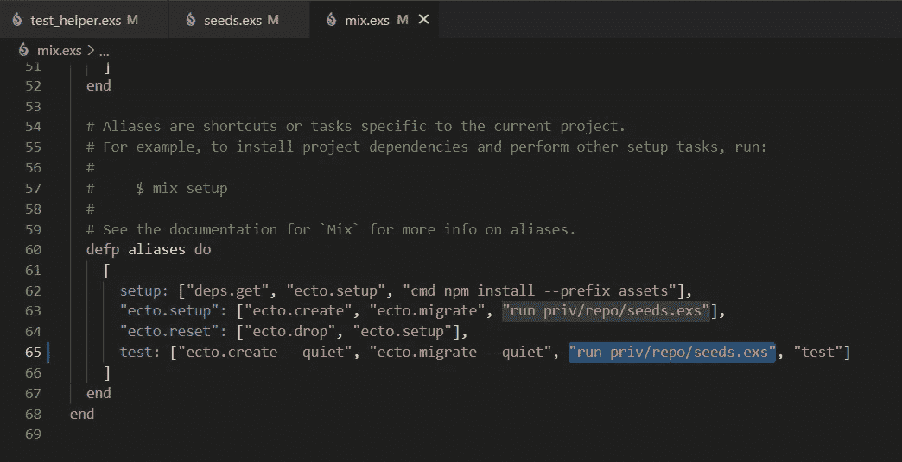

## 制作其他种子文件。

`seed.exs`文件没有什么特别之处，这样您就可以创建其他种子文件。在这个 blog 应用程序示例中，您可能想要一个不同的种子文件来为您添加五篇文章。


您可以使用以下命令运行该文件:

```
mix run .\priv\repo\five_blog_posts.exs
```

# 使用 Faker 的真实假数据。

[Faker](https://github.com/elixirs/faker) 是一个用于创建虚假数据的药剂库。当您想要创建真实的数据来测试您的应用程序时，这很有用。例如，在[演示博客应用程序](https://github.com/BrooklinJazz/phoenix_seeding)中，生成长、中和短内容会很方便。

*   安装 [Faker](https://github.com/elixirs/faker) :很可能你必须在你的 mix 依赖项中添加以下的最新版本:

```
{:faker, "~> 0.16", only: :test}
```

Faker 建议您在测试环境中只安装 faker 模块。然而，因为我们正在为开发测试播种数据，所以您可能也希望为开发环境提供数据。

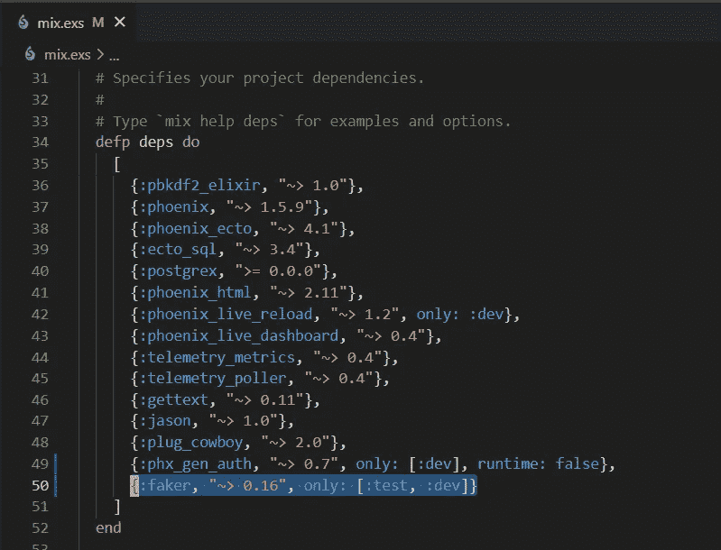

Faker 上的安装步骤也可能会要求将`Faker.start()`添加到 test_helper 文件中。

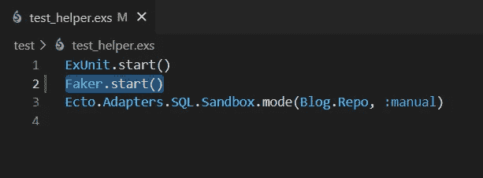

通过运行`mix deps.get.`确保安装了 faker 依赖项

一旦安装了 Faker，你就可以用它方便地生成假数据。我将介绍最有用的模块，但是如果你想了解 Faker 能做的一切，请查看它们的文档。

## Faker Lorem

生成单词、句子和段落，完全控制内容的大小。Lorem 是“Lorem Ipsum”的简称，是一种常见的生成假文本的方式。

```
alias Faker.Lorem # fake word with 5 characters
Lorem.characters(5) 
# fake word with between 5 to 10 characters
Lorem.characters(5..10)# fake sentence with 5 words
Lorem.sentence(5)
# fake sentence with between 5 to 10 words
Lorem.sentence(5..10)# fake paragraph with 5 sentences
Lorem.paragraph(5)
# fale paragraph with 5 to 10 sentences
Lorem.paragraph(5..10)# fake list with 5 paragraphs joined in a string
Lorem.paragraphs(5) |> Enum.join("\n")
# fake list with between 5 to 10 paragraphs joined in a string
Lorem.paragraphs(5..10) |> Enum.join("\n")
```

你可以用它来改进之前的`five_blog_posts.exs`种子文件。

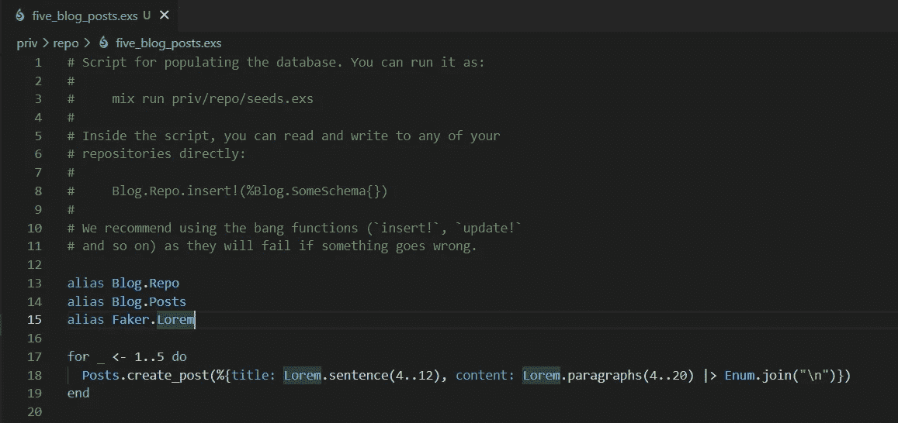

## 骗子

为某人生成姓名

```
alias Faker.PersonPerson.first_name() "Elizabeth"
Person.last_name() "Hayes"
Person.name() "Mr. Bianka Ryan"
Faker.Person.prefix() "Mr."
Faker.Person.title() "Dynamic Identity Administrator"
```

## 伪造者地址

生成伪真实地址

```
alias Faker.AddressAddress.country() # "Gibraltar"
Address.state() # "Kansas"
Address.city() # "East Casey"
Address.postcode() # "84979"
```

## Faker 互联网

生成与互联网相关的数据，如电子邮件、图像、链接、用户名和 IP 地址

```
Faker.Internet.email() "elizabeth2056@rolfson.net"
Faker.Internet.image_url() "https://placehold.it/936x936"
Faker.Internet.url() "http://sipes.com"
Faker.Internet.user_name() "elizabeth2056"
```

# 定制测试夹具模块和测试夹具功能

当您第一次创建 phoenix 上下文时，您会得到测试夹具功能来帮助您进行测试。

例如，当您运行:

```
mix phx.gen.html Posts Post posts title:string content:text
```

将生成一个如下所示的文件。

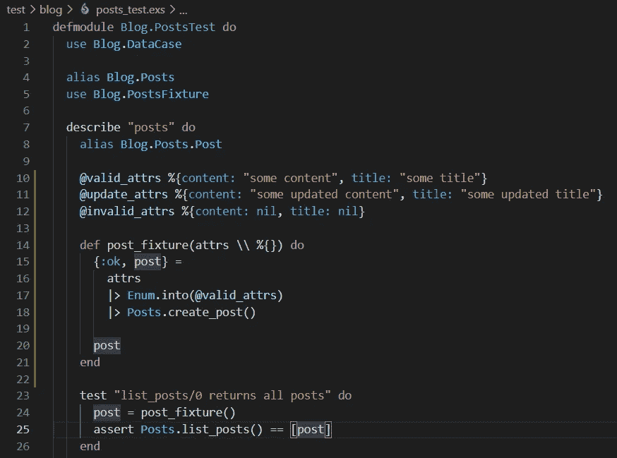

测试夹具函数是为同一个测试文件的本地测试创建一些数据的好方法。

`post_fixture`函数创建一个帖子，以便您可以测试 Posts.list_posts()函数。更好的是，只为这个测试而不是其他测试创建数据。所以对其他测试没有副作用，导致测试交互很难调试。

## 重用测试夹具功能

这很好，但是如果您有另一个需要 post_fixture 的测试文件呢？

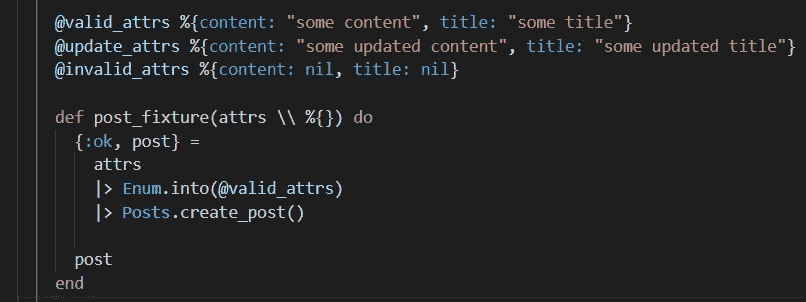

重写这个会有很多重复！重用测试夹具功能的一个简单方法是将它们移动到一个单独的测试夹具模块中，您可以在您的测试文件中`use`。

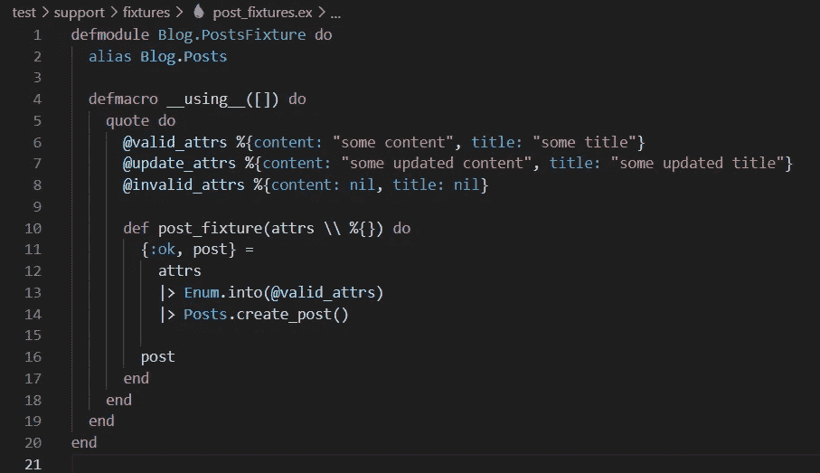

然后`use`在您想要访问`@valid_attrs, @update_attrs, or @invalid_attrs`值或`post_fixture`函数的任何文件中添加后缀。

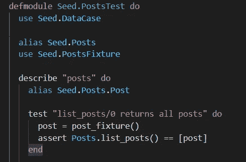

关于`use`和`__using__`的解释，请查看[仙丹学校的课程](https://elixirschool.com/en/lessons/basics/modules/#use)。

# 使用 Ex 玛奇纳的工厂

如果使用您自己的定制测试夹具和 Faker 数据还不够，您可以考虑使用 Ex 玛奇纳 elixir 库作为一个方便的测试数据基础设施。请注意，Ex 玛奇纳使用术语“工厂”而不是“夹具”。

*   [安装 Ex 玛奇纳](https://github.com/thoughtbot/ex_machina):遵循回购安装说明，了解最新的安装步骤。

## 玛奇纳工厂交货模块

一旦您安装了 Ex 玛奇纳，您将需要设置一个工厂模块。
工厂模块将`use`ExMachina 模块。

```
defmodule Blog.Factory do
     use ExMachina.Ecto, repo: Blog.Repo
end
```

## 玛奇纳工厂交货功能

工厂模块包含的工厂函数必须以`_factory`结尾，这是由于 Ex 玛奇纳的工作方式。

```
def post_factory do
    %Post{
      title: Example Title,
      content: "Example Content"
    }
end
```

工厂函数也可以使用`struct!`从其他工厂函数中派生出来

```
# derived factory
  def long_post_factory do
    struct!(
      post_factory(),
      %{
        content: Faker.Lorem.paragraphs(5..10) |> Enum.join("\n")
      }
    )
 end
```

## 顺序

Ex 玛奇纳提供了`sequence`函数，用于在每次调用工厂函数时递增您提供的字符串或列表。

```
sequence("Name") # Name0
sequence("Name") # Name1
```

`sequence`也可以用一个原子和一个列表来调用，以循环遍历一个值列表。

```
sequence(:role, ["admin", "member", "superuser"]) # admin
sequence(:role, ["admin", "member", "superuser"]) # member
sequence(:role, ["admin", "member", "superuser"]) # superuser
```

## 插入

在您的测试或种子文件中，这些工厂函数可以与 Ex 玛奇纳提供的`insert`函数一起使用。`insert` 以一个原子作为自变量。原子应该匹配`_factory`前的函数名。比如`post_factory`和`:post`一起用。

```
insert(:post) #  inserts  %Blog.Posts.Post{
                __meta__: #Ecto.Schema.Metadata<:built,"posts">,
                title: "Example Title0",
                content: "Example Content0",
                inserted_at: nil,
                updated_at: nil
              } into the database
```

# 把所有的放在一起

把你学到的关于 Ex 玛奇纳、测试夹具和 Faker 的所有东西放在一起，这里有一个示例工厂和在测试中的使用。

## 定义工厂

请注意，`sequence`可以接受您想要的任何值的列表。在这种情况下，我使用 Faker 和 `sequence`在长、中和短内容之间循环。

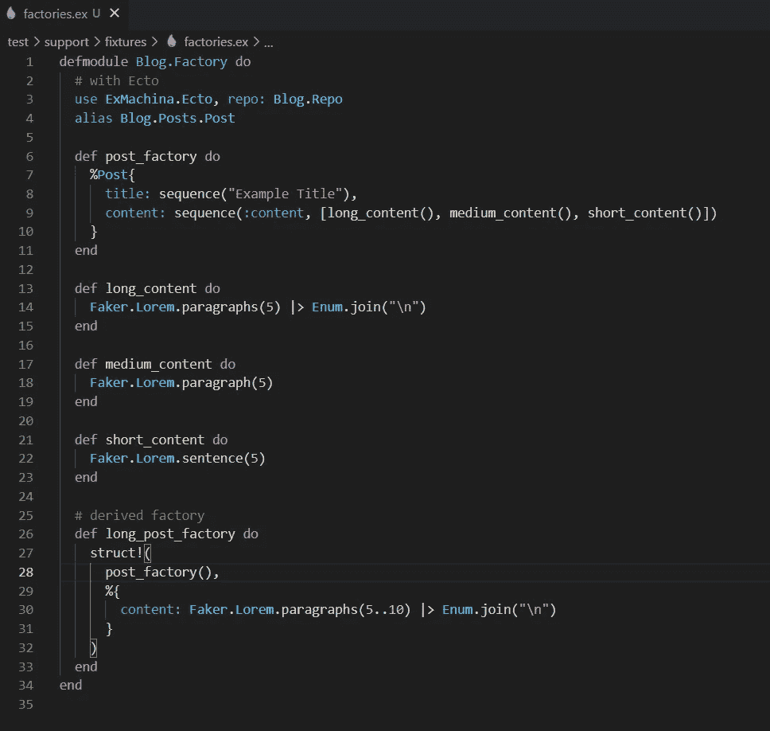

## 创建一个工厂测试

将工厂导入到您的测试文件中，以访问 Ex 玛奇纳提供的`insert`功能。

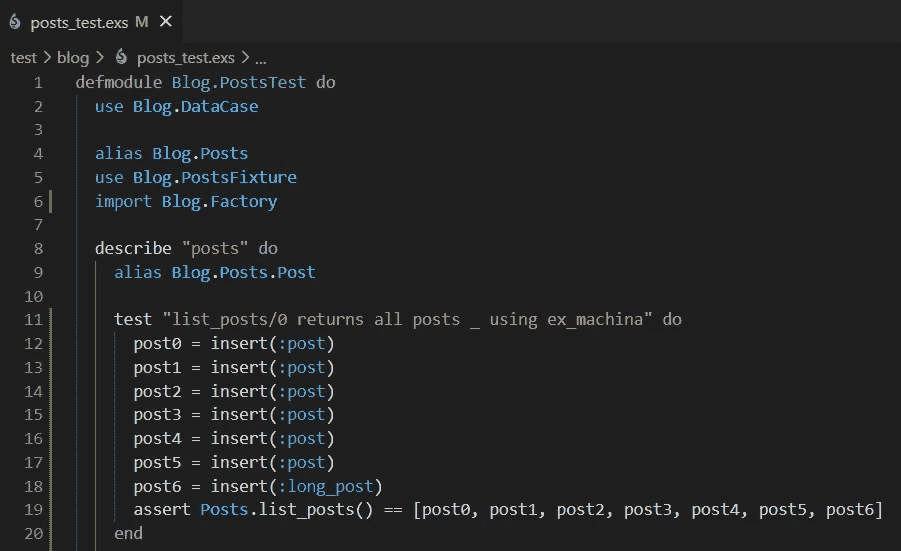

# 结论

您已经学会了通过利用定制的测试夹具模块、测试夹具函数(例如玛奇纳和 Faker)来提高 phoenix 数据播种的可靠性、可重用性和可读性。

我希望你觉得这篇文章很有用，并乐于将你学到的东西应用到你的下一个或当前项目中。

如果您有任何问题或意见，请通过张贴回复让我知道；我很乐意回复你！

## 进一步阅读

*   [玛奇纳交货回购](https://github.com/thoughtbot/ex_machina)和[玛奇纳交货单据](https://hexdocs.pm/ex_machina/ExMachina.html)
*   [凤凰播种数据文档](https://hexdocs.pm/phoenix/1.3.0-rc.1/seeding_data.html)
*   [伪造文件](https://hexdocs.pm/faker/api-reference.html)
*   [使用 Faker 和 Ex 玛奇纳的博客应用示例](https://github.com/BrooklinJazz/phoenix_seeding)